

# 이지연 · Jiyeon Lee

**Full-stack Engineer**

[Velog](https://velog.io/@jiyean99/posts) &nbsp;·&nbsp; [KakaoTalk](https://open.kakao.com/o/s081A11h)

> **기획·디자인·개발·QA를 혼자 도는 풀스택 엔지니어** - 요구사항 정의부터 데이터 파이프라인·API·화면·QA까지 제품 전 과정을 end-to-end로 책임집니다. 
> LLM 인텔리전스 연동(Gemini·Claude 멀티 프로바이더)과 대규모 실시간 서비스를 프로덕션에서 다뤘습니다.

 

## Tech Stack

**Language & Backend** 
    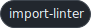   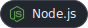    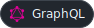

**AI / ML** 
     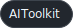 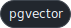

**Database & Messaging** 
          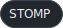 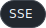

**Infra & DevOps** 
            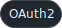 

**Frontend** 
       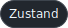     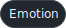 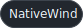    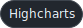   

**Collaboration & Tools** 
      

 

## Experience

> 프로젝트별 상세 역할·성과와 아키텍처 도식은 **[경력 상세 →](docs/experience.md)** 에 정리했습니다.

>  &nbsp;**[(주)에이아이지먼트](https://aigement.com)** &nbsp;·&nbsp; Full-stack Engineer &nbsp;&nbsp;`2026.06 – 현재` 
> B2B SaaS·PoC를 기획·디자인·개발·QA까지 단독 전담 — 요구사항·설계부터 데이터 파이프라인·API·화면·QA까지 end-to-end.

| 프로젝트 | 기간 | 요약 | |
|:--|:--|:--|:--|
| **PLYN** [`↗`](https://plynai.com) | `2026.06 – 진행중` | AI-Native SRM — 공급사 발굴·RFQ·LLM 인텔리전스 연동, 모듈러 모놀리스 · CES 2027 출품 | [상세 →](docs/experience.md#plyn) |
| **해상운송 정시성 Visibility PoC** | `2026.06 – 2026.12` | 화물 지연 리스크 조기 감지 — raw·core·svc 파이프라인부터 대시보드까지 단독 | [상세 →](docs/experience.md#lge) |
| **스토리지니** | `2026.06 – 진행중` | App/Agent 파이프라인 기반 AI 스토리 생성 — 인수인계·파이프라인 확장 | [상세 →](docs/experience.md#storygenie) |
| **팀 협업 체계·개발 환경 구축** | `2026.06 – 진행중` | 분산 도구 정리 — Jira 이관 · Slack Git 알림 봇 신설 | [상세 →](docs/experience.md#team) |

>  &nbsp;**[(주)잼퍼블릭](https://zempublic.co.kr)** &nbsp;·&nbsp; Frontend Engineer &nbsp;&nbsp;`2023.03 – 2025.08` (2년 5개월) 
> 실시간 웹 서비스와 사내 시스템 프론트엔드를 단독으로 설계·운영했습니다.

| 프로젝트 | 기간 | 요약 | |
|:--|:--|:--|:--|
| **승부사 온라인** [`↗`](https://www.adventurer.co.kr/) | `2023.03 – 2025.08` | 대규모 실시간 스포츠 베팅 웹앱 — 이중 WS·MobX 31스토어·Remote Config | [상세 →](docs/experience.md#adventurer) |
| **사내 매출 통계 대시보드** | `2023.03 – 2025.08` | ADV·Champ 이중 도메인 실시간 리포트 — Highcharts·등급 접근 제어 | [상세 →](docs/experience.md#dashboard) |
| **챔프포커** [`↗`](https://champpoker.co.kr/) | `2025.01 – 2025.08` | Unity 웹보드 게임 웹뷰 퍼블리싱 — JS Bridge ↔ Unity WebView | [상세 →](docs/experience.md#champpoker) |
| **신규 사업부 모바일 MVP** | `2025.07 – 2025.08` | Expo/RN 크로스 플랫폼 — 2개월 내 iOS·Android 동시 배포 | [상세 →](docs/experience.md#mobile) |

 

## Side Projects

| 프로젝트 | 기간 | 설명 | 주요 역할 | 기술 |
|:--|:--|:--|:--|:--|
| **개인 지출 분석 AI 에이전트** (가칭 · 상표 출원 검토 중) [`아키텍처 →`](docs/finance-agent.md) | `2026.07` `– 진행중` | 개인 지출을 분석하는 AI 에이전트와, 그 에이전트 자체를 관측하는 비용·관측 대시보드 | • 3-언어 백엔드 아키텍처 &nbsp;&nbsp;(NestJS BFF · FastAPI Agent &nbsp;&nbsp;· Spring Domain) • 계약 우선(OpenAPI) · 멱등 쓰기 • MCP 서버(FastAPI) 구현 • Redis Streams 비동기 연동 • ADR 16건 의사결정 기록 | `NestJS` `FastAPI · MCP` `Spring Boot` `Redis Streams` `TimescaleDB · pgvector` `OpenTelemetry` |
| **Workforce** ([`바로가기 ↗`](https://github.com/beyond-sw-camp/be23-fin-4team-workforce-be-devops)) | `2026.03` `– 2026.05` | AI 챗봇·이벤트 기반 자동화로 근태·급여·결재·평가를 통합한 MSA 기반 HRMS | • 목표·평가(OKR) 도메인 End-to-End • 실시간 Member 채팅 &nbsp;&nbsp;(WebSocket · Redis fan-out) • K8s 무중단 배포 • AWS EKS 인프라 구성 | `Spring Boot` `Kafka` `WebSocket/STOMP` `Redis` `Kubernetes` `AWS EKS` |
| **Articket** ([`바로가기 ↗`](https://github.com/beyond-sw-camp/be23-2nd-team5-articket-be)) | `2026.01` `– 2026.03` | 실시간 좌석 선점·결제로 예매를 확정하는 공연 예매 플랫폼 | • 팀리드(PM) • 인증·인가 설계 &nbsp;&nbsp;(JWT · 소셜 OAuth2) • 실시간 알림 &nbsp;&nbsp;(SSE · Redis Pub/Sub) • FE 아키텍처 설계 • PortOne · KakaoMap 연동 | `Spring Boot` `JWT · OAuth2` `Redis` `SSE` `PortOne` `AWS` |
