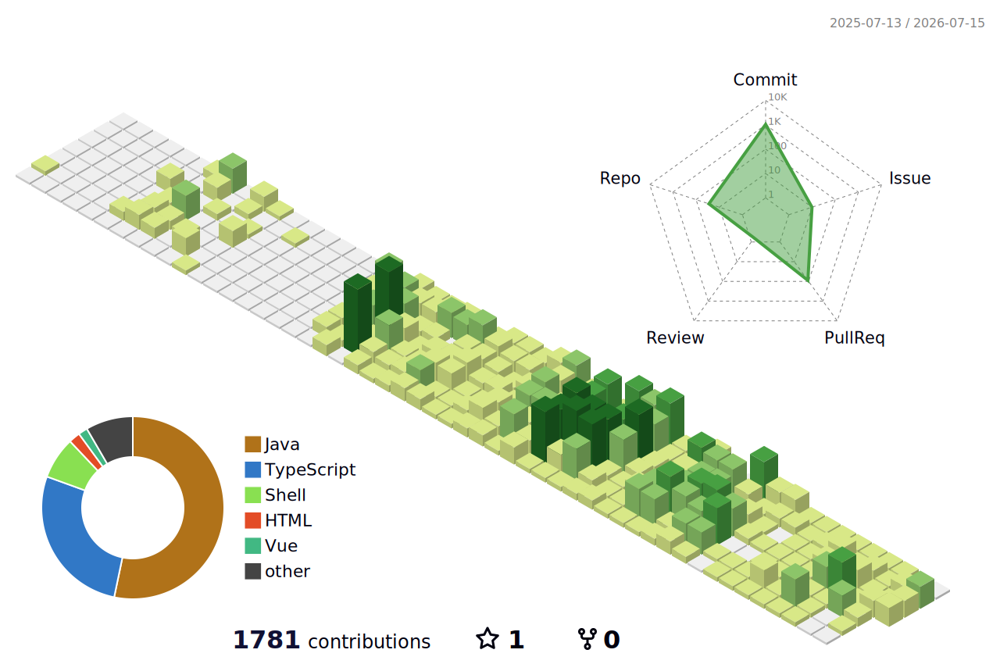

# 이지연 · Jiyeon Lee

**Full-stack Engineer**

[Velog](https://velog.io/@jiyean99/posts) &nbsp;·&nbsp; [KakaoTalk](https://open.kakao.com/o/s081A11h)

> 책임감 있게 임하고 겸손하게 배우며, 원만한 소통을 지향합니다. 
> 실시간·대규모 트래픽 서비스, MSA·클라우드 네이티브 인프라, LLM 기반 서비스 개발에 관심이 많습니다.

 

## Tech Stack

**Language &amp; Backend** &nbsp;   
**Database &amp; Messaging** &nbsp;   
**Infra &amp; DevOps** &nbsp;   
**Frontend &amp; Tools** &nbsp;  

 

## Experience

>  &nbsp;**[(주)에이아이지먼트](https://aigement.com)** &nbsp;·&nbsp; Full-stack Engineer &nbsp;&nbsp;`2026.06 – 현재` 
> B2B SaaS·PoC 개발. 요구사항 정의부터 데이터 파이프라인·API·화면까지 end-to-end로 담당합니다.

- **PLYN**([`바로가기 ↗`](https://plynai.com)) &nbsp;·&nbsp; `2026.06 – 진행중`

  공급망 리스크 예측·설명 AI 플랫폼 — LLM 연동 및 리스크 리포트 화면 설계·구현

  ``Python`` ``FastAPI`` ``PostgreSQL`` ``React``

  
  
  

  

  
상세 역할 및 성과

   

  - **CES 데모 플로우 단독 구성** — 문서 기반 수집 파이프라인을 단일 흐름으로 묶어 리스크 컨텍스트를 2분 내 확보하는 시나리오 설계
  - **인터랙티브 리포트 구현** — 예측 → 설명 → 대응으로 이어지는 리스크 리포트를 하나의 화면 흐름으로 구현
  - **리스크 보드·원인 카드 UI** — 위험 등급 보드와 원인 그래프를 시각화해 위험의 근거를 화면에서 설명
  - **수집 플로우 v2 확장·대외 산출물 제작** — 수집 파이프라인 확장 및 데모 영상·웹 데모·보고서 산출물 담당

  

- **해상운송 정시성 Visibility PoC** &nbsp;·&nbsp; `2026.06 – 2026.12` &nbsp;·&nbsp; 고객사: 글로벌 가전 제조사 · 정부지원사업

  지연 예측 기반 위험구간 모니터링·경보 대시보드 — 요구사항 정의부터 데이터 적재·모델 연동·대시보드까지 end-to-end 담당

  ``Python`` ``FastAPI`` ``PostgreSQL`` ``Alembic`` ``React``

  
  
  
  

  

  
상세 역할 및 성과

   

  - **요구사항 명세·원천 데이터 정의** — 물류사 export 항목을 업무 요건과 매핑해 수급 범위·주기·필수 컬럼 확정
  - **일 스냅샷 자동 적재 파이프라인 설계** — 외부 export 5종을 append-only 구조로 적재(누적 약 20만 행), 파일 해시 기반 이력 테이블로 멱등성·재현성 확보 → 동일 파일 중복 적재 0건
  - **변화 감지 구조 설계** — 일 변경률 8.4% 실측 → 원본은 landing 보존, 변화 추적은 파생 레이어가 전담하는 계층 분리안 도출
  - **엔티티 키 검증** — 데이터 프로파일링으로 복합 자연키 유일성 99.6% 확보, 잔여 중복은 원천의 부분정보 분할 방출이 원인임을 규명해 대체 판정 로직 제안
  - **정시성 모니터링·위험 보드 개발** — B/L 목록·경로·상태·ETA 기준 위험구간을 임계값별로 시각화, 담당자 알림 흐름 구현
  - **예측 모델 연동·서비스화** — DS 개발 지연 예측 모델의 입력 데이터 규격화 및 일 배치 연결, 예측 결과를 위험 신호로 대시보드 노출
  - **대량 목록 조회 UX 안정화** — 다중 검색·필터 조합 환경에서 조회 성능 확보

  

- **스토리지니** &nbsp;·&nbsp; `2026.06 – 진행중`

  App/Agent 파이프라인 기반 AI 스토리 생성 서비스 — 서비스 인수인계 및 생성 파이프라인 확장

  ``Python`` ``FastAPI`` ``PostgreSQL``

  
  

  

  
상세 역할 및 성과

   

  - **서비스 인수인계** — 코드·인프라 구조를 파악해 유실 없이 서비스 연속성 확보
  - **App/Agent 분리 구조 기능 확장** — 서비스 API(App)와 생성 파이프라인(Agent) 계층을 분리해 기능 확장
  - **생성 파이프라인 안정화** — 생성 실패·지연 구간 대응 및 스토리·삽화 생성 흐름 개선

  

<!-- 
- **항공물류 PoC** &nbsp;·&nbsp; `2026.07 – 예정` &nbsp;·&nbsp; 공공 부문 · 정부지원사업

  항공 화물 운송 데이터 기반 PoC — 프로토타입 개발 착수 예정
  국방 분야 화주 PoC — 프로토타입 개발 착수 예정 &nbsp; ``Python``
-->

 

>  &nbsp;**[(주)잼퍼블릭](https://zempublic.co.kr)** &nbsp;·&nbsp; Frontend Engineer &nbsp;&nbsp;`2023.03 – 2025.08` (2년 5개월) 
> 실시간 웹 서비스와 사내 시스템 프론트엔드를 단독으로 설계·운영했습니다.

- **승부사 온라인**([`바로가기 ↗`](https://www.adventurer.co.kr/)) &nbsp;·&nbsp; `2023.03 – 2025.08`

  실시간 스포츠 웹 서비스 — 프론트엔드 단독 설계·운영

  ``React`` ``TypeScript`` ``MobX`` ``Socket.io``

  
  
  

  

  
상세 역할 및 성과

   

  - **컴포넌트·상태 구조 표준화** — 모듈화 컴포넌트 + MobX 전역 상태 구조로 복잡한 화면 대응력과 확장성 확보
  - **실시간 데이터 전환 처리** — Socket.io 기반 실시간 스코어 피드를 화면에 반영, 운영 중 데이터 폭주 구간 안정 처리
  - **렌더링 최적화·경량화** — 컴포넌트 분할과 로딩 최적화로 필요한 코드만 로드하도록 개선
  - **정적 리소스 최적화** — 이미지·페이지 로드 부하를 줄여 초기 렌더 속도 개선
  - **단독 담당 운영** — 프론트엔드 기능 추가·장애 대응·릴리스 전 과정을 단독 담당

  

- **사내 매출 통계 대시보드** &nbsp;·&nbsp; `2023.03 – 2025.08` &nbsp;·&nbsp; 사내 시스템

  실시간 매출·이벤트 통계 대시보드 — 프론트엔드 설계·운영

  ``Vue`` ``Vuex`` ``Socket.io`` ``Highcharts``

  
  
  

  

  
상세 역할 및 성과

   

  - **UI 컴포넌트 모듈화** — 대시보드 전반의 반복 요소를 공통 컴포넌트로 추출해 신규 화면 개발 비용 절감
  - **데이터 시각화 인터페이스 구현** — 매출·이벤트 데이터를 Highcharts 기반 그래프·차트로 전환해 핵심 지표를 직관적으로 분석 가능하도록 구성
  - **실시간 지표 반영** — Socket.io 스트림을 Vuex Store로 관리해 지표를 즉시 화면에 반영
  - **데이터 추출 기능** — CSV 저장을 지원해 운영팀이 별도 요청 없이 데이터를 내려받도록 개선

  

- **챔프포커**([`바로가기 ↗`](https://champpoker.co.kr/)) &nbsp;·&nbsp; `2025.01 – 2025.08`

  Unity 웹보드 게임 — 웹뷰 인터페이스 퍼블리싱

  ``JavaScript`` ``JS Bridge`` ``Unity WebView``

  
  
  

  

  
상세 역할 및 성과

   

  - **퍼블리싱 관리 체계화** — 텍스트·스타일·이미지 요소를 JSON 기반으로 분리 관리해 코드 변경 없이 콘텐츠를 반영하도록 구조화
  - **JS Bridge ↔ Unity WebView 연동** — 게임 클라이언트와 웹뷰 간 공지·이벤트 렌더링을 브릿지 통신으로 구현
  - **웹뷰 스타일 가이드·반응형 대응** — 기기별 해상도·렌더링 차이를 흡수하는 스타일 가이드 정의
  - **기기별 오류 대응 최적화** — iOS/Android 웹뷰 환경별 렌더링 이슈 대응

  

- **신규 사업부 모바일 MVP** &nbsp;·&nbsp; `2025.07 – 2025.08`

  Expo 기반 React Native 마이그레이션 및 프론트엔드 개발

  ``Expo`` ``React Native`` ``TypeScript`` ``Zustand`` ``NativeWind``

  
  
  

  

  
상세 역할 및 성과

   

  - **크로스 플랫폼 앱 구조 설계** — Expo/RN 기반 iOS·Android 동시 대응 초기 세팅 및 NativeWind 디자인 시스템 구성
  - **러닝 핵심 플로우 화면 개발** — 러닝 기록·세션 상태를 Zustand로 관리하는 코어 플로우 구현
  - **하이브리드 웹뷰 연동** — 웹 콘텐츠를 WebView로 통합하고 네이티브 브릿지 통신 처리
  - **2개월 내 양 플랫폼 동시 배포** — EAS Build/OTA를 도입해 스토어 심사 없이 수정 반영, 검증 사이클 단축
  - **재작업 리소스 최소화** — 컴포넌트 단위 개발로 빠른 기능 검증 진행

  

 

## Side Projects

| 프로젝트 | 기간 | 설명 | 주요 역할 | 기술 |
|:--|:--|:--|:--|:--|
| **Workforce** ([`바로가기 ↗`](https://github.com/beyond-sw-camp/be23-fin-4team-workforce-be-devops)) | `2026.03` `– 2026.05` | AI 챗봇·이벤트 기반 자동화로 근태·급여·결재·평가를 통합한 MSA 기반 HRMS | • 목표·평가(OKR) 도메인 End-to-End • 실시간 Member 채팅 &nbsp;&nbsp;(WebSocket · Redis fan-out) • K8s 무중단 배포 • AWS EKS 인프라 구성 | `Spring Boot` `Kafka` `WebSocket/STOMP` `Redis` `Kubernetes` `AWS EKS` |
| **Articket** ([`바로가기 ↗`](https://github.com/beyond-sw-camp/be23-2nd-team5-articket-be)) | `2026.01` `– 2026.03` | 실시간 좌석 선점·결제로 예매를 확정하는 공연 예매 플랫폼 | • 팀리드(PM) • 인증·인가 설계 &nbsp;&nbsp;(JWT · 소셜 OAuth2) • 실시간 알림 &nbsp;&nbsp;(SSE · Redis Pub/Sub) • FE 아키텍처 설계 • PortOne · KakaoMap 연동 | `Spring Boot` `JWT · OAuth2` `Redis` `SSE` `PortOne` `AWS` |

 

## Contributions

