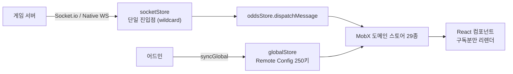

<a id="top"></a>

# 승부사 온라인 — 대규모 실시간 스포츠 베팅 웹앱

> **End-to-End Product Case Study**
> 문제 정의 → 요구사항 → UX → 시스템 설계 → 구현 → 검증 → 결과

[`← 경력 상세로`](../experience.md) &nbsp;·&nbsp; [`사이트 ↗`](https://www.adventurer.co.kr/)

---

## A. Executive Summary

배당률·경기 상태·잔액이 **초 단위로 바뀌는** 실시간 스포츠 베팅 웹 애플리케이션입니다. PC·모바일 완전 대응 프론트엔드를 2년 6개월간 단독으로 설계·운영했습니다.

이 프로젝트의 중심 과제는 화면을 예쁘게 만드는 것이 아니라 **"연결이 불안정하고 값이 계속 바뀌는 환경에서 사용자가 본 숫자를 신뢰할 수 있게 하는 것"**이었습니다. 베팅은 되돌리기 비용이 큰 액션이라, 사용자가 클릭하는 순간의 배당률이 서버와 어긋나면 그건 UI 버그가 아니라 금전 사고가 됩니다.

세 가지 구조로 풀었습니다 — 환경에 따라 전환되는 **이중 소켓**, 화면이 아니라 도메인으로 나눈 **MobX 29 스토어**, 그리고 배포 없이 값을 바꾸는 **Remote Config 250키**. 마지막 것에서 얻은 원칙("값을 바꾸는 데 배포가 필요하면 그건 설정이 아니라 상수다")은 이후 백엔드 프로젝트까지 이어졌습니다.

<sub>실측 기준 — `adv-qa` 백업 저장소를 직접 파싱해 산출(파일 수 · enum 멤버 수 · `git shortlog`).
<b>DAU·동시접속 등 트래픽 지표는 회사 내부 자산이라 이 문서에 기재하지 않았습니다.</b></sub>

---

## 01. Project Overview

```text
PROJECT
승부사 온라인 (Adventurer)

ONE-LINER
실시간 배당률로 스포츠 경기에 베팅하는 웹 서비스의 PC·모바일 프론트엔드

PROBLEM
배당·경기 상태·잔액이 초 단위로 바뀌는데, 연결은 항상 안정적이지 않다
사용자가 화면에서 본 값과 서버의 값이 어긋나면 금전 사고가 된다

SOLUTION
연결을 이중화해 환경별로 전환하고, 상태를 도메인 단위로 쪼개 정확히 필요한 곳만 갱신하며
운영 값은 배포 없이 즉시 반영한다

TARGET
스포츠 베팅 이용자 (PC · 모바일)

ROLE
프론트엔드 단독 설계 · 개발 · 운영 (2년 6개월)

STACK
React 16 · TypeScript · MobX 5 · Socket.io + Native WebSocket ·
Emotion · Webpack 4 · react-loadable · react-window
```

| | |
|---|---|
| **기간** | `2023.03 – 2025.08` (2년 6개월) |
| **역할** | 프론트엔드 단독 — 기능 기획서부터 QA까지 |
| **실측 규모** | **741 파일** (TSX 538 · TS 203) |
| **동시 담당** | 모노레포 저장소 6개 (`v2-front` · `report-front` · `home` · `entr` · `admin-front` · `lib`) |

---

## 02. Background & Problem Definition

### Business Context

실시간 베팅 서비스는 **값의 신선도가 곧 상품성**입니다. 배당률이 몇 초만 늦어도 사용자는 이미 변한 값에 베팅하게 되고, 서버는 그 요청을 거절해야 합니다. 거절이 잦으면 사용자는 서비스를 신뢰하지 않습니다.

### Problem Statement

```text
현재 상황
  배당률 · 경기 상태 · 스코어 · 잔액이 서버에서 초 단위로 갱신된다

      ↓
사용자가 겪는 문제
  ① 연결이 끊기거나 막힌 환경에서는 값이 갱신되지 않는데, 화면은 멀쩡해 보인다
  ② 베팅 슬립을 작성하는 도중 배당이 바뀌면 무엇에 베팅한 것인지 모호해진다
  ③ 이벤트나 점검이 있을 때 안내가 늦게 반영된다

      ↓
문제가 발생하는 원인
  ① WebSocket이 막히는 네트워크 환경이 실제로 존재한다 (일부 사내망 · 프록시)
  ② 실시간 이벤트가 많아 화면 전체를 다시 그리면 성능이 무너진다
  ③ 운영 값 하나를 바꾸는 데 코드 수정 → 빌드 → 배포가 필요하다

      ↓
비즈니스 영향
  값의 불일치는 문의·환불로 이어지고, 배포 지연은 그대로 기회 손실이 된다

      ↓
해결해야 할 핵심 문제
  불안정한 연결 위에서 "사용자가 본 값"과 "서버의 값"을 일치시키고,
  운영이 배포를 기다리지 않게 한다
```

---

## 03. Research & Discovery

> ⚠️ **정량적 사용자 조사(인터뷰·설문·사용성 테스트)는 수행하지 않았습니다.**
> 요구사항은 운영 중 접수된 사용자 문의(VOC)와 기능 기획 과정, 그리고 직접 수행한 환경 테스트에 근거합니다.

| 수행 | 내용 |
|---|---|
| ✅ **환경 호환성 테스트** | WebSocket이 막히는 환경 실측 → 폴백 필요성 확인 |
| ✅ **운영 문의(VOC) 반영** | 배당 변경 시 혼선, 모바일 탭 지연 등 반복 문의를 기능 요구로 전환 |
| ✅ **기기별 웹뷰 테스트** | 뷰포트·스크롤·입력 이슈를 기기별로 확인 |
| ❌ 사용자 인터뷰 · 설문 | 미수행 |
| ❌ 사용성 테스트 | 미수행 |

---

## 04. User Definition

| Role | 목적 | Pain Point | 필요한 것 |
|---|---|---|---|
| **베팅 이용자** | 원하는 경기에 정확한 배당으로 베팅 | 배당이 바뀌었는지 모르고 제출 | **변경을 알려주고 반영 여부를 선택하게** |
| **모바일 이용자** | 이동 중 빠른 확인·베팅 | 탭 지연 · 긴 목록 스크롤 버벅임 | 반응 속도 · 목록 가상화 |
| **운영자** | 이벤트·점검·경제 수치 조정 | 값 하나 바꾸는 데 배포 대기 | **무배포 설정 제어** |

> ⚠️ 위 정의는 운영 문의와 기능 기획 맥락에 근거하며, 사용자 대상 검증은 하지 않았습니다.

---

## 05. User Journey & Current Flow

핵심 시나리오 — **경기 목록에서 베팅 제출까지**.

```text
Trigger    경기를 보러 접속
   ↓
System     소켓 연결 → 배당 · 스코어 실시간 수신
   ↓
Action     경기를 골라 베팅 슬립에 담는다
   ↓
System     ⚠️ 이 사이에 배당이 바뀔 수 있다
   ↓
Decision   금액을 입력하고 예상 당첨금을 확인
   ↓
Action     제출
   ↓
Result     서버가 현재 배당으로 검증 → 불일치면 거절
```

| 단계 | Pain Point | Opportunity |
|---|---|---|
| 연결 | 막힌 환경에서 값이 멈추는데 화면은 정상으로 보임 | **연결 방식 이중화 + 폴백** |
| 슬립 담기 → 제출 | 그 사이 배당 변경을 사용자가 모름 | **변경 버블 알림 + 자동 반영** |
| 목록 스크롤 | 경기가 많으면 렌더 비용 폭증 | 가상화 |
| 운영 변경 | 배포를 기다려야 반영 | **무배포 설정** |

---

## 06. UX & Product Insight

### Insight 1 — 연결이 끊긴 것을 사용자가 알 수 없다

```text
Finding
  WebSocket이 막히는 환경에서 값 갱신이 멈추는데, 화면은 마지막 값을 그대로 보여준다.
  사용자는 "안 바뀌는 것"과 "안 받아지는 것"을 구분할 수 없다.

Insight
  실시간 서비스에서 가장 위험한 상태는 오류가 아니라 조용한 정지다.

Opportunity
  연결 자체를 환경에 맞게 전환하고, 재연결 상한을 두어 상태를 사용자에게 알린다.

Requirement
  Socket.io + Native WebSocket 이중 구현, polling 폴백,
  재연결 시도 상한(5회) 후 사용자에게 상태 노출
```

### Insight 2 — 값이 바뀐 사실 자체가 정보다

```text
Finding
  슬립 작성 중 배당이 바뀌면 제출이 거절된다. 사용자는 이유를 모른다.

Insight
  변경을 숨기고 자동 반영만 하면 "내가 본 배당이 아닌데?"가 되고,
  변경 때문에 막기만 하면 베팅을 못 한다.

Opportunity
  변경을 알리되 흐름을 끊지 않는다.

Requirement
  배당률 변경을 버블 알림으로 표시하고 슬립에 자동 반영,
  사용자는 바뀐 값을 보고 제출 여부를 결정
```

### Insight 3 — 민감 지표는 숨기는 게 아니라 안 그리는 것

```text
Finding
  등급별로 볼 수 있는 지표가 다른데, CSS로 숨기면 DOM에는 남는다.

Insight
  "보이지 않는다"와 "없다"는 다르다. 접근 제어는 렌더 단계에서 끝나야 한다.

Requirement
  권한 조건을 만족하지 않으면 컴포넌트를 렌더링하지 않는다 (→ 대시보드 케이스에서 확장)
```

---

## 07. Product Strategy

```text
Business Goal   실시간 값의 신뢰도를 유지해 문의·환불을 줄인다
       ↓
User Goal       내가 본 값으로 베팅이 성사된다
       ↓
Product Goal    불안정한 연결 위에서 값의 일치를 보장하고, 운영 반영 속도를 배포에서 분리한다
       ↓
Feature         이중 소켓 · 도메인 상태 분리 · 배당 변경 알림 · Remote Config
       ↓
Metric          (사용 지표는 회사 자산이라 이 문서에 기재하지 않습니다)
```

---

## 08. Feature Definition

### 이중 소켓 연결

```text
Problem       WebSocket이 막히는 환경에서 실시간 값이 멈춘다
   ↓
User Need     어떤 환경에서든 값이 갱신돼야 한다
   ↓
Feature       Socket.io + Native WebSocket 두 구현 + polling 폴백 + 재연결 상한
   ↓
Value         환경에 관계없이 값이 흐르고, 정말 끊겼을 때는 사용자가 알 수 있다
```

### 베팅 슬립 — 실시간 배당 계산

```text
Problem       단식·다리 조합의 예상 당첨금을 사용자가 직접 계산할 수 없다
   ↓
User Need     담을 때마다 즉시 반영된 금액을 보고 싶다
   ↓
Feature       조합 실시간 계산 + 배당 변경 버블 알림 + 다중 화폐 · 쿠폰 자동 선택
   ↓
Value         제출 전에 무엇에 얼마를 거는지가 명확해진다
```

### Remote Config — 무배포 기능 제어

```text
Problem       이벤트 배너 on/off, 경제 수치 조정에 코드 수정 → 빌드 → 배포가 필요하다
   ↓
User Need     (운영자) 지금 바로 바꾸고 싶다. 문제가 나면 바로 되돌리고 싶다
   ↓
Feature       설정 키 250개를 enum으로 중앙 정의 + 소켓 이벤트로 즉시 갱신
   ↓
Value         배포 주기와 실험 주기가 분리된다. 롤백이 배포가 아니라 값 되돌리기가 된다
```

---

## 09. Information Architecture

```text
승부사 온라인
├── 홈 — 추천 경기 · 진행 중 경기
├── 스포츠
│   ├── 종목별 경기 목록 (실시간 배당)
│   └── 경기 상세 · 라이브
├── 베팅
│   ├── 베팅 슬립 (플로팅)
│   └── 베팅 내역
├── 마이페이지 — 잔액 · 쿠폰 · 아이템
└── 고객센터 · 이벤트
```

베팅 슬립을 **페이지가 아니라 플로팅 요소**로 둔 것이 IA의 핵심입니다. 사용자는 여러 경기를 오가며 슬립을 채우므로, 슬립이 페이지 전환에 종속되면 흐름이 끊깁니다.

---

## 10. User Flow

```text
접속
   ↓  [System] 소켓 연결 시도 (websocket → 실패 시 polling 폴백)
경기 목록 (실시간 배당 수신)
   ↓
경기 선택 → 슬립에 담기
   ↓  [System] 조합 배당 실시간 재계산
   ├─ 배당 변경 발생 ─── 버블 알림 + 슬립 자동 반영
   ↓
금액 입력
   ↓  [System] 화폐 종류 · 쿠폰 · 아이템 자동 선택 · 유효성 검사
제출
   ↓
   ├─ 성공 → 베팅 내역
   └─ 거절 → 사유 표시
```

| 상태 | 처리 |
|---|---|
| **Error State** | 재연결 5회 실패 → 상태를 사용자에게 노출, 수동 재시도 |
| **Loading State** | 배당 갱신 중 이전 값 유지 + 변경 시 버블 |
| **Validation** | 금액 포맷·한도·잔액 검사 |

---

## 11. UX Design

```text
Decision   베팅 슬립을 플로팅 요소로 유지
Reason     사용자가 여러 경기를 오가며 슬립을 채운다. 페이지 종속이면 흐름이 끊김
Trade-off  모바일에서 화면 면적을 상시 점유
```

```text
Decision   배당 변경을 차단이 아니라 알림 + 자동 반영으로
Reason     차단하면 베팅을 못 하고, 조용히 반영하면 "내가 본 값이 아닌데"가 됨
Trade-off  사용자가 알림을 놓칠 수 있음
```

```text
Decision   재연결 시도를 무한이 아니라 5회로 제한
Reason     무한 재연결은 서버 복구 시 thundering herd를 만들고,
           사용자에게는 "연결 안 됨"을 영영 알리지 못함
Trade-off  일시적 네트워크 장애에서 사용자가 수동 재시도를 해야 함
```

> ⚠️ **사용성 테스트는 수행하지 않았습니다.** 위 결정은 운영 문의와 도메인 판단에 근거합니다.

---

## 12. UI Design · 13. Branding / Design System

> ⚠️ **화면 산출물은 회사 자산이라 게재하지 않습니다.**
>
> 다만 프론트엔드 리드로서 **공용 스타일·컴포넌트 규칙을 팀 문서로 정리**해 화면이 늘어도 톤이 흐트러지지 않게 유지했고, 반응형·접근성 기준도 팀 규칙으로 문서화했습니다. (→ [프론트엔드 리드 케이스 스터디](frontend-lead.md))
>
> 스타일링은 Emotion 기반 CSS-in-JS이며, 디자인 토큰을 컴포넌트 레벨에서 소비하는 구조였습니다.

---

## 14. Core Feature Deep Dive — 이중 소켓 연결

### Problem

실시간 값이 생명인 서비스인데, **WebSocket이 막히는 환경이 실제로 존재**합니다. 그리고 연결이 끊겨도 화면은 마지막 값을 그대로 보여주므로 사용자가 알아챌 수 없습니다.

### Goal

환경에 관계없이 값이 흐르게 하고, 정말로 끊겼을 때는 그 사실이 드러나게 한다.

### Business Logic

- Socket.io와 Native WebSocket **두 구현을 각각 두고 런타임에 전환**
- WebSocket이 막힌 환경에서는 `polling` 트랜스포트를 앞에 추가해 폴백
- 재연결은 지수 백오프로 **최대 5회** — 상한에 걸리면 사용자에게 상태를 알리고 수동 재시도

### Architecture



### 구현 — 단일 진입점

```js
const transports = ['websocket']
if (!socketStore.notSupportPolling) {   // 폴링 미지원 환경이 아니면 polling 을 앞에 둔다
  transports.unshift('polling')
}
this.socket = connect(url, {
  transports,
  reconnectionDelay: 1000,
  reconnection: true,
  reconnectionAttempts: 5,              // 재연결 상한
})
patch(this.socket)                       // socketio-wildcard
this.socket.on('*', pkg => {             // 이벤트별 리스너 대신 단일 진입점
  socketStore.addMessage({ event: pkg.data[0], from: 'server', data: pkg.data[1] })
})
```

**왜 wildcard인가** — 이벤트가 26종인데 각각 리스너를 달면 이벤트를 추가할 때마다 연결 코드를 고쳐야 합니다. `.on('*')` 단일 진입점으로 받아 `socketStore.addMessage` → `oddsStore.dispatchMessage` 한 경로로 라우팅하면 **이벤트가 늘어도 진입점은 하나**입니다.

**대가** — 타입 안정성이 떨어집니다. 이벤트 이름 오타를 컴파일러가 잡지 못합니다. 그래서 이벤트 이름을 `PORTAL_SOCKET_EVENT` enum으로 중앙 정의했습니다(26종). 라이브 프로토콜은 별도 12종.

### Result

| | |
|---|---|
| 처리 이벤트 | 포털 소켓 이벤트 **26종** · 라이브 프로토콜 **12종** |
| 폴백 | WebSocket 차단 환경에서 polling으로 자동 전환 |
| 재연결 | 지수 백오프 · 상한 5회 → 이후 사용자에게 상태 노출 |

---

## 14-B. Core Feature Deep Dive — Remote Config

### Problem

이벤트 배너 on/off, 특정 기능 중단, 경제 수치(수수료·한도) 조정에 **코드 수정 → 빌드 → 배포**가 필요했습니다. 문제가 생기면 롤백도 배포였고, 실시간 서비스에서 그 지연은 그대로 손실입니다.

### Business Logic

- 설정 키 **250개를 TypeScript enum(`GlobalStoreKey`)으로 중앙 정의**
- 어드민에서 값 변경 → `syncGlobal` 소켓 이벤트 → MobX `@observable` 자동 갱신 → 구독 컴포넌트 즉시 반영 (**새로고침 불필요**)

### 왜 enum인가

문자열 키를 여기저기 쓰면 오타가 런타임까지 갑니다. enum이면 **컴파일 단계에서 차단**됩니다. 250개쯤 되면 이게 결정적입니다.

### Trade-off — 이 기능의 위험

| 위험 | 내용 |
|---|---|
| 코드보다 설정이 강해짐 | "코드는 맞는데 동작이 다르다"가 생김 → 어떤 값이 걸려 있는지 보이게 해야 함 |
| 권한 | 관리 안 하면 누구나 서비스를 끌 수 있음 |
| 테스트 | 설정 조합이 폭발해 전수 검증이 어려워짐 |

### Result

배포 없이 기능 on/off·경제 수치를 제어하고, 문제 시 **값만 되돌려 롤백**할 수 있게 됐습니다. 배포 주기와 실험 주기가 분리됐습니다.

> 💡 **이 원칙은 이후 백엔드로 이어졌습니다.** 정시성 PoC에서 헬스 판정 임계값(`heartbeat_threshold_sec`)을 코드가 아니라 테이블 컬럼에 둔 것이 같은 발상입니다 — **값을 바꾸는 데 배포가 필요하면 그건 설정이 아니라 상수다.**

---

## 20. Frontend Architecture

```text
Page (라우트 단위 코드 스플리팅)
 ↓
Feature (스포츠 · 베팅 · 마이페이지 …)
 ↓
Component (구독한 값만 리렌더)
 ↓
MobX 도메인 스토어 29종
 ↓
socketStore (단일 진입점) / Axios 커스텀 인스턴스
```

### 상태 — 화면이 아니라 도메인으로 나눈다

`@observable` · `@computed` · `@action`으로 세밀한 반응성을 설계해 **변경된 값을 구독한 컴포넌트만 정확히 리렌더**합니다.

| 결정 | 이유 |
|---|---|
| **도메인 단위 29 스토어** | 화면 단위로 나누면 화면이 늘 때마다 스토어가 늘어남. 도메인으로 나누면 화면이 늘어도 스토어는 그대로 |
| **의존 순서 명시** (`auth → user → matchup`) | 순환이 생기면 초기화 순서가 터짐 |
| **라우터 스토어 연동** | URL ↔ 상태 양방향 동기화 |

**왜 MobX인가 (그리고 대가)** — 관찰 기반이라 보일러플레이트가 적고 세밀한 반응성이 쉽습니다. 초당 여러 건의 실시간 이벤트가 들어오는 화면에서는 이 장점이 결정적입니다. 대신 **어디서 상태가 바뀌는지 추적이 어렵습니다.** Redux는 반대 트레이드오프입니다.

### HTTP 레이어

- Axios 커스텀 인스턴스에 **중복 요청 제거** (URL + 파라미터 시간 윈도우)
- **401 → 자동 토큰 갱신 후 원요청 재시도**
- 에러 코드 → 사용자 메시지 매핑 · 전역 토스트

---

## 26. Performance / Optimization

| 항목 | 문제 | 처리 |
|---|---|---|
| **초기 번들** | 741 파일 규모라 초기 로드가 무거움 | `react-loadable` 라우트 단위 코드 스플리팅 |
| **대용량 목록** | 경기 목록이 길면 렌더 비용 폭증 | `react-virtualized` / `react-window` 가상화 |
| **빌드 시간** | 대규모 코드베이스 컴파일 지연 | `cache-loader` + `thread-loader` 병렬 컴파일 |
| **모바일 탭 지연** | 300ms 지연으로 반응이 느리게 느껴짐 | 탭 지연 제거 |
| **스크롤 성능** | 리스너 중복 등록 | 중복 등록 방지 |

> ⚠️ **개선 전후를 수치로 측정한 기록이 없습니다.** 위 항목은 적용한 최적화이며, 정량 결과(번들 크기·응답 시간)는 확인 가능한 자료가 없어 적지 않습니다.

---

## 27. Result

### Engineering — 검증 가능한 산출

| 항목 | 값 | 확인 방법 |
|---|---|---|
| 프로덕션 규모 | **741 파일** (TSX 538 · TS 203) | 저장소 파일 수 실측 |
| MobX 도메인 스토어 | **29종** | `store/index.ts` export 실측 |
| Remote Config 키 | **250개** | `GlobalStoreKey` enum 멤버 수 |
| 포털 소켓 이벤트 | **26종** | `PORTAL_SOCKET_EVENT` (`lib/src/v2/protocol/socket.ts`) |
| 라이브 프로토콜 | **12종** | 프로토콜 정의 실측 |
| 모노레포 기여 | 누적 6,441커밋 중 **926커밋** | `git shortlog` (2023.04 – 2025.08) |
| 동시 담당 저장소 | **6개** (워크스페이스 33개 중) | — |

### Product / Business

> ⚠️ **DAU · 동시접속 · 전환율 등 트래픽·사업 지표는 회사 내부 자산이라 이 문서에 기재하지 않습니다.**

### 프로젝트가 남긴 것

- **2년 6개월 단일 제품 운영 경험** — 기능 추가와 장애 대응을 이어가며 하나를 오래 유지해봤습니다
- **원칙 하나** — 값을 바꾸는 데 배포가 필요하면 그건 설정이 아니라 상수다. 이 원칙이 이후 백엔드 설계로 이어졌습니다

---

## 28. Before / After

```text
BEFORE  ─ 연결
  단일 WebSocket → 막힌 환경에서 값이 조용히 멈춤 (화면은 정상으로 보임)

AFTER
  Socket.io + Native WS 이중 구현 · polling 폴백 · 재연결 상한 5회
  → 환경 무관하게 값이 흐르고, 끊기면 사용자가 안다
```

```text
BEFORE  ─ 운영 반영
  이벤트 배너 on/off → 코드 수정 → 빌드 → 배포 → 반영
  문제 발생 시 롤백도 배포

AFTER
  어드민에서 값 변경 → syncGlobal → observable 갱신 → 즉시 반영
  롤백 = 값 되돌리기
```

---

## 29. Reflection

### 무엇을 잘했는가

**연결을 "되면 좋은 것"이 아니라 "안 될 수 있는 것"으로 설계했습니다.** 이중 구현과 폴백, 재연결 상한은 전부 실패를 전제한 설계입니다.

**설정을 코드에서 분리한 것**이 가장 오래 남는 판단이었습니다. 이 원칙은 지금도 다른 스택에서 그대로 쓰고 있습니다.

**도메인 단위로 상태를 나눈 것** — 2년 반 동안 화면이 계속 늘었는데 스토어 수는 크게 늘지 않았습니다.

### 무엇이 부족했는가

**성능 개선을 측정하지 않았습니다.** 코드 스플리팅·가상화를 적용했지만 전후 수치가 없어서, 지금은 "적용했다"까지만 말할 수 있습니다. 개선했다고 말하려면 숫자가 있어야 합니다.

**wildcard 구독의 타입 안정성 손실을 enum으로만 막았습니다.** 런타임에서 페이로드 구조가 어긋나는 것은 여전히 잡히지 않습니다.

**사용자 조사를 하지 않았습니다.** 배당 변경 알림 방식이 실제로 혼선을 줄였는지 확인할 방법이 없었습니다.

### 어떤 의사결정이 가장 중요했는가

**Remote Config입니다.** 기능 하나가 아니라 **운영과 개발의 관계를 바꾼 결정**이었습니다. 배포 주기와 실험 주기를 분리하면 조직이 일하는 방식 자체가 달라집니다.

### 예상과 달랐던 것

**"실시간"의 진짜 난이도는 속도가 아니라 신뢰였습니다.** 값을 빨리 가져오는 것보다 "지금 이 값이 최신인가"를 사용자가 알 수 있게 하는 게 훨씬 어려웠습니다.

### 다시 만든다면

- **번들·렌더 지표를 CI에 붙이겠습니다.** 최적화를 하고도 증명할 수 없는 상태로 두지 않겠습니다.
- **소켓 페이로드에 런타임 검증을 넣겠습니다.** enum은 이름만 지키고 구조는 안 지킵니다.
- 지금 규모라면 **Zustand·Jotai 같은 가벼운 상태 라이브러리**도 검토했을 것 같습니다. 당시엔 React 16 + 데코레이터 환경이었고 팀이 MobX에 익숙했습니다.

### 배운 것

| 관점 | 배운 것 |
|---|---|
| **기술** | 실시간 시스템에서 가장 위험한 상태는 오류가 아니라 **조용한 정지**다 |
| **제품** | 값을 바꾸는 데 배포가 필요하면 그건 설정이 아니라 상수다 |
| **UX** | 변경을 숨기는 것도, 변경으로 막는 것도 답이 아니다. **알리고 선택하게** 하는 것 |
| **아키텍처** | 상태는 화면이 아니라 도메인으로 나눠야 화면이 늘어도 버틴다 |

---

## F. Portfolio Summary

```text
PROBLEM
  배당·상태가 초 단위로 바뀌는데 연결은 불안정하고,
  사용자가 본 값과 서버 값이 어긋나면 금전 사고가 된다

SOLUTION
  연결 이중화 + 환경별 폴백 / 도메인 단위 상태 분리 / 무배포 설정 제어

MY ROLE
  프론트엔드 단독 설계 · 개발 · 운영 (2년 6개월)

KEY FEATURES
  이중 소켓 + wildcard 단일 진입점 / 실시간 배당 계산 베팅 슬립 /
  Remote Config 250키 / 대용량 목록 가상화

UX CONTRIBUTION
  배당 변경을 차단이 아니라 알림+반영으로 설계
  재연결 상한을 둬 "조용한 정지"를 사용자에게 드러냄

ENGINEERING CONTRIBUTION
  Socket.io + Native WS 이중 구현 · polling 폴백 /
  MobX 도메인 스토어 29종 · 세밀 리렌더 제어 /
  Axios 중복 요청 제거 · 401 자동 갱신 / 코드 스플리팅 · 가상화

TECH STACK
  React 16 · TypeScript · MobX 5 · Socket.io · Native WebSocket ·
  Emotion · Webpack 4 · react-loadable · react-window

RESULT
  741 파일 프로덕션 2년 6개월 단독 운영 · 소켓 이벤트 26종 · 프로토콜 12종 ·
  Remote Config 250키 · 모노레포 6,441커밋 중 926커밋 기여
  (트래픽 지표는 회사 자산이라 미기재)
```

---

<p align="right">

[`← 경력 상세로`](../experience.md) &nbsp;·&nbsp; [↑ 맨 위로](#top)

</p>
