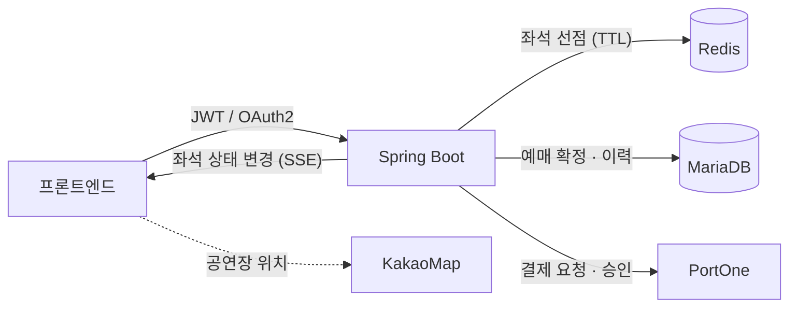

<a id="top"></a>

# Articket — 공연 예매 플랫폼

> **Case Study** · 한화 SW CAMP 팀 프로젝트 · **팀 리드(PM)**

[`← 경력 상세로`](../experience.md) &nbsp;·&nbsp; [`저장소 ↗`](https://github.com/beyond-sw-camp/be23-2nd-team5-articket-be)

---

## A. Executive Summary

실시간 좌석 선점과 결제로 예매를 확정하는 공연 예매 플랫폼입니다. **팀 리드(PM)**로 일정·범위·역할 분담과 통합을 책임지면서, 기술적으로는 인증·인가 설계와 SSE 실시간 알림을 직접 맡았습니다.

이 프로젝트의 기술적 핵심은 **"선점과 결제 사이의 시간"**입니다. 사용자가 좌석을 고른 뒤 결제를 마칠 때까지 그 좌석은 다른 사람이 못 사야 하는데, 영원히 잡아둘 수도 없습니다. 이 구간의 상태 전이와 만료 처리가 설계의 대부분이었습니다.

---

## 01. Project Overview

```text
PROJECT      Articket — 공연 예매 플랫폼
ONE-LINER    실시간 좌석 선점·결제로 예매를 확정하는 공연 예매 서비스
PROBLEM      선점과 결제 사이에 좌석 상태가 흔들리면 중복 판매나 재고 잠김이 발생한다
SOLUTION     TTL 기반 선점 + 결제 확정 시 재검증 + 상태 변경 실시간 푸시
MY ROLE      팀 리드(PM) · 인증·인가 설계 · SSE 실시간 알림 · FE 아키텍처 설계
STACK        Java · Spring Boot · Redis · JWT · OAuth2 · SSE · MariaDB
```

| | |
|---|---|
| **기간** | `2026.01 – 2026.03` (약 2개월) |
| **팀 구성** | 4인 |
| **내 역할** | 팀 리드(PM) + 백엔드(인증·알림) |
| **외부 연동** | PortOne(결제) · KakaoMap |

---

## 02. Problem Definition

```text
현재 상황
  인기 공연은 오픈 시점에 다수 사용자가 같은 좌석을 동시에 노린다

      ↓
사용자가 겪는 문제
  ① 좌석을 골랐는데 결제 중에 남에게 팔린다
  ② 다른 사람이 잡은 좌석인지 아닌지가 화면에 늦게 반영된다

      ↓
문제가 발생하는 원인
  좌석 상태가 "빈 좌석 / 팔린 좌석" 두 가지뿐이면
  "지금 누군가 결제 중인 좌석"을 표현할 수 없다

      ↓
비즈니스 영향
  중복 판매는 환불·CS 비용이고, 과도한 선점은 재고가 잠기는 손실이다

      ↓
해결해야 할 핵심 문제
  선점과 확정 사이에 제3의 상태를 두고, 그 상태가 스스로 만료되게 한다
```

---

## 03. Research & Discovery

> ⚠️ **사용자 조사·경쟁 서비스 분석은 수행하지 않았습니다.** 요구사항은 도메인 특성과 팀 기능 정의 과정에서 도출했습니다.

---

## 08. Feature Definition

### 좌석 선점 · 결제 확정

```text
Problem       결제 중인 좌석을 다른 사람이 살 수 있다
   ↓
User Need     내가 고른 좌석이 결제를 마칠 때까지 유지돼야 한다
   ↓
Feature       TTL 기반 선점 → 결제 확정 시 DB 확정 → 만료 시 자동 해제
   ↓
Value         중복 판매를 막으면서 재고도 잠기지 않는다
```

### 실시간 좌석 상태 알림

```text
Problem       옆 사람이 방금 잡은 좌석이 내 화면에는 아직 비어 보인다
   ↓
User Need     좌석 상태가 즉시 반영돼야 한다
   ↓
Feature       SSE 기반 좌석 상태 변경 푸시
   ↓
Value         선택 → 실패의 헛수고가 줄어든다
```

---

## 14. Core Feature Deep Dive — 좌석 선점과 만료

### Problem

좌석 상태를 "빈 좌석 / 팔린 좌석" 두 가지로만 두면 **결제 중인 좌석을 표현할 수 없습니다.** 그렇다고 결제 시작과 동시에 팔린 것으로 처리하면, 결제를 포기한 좌석이 영영 잠깁니다.

### Business Logic — 제3의 상태와 자동 만료

```text
빈 좌석
   │  선택
   ↓
선점 (Redis TTL)  ──── TTL 만료 ────→ 빈 좌석 (자동 해제)
   │  결제 성공
   ↓
확정 (DB)
```

- **선점은 Redis에 TTL로** — 만료가 자동이라 별도 정리 배치가 필요 없습니다
- **확정은 DB에** — 금전이 걸린 최종 상태는 영속 저장소가 소유합니다

### 경합 지점 — "선점은 만료됐는데 결제는 성공한" 경우

> 🔥 이 설계에서 가장 까다로운 지점입니다.

TTL이 만료된 직후에 결제 승인이 돌아오면, 그 좌석은 이미 다른 사람이 선점했을 수 있습니다.

```text
Solution   결제 확정 시점에 선점 유효성을 다시 확인한다.
           선점이 유효하지 않으면 확정하지 않고 결제를 취소 경로로 보낸다.

Trade-off  결제가 성공했는데 예매가 실패하는 케이스가 생긴다.
           사용자 경험상 최악이므로 TTL 을 결제 소요 시간보다 충분히 길게 잡아
           발생 확률 자체를 낮춰야 한다.
```

> ⚠️ **한계** — 이 방식은 경합 창을 좁히는 것이지 없애는 것이 아닙니다. 완전히 없애려면 결제 시작 시점에 선점을 연장하거나, 분산 락으로 확정 구간을 직렬화해야 합니다. 이번 프로젝트에서는 거기까지 가지 않았습니다.

---

## 14-B. Core Feature — 인증·인가 설계

| 구성 | 내용 |
|---|---|
| **JWT** | 무상태 인증 — 서버가 세션을 들고 있지 않음 |
| **소셜 OAuth2** | 가입 마찰을 줄이기 위한 소셜 로그인 |
| **인가** | 예매·취소 등 본인 자원 접근 통제 |

```text
Decision   JWT 무상태 인증
Reason     서비스가 스케일아웃되어도 세션 공유 문제가 없다
Trade-off  즉시 무효화가 어렵다 — 로그아웃·탈퇴 시 토큰이 만료까지 유효하다
           (짧은 access + refresh 조합으로 완화)
```

---

## 14-C. Core Feature — SSE 실시간 알림

```text
Decision   WebSocket 이 아니라 SSE

Reason     좌석 상태 변경은 서버 → 클라이언트 단방향이다.
           양방향이 필요 없으면 SSE 가 더 싸다.
           HTTP 위에서 동작해 프록시·인프라 호환이 좋고, 재연결이 표준으로 들어 있다.

Trade-off  브라우저당 HTTP/1.1 커넥션 제한(도메인당 6개)에 걸릴 수 있다.
           HTTP/2 환경에서는 완화된다.
```

> 💡 같은 실시간 요구라도 **방향성**에 따라 선택이 달라집니다. 승부사(양방향·고빈도)에서는 WebSocket을, 여기(단방향·상태 푸시)에서는 SSE를 썼습니다.

---

## 15. Architecture



---

## 팀 리드(PM)로서

| 책임 | 내용 |
|---|---|
| **일정** | 2개월 기간 안에서 마일스톤 설정과 진행 관리 |
| **범위** | 무엇을 이번에 넣고 무엇을 뺄지 결정 |
| **역할 분담** | 4인의 담당 영역 배분 |
| **통합** | 각자 만든 것을 합쳐 동작하게 만드는 책임 |

> ⚠️ **이 문서에는 팀 운영 과정의 구체적 사례(일정 조정·의견 충돌 해소 등)를 적지 않았습니다.**
> 기록으로 남긴 자료가 없어 재구성하면 사실과 어긋날 수 있기 때문입니다. 확인 가능한 역할 범위만 적습니다.

---

## 25. QA / Testing

> ⚠️ **테스트 커버리지·부하 테스트 수치는 확보하지 못했습니다.**
> 좌석 동시 선점 시나리오는 수동으로 재현해 확인했으나, 정량 결과로 남긴 자료가 없어 수치를 적지 않습니다.

---

## 27. Result

| 항목 | 내용 |
|---|---|
| 기간 내 완료 | 2개월 · 4인 |
| 구현 범위 | 좌석 선점·결제 확정 · 인증/인가 · SSE 알림 · 결제 연동 |
| 내 담당 | 팀 리드(PM) · 인증·인가 설계 · SSE 알림 · FE 아키텍처 설계 |

> ⚠️ **사용자 지표는 없습니다.** 교육 과정 프로젝트로 실서비스 운영 단계가 아닙니다.

---

## 29. Reflection

### 무엇을 잘했는가

**상태를 두 개가 아니라 세 개로 본 것**입니다. "빈 좌석 / 팔린 좌석"만으로는 이 도메인을 표현할 수 없다는 걸 초기에 파악해, 선점이라는 제3의 상태와 자동 만료를 설계에 넣었습니다.

**실시간 방식을 요구에 맞게 골랐습니다.** 습관적으로 WebSocket을 쓰지 않고, 단방향이라는 성질에서 SSE를 택했습니다.

### 무엇이 부족했는가

**경합을 좁히기만 하고 없애지 못했습니다.** "선점 만료 + 결제 성공"의 창은 여전히 남아 있고, 분산 락이나 선점 연장 같은 보완을 넣지 못했습니다.

**동시성 검증을 정량화하지 못했습니다.** 수동 재현으로 확인했지만 부하 도구로 재현해 수치를 남겼어야 합니다.

**팀 운영 기록을 남기지 않았습니다.** 리드로서 내린 판단들이 문서로 남아 있지 않아, 지금 돌아보면 "무엇을 왜 잘랐는지"를 정확히 재구성할 수 없습니다. 이 경험이 이후 ADR·개발원장을 남기는 습관으로 이어졌습니다.

### 배운 것

| 관점 | 배운 것 |
|---|---|
| **도메인 모델링** | 상태를 몇 개로 볼 것인가가 곧 도메인 이해도다. 중간 상태를 못 만들면 경합을 표현할 수 없다 |
| **기술 선택** | 같은 "실시간"도 방향성(단방향/양방향)에 따라 답이 다르다 |
| **리드 역할** | 결정을 내리는 것보다 **결정을 남기는 것**이 어렵다 |

---

## F. Portfolio Summary

```text
PROBLEM     선점과 결제 확정 사이에 좌석 상태가 흔들리면
            중복 판매 또는 재고 잠김이 발생한다

SOLUTION    Redis TTL 기반 선점(제3의 상태) + 결제 확정 시 선점 재검증
            + SSE 로 좌석 상태 변경 실시간 푸시

MY ROLE     팀 리드(PM) — 일정 · 범위 · 역할 분담 · 통합 책임
            + 인증·인가 설계(JWT · OAuth2) · SSE 알림 · FE 아키텍처 설계

KEY DECISION
            SSE vs WebSocket — 좌석 상태는 단방향이므로 SSE
            TTL 자동 만료 — 별도 정리 배치 없이 재고 잠김 방지

TECH STACK  Java · Spring Boot · Redis · JWT · OAuth2 · SSE · MariaDB
            PortOne(결제) · KakaoMap

LIMITATION  "선점 만료 + 결제 성공" 경합 창을 좁혔을 뿐 제거하지 못함
            동시성 검증을 정량화하지 못함
```

---

<p align="right">

[`← 경력 상세로`](../experience.md) &nbsp;·&nbsp; [↑ 맨 위로](#top)

</p>
