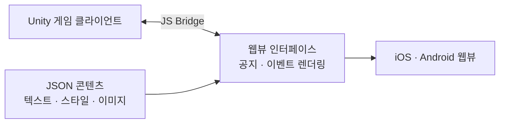

<a id="top"></a>

# 챔프포커 웹뷰

> **Case Study**
> Unity 웹보드 게임의 웹뷰 인터페이스 프론트엔드

[`← 경력 상세로`](../experience.md) &nbsp;·&nbsp; [`사이트 ↗`](https://champpoker.co.kr/)

---

## A. Executive Summary

Unity로 만든 웹보드 게임 안에서 **공지·이벤트를 보여주는 웹뷰 인터페이스**를 담당했습니다.

이 프로젝트의 값어치는 화면 자체가 아니라 **배포 주기를 분리한 것**입니다. 게임 클라이언트는 스토어 심사를 거쳐야 나가지만, 이벤트 콘텐츠는 훨씬 자주 바뀝니다. 콘텐츠를 웹뷰로 빼면 **게임 클라이언트 배포를 기다리지 않고 이벤트를 개편**할 수 있습니다.

여기에 더해 콘텐츠 자체를 JSON으로 분리해, **웹뷰 코드 변경 없이도** 텍스트·스타일·이미지를 바꿀 수 있게 했습니다.

---

## 01. Project Overview

```text
PROJECT      챔프포커 웹뷰
ONE-LINER    Unity 웹보드 게임 안에서 공지·이벤트를 렌더링하는 웹뷰 인터페이스
PROBLEM      이벤트 개편이 게임 클라이언트 배포 주기에 묶여 있다
SOLUTION     콘텐츠를 웹뷰로 분리하고, 콘텐츠 자체도 JSON 으로 코드에서 분리
ROLE         웹뷰 프론트엔드 개발
STACK        HTML/CSS · JavaScript · JS Bridge · Unity WebView
```

| | |
|---|---|
| **기간** | `2025.01 – 2025.08` |
| **지원 환경** | iOS · Android 웹뷰 |

---

## 02. Problem Definition

```text
현재 상황
  이벤트 안내·공지가 게임 클라이언트 안에 들어 있다

      ↓
문제
  이벤트를 하나 바꾸려면 게임 클라이언트를 다시 빌드하고 스토어 심사를 기다려야 한다

      ↓
원인
  변경 주기가 다른 것(게임 로직 vs 이벤트 콘텐츠)이 같은 배포 단위에 묶여 있다

      ↓
비즈니스 영향
  이벤트 기획이 배포 일정에 종속되어, 시의성 있는 운영이 어렵다

      ↓
해결해야 할 핵심 문제
  변경 주기가 다른 것을 다른 배포 단위로 분리한다
```

> 💡 이 문제 구조는 승부사의 Remote Config와 같습니다: **"바꾸는 데 배포가 필요한가"**가 판단 기준입니다.

---

## 03. Research & Discovery

> ⚠️ 사용자 조사는 수행하지 않았습니다. 요구는 게임 운영팀의 이벤트 개편 주기에서 나왔고, **기기별 웹뷰 환경 테스트**는 직접 수행했습니다.

---

## 15. Architecture



**두 겹의 분리**

| 겹 | 분리한 것 | 효과 |
|---|---|---|
| ① | 게임 클라이언트 ↔ 웹뷰 | 스토어 심사 없이 콘텐츠 갱신 |
| ② | 웹뷰 코드 ↔ JSON 콘텐츠 | 코드 수정 없이 텍스트·스타일·이미지 변경 |

---

## 14. Core Feature Deep Dive - JS Bridge ↔ Unity WebView 연동

### Problem

웹뷰는 게임 안에 떠 있지만, 게임의 상태(로그인 정보·보유 재화 등)를 알아야 제대로 된 안내를 할 수 있습니다. 반대로 웹뷰에서 누른 동작이 게임으로 전달돼야 합니다.

### Solution

JS Bridge로 양방향 통신을 구현했습니다. 웹에서 네이티브(Unity) 기능을 호출하고 콜백을 받는 구조입니다.

### 어려웠던 지점

| 문제 | 대응 |
|---|---|
| **비동기 콜백 수명 관리** | 호출과 응답 사이에 웹뷰가 닫히거나 화면이 전환되는 경우 처리 |
| **기기별 렌더링 차이** | iOS/Android 웹뷰의 뷰포트·스크롤·입력 이슈를 기기별로 대응 |
| **스타일 일관성** | 해상도 차이를 흡수하는 웹뷰 스타일 가이드를 정의 |

### Trade-off

웹뷰는 네이티브보다 반응성이 떨어지고, 기기 파편화를 그대로 떠안습니다. 대신 **배포 주기 분리**라는 이득이 그 비용보다 컸습니다.

---

## 23. Implementation - 콘텐츠를 코드에서 뺀다

텍스트·스타일·이미지 요소를 **JSON 기반으로 분리 관리**해, 코드 변경 없이 콘텐츠를 반영하도록 구조화했습니다.

```text
BEFORE   콘텐츠가 마크업에 하드코딩
         → 문구 하나 바꾸려면 코드 수정 · 배포

AFTER    JSON 에 텍스트 · 스타일 · 이미지 선언
         → 웹뷰는 JSON 을 읽어 렌더링만 함
```

**대가** - JSON 스키마가 곧 계약이 되므로, 표현할 수 없는 레이아웃 요청이 오면 스키마를 확장해야 합니다. 자유도와 안정성의 트레이드오프입니다.

---

## 27. Result

| 항목 | 내용 |
|---|---|
| 배포 주기 분리 | 게임 클라이언트 배포와 무관하게 **콘텐츠만 갱신** 가능 |
| 콘텐츠 관리 | JSON 기반 - 코드 변경 없이 반영 |
| 지원 환경 | iOS · Android 웹뷰 (기기별 이슈 대응) |

> ⚠️ **정량 지표(이벤트 개편 리드타임 단축 등)는 측정하지 않았습니다.**

---

## 29. Reflection

**잘한 것** - 화면을 만드는 일로 접근하지 않고 **배포 단위 문제로 봤습니다.** "웹뷰로 만든다"는 기술 선택이 아니라 "변경 주기가 다른 것을 분리한다"는 구조 판단이었습니다.

**부족한 것** - 개편 리드타임이 실제로 얼마나 줄었는지 측정하지 않았습니다. 그리고 JSON 스키마를 설계할 때 확장 시나리오를 충분히 고려하지 않아, 새 레이아웃 요청마다 스키마를 손봐야 했습니다.

**배운 것**: 하이브리드(웹뷰) 선택의 진짜 이유는 대개 "개발이 편해서"가 아니라 **"배포가 분리돼서"**입니다. 그 이득이 기기 파편화 비용보다 큰지가 판단 기준입니다.

---

## F. Portfolio Summary

```text
PROBLEM     이벤트 개편이 게임 클라이언트 스토어 심사 주기에 묶여 있다
SOLUTION    콘텐츠를 웹뷰로 분리 + 콘텐츠 자체도 JSON 으로 코드에서 분리
MY ROLE     웹뷰 프론트엔드 개발
KEY POINT   JS Bridge ↔ Unity WebView 양방향 연동 · 비동기 콜백 수명 관리
            기기별 렌더링 차이를 흡수하는 스타일 가이드 정의
STACK       HTML/CSS · JavaScript · JS Bridge · Unity WebView
RESULT      게임 클라이언트 배포 주기와 무관하게 콘텐츠 갱신 가능
```

---

<p align="right">

[`← 경력 상세로`](../experience.md) &nbsp;·&nbsp; [↑ 맨 위로](#top)

</p>
