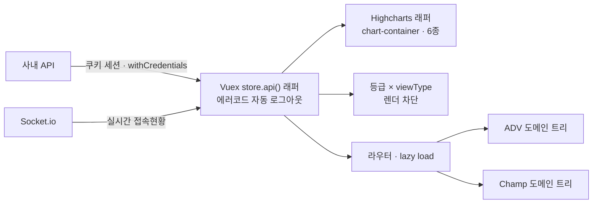

<a id="top"></a>

# 사내 매출 통계 대시보드

> **Case Study** · 사내 시스템
> 두 도메인의 매출·유저·게임 데이터를 실시간 시각화하는 어드민 리포트

[`← 경력 상세로`](../experience.md)

---

## A. Executive Summary

스포츠 베팅(ADV)과 포커(Champ) **두 플랫폼의 데이터를 하나의 어드민에서** 보는 리포트 대시보드입니다.

이 프로젝트의 핵심 과제는 차트를 그리는 것이 아니라 **"누가 무엇까지 볼 수 있는가"**였습니다. 매출·고수익 위험 지표는 조직 안에서도 열람 범위가 다른데, 대시보드는 기본적으로 모든 데이터를 한 화면에 모으는 도구입니다. 이 둘이 충돌합니다.

그래서 접근 제어를 **CSS로 숨기는 방식이 아니라 렌더링 자체를 차단**하는 방식으로 설계했습니다. 숨기면 DOM에는 남고, 개발자 도구를 열면 보입니다.

---

## 01. Project Overview

```text
PROJECT      사내 매출 통계 대시보드 (ADV · Champ)
ONE-LINER    두 플랫폼의 매출·유저·게임 데이터를 실시간 시각화하는 어드민 리포트
PROBLEM      데이터를 한 화면에 모으면서도 열람 권한은 등급별로 달라야 한다
SOLUTION     도메인 격리 + 이중 권한(등급 × viewType) 렌더 차단
ROLE         프론트엔드 단독 설계 · 개발
STACK        Vue 2.7 · Vuex 3 · Vuetify · Highcharts 10 · Socket.io · Firebase Hosting
```

| | |
|---|---|
| **기간** | `2023.03 – 2025.08` |
| **규모** | 컴포넌트 30 · 차트 6종 · 상세 다이얼로그 14종 |
| **환경** | dev · qa · prod 3환경 분리 빌드 |

---

## 02. Problem Definition

```text
현재 상황
  스포츠 베팅과 포커가 별개 플랫폼인데, 경영 지표는 함께 봐야 한다

      ↓
사용자가 겪는 문제
  ① 두 플랫폼 지표를 보려면 서로 다른 도구를 오가야 한다
  ② 실시간 접속 현황은 별도 확인이 필요하다
  ③ 민감 지표가 열람 권한이 없는 사람에게도 노출될 위험

      ↓
원인
  데이터가 도메인별로 나뉘어 있고, 권한 체계가 화면 단위로만 존재한다

      ↓
해결해야 할 핵심 문제
  두 도메인을 한 도구에서 보되, 데이터는 격리하고 열람은 등급으로 통제한다
```

---

## 03. Research & Discovery

> ⚠️ **사용자 조사는 수행하지 않았습니다.** 요구사항은 사내 운영·경영 담당자의 요청과 기능 기획 과정에서 도출했습니다.

---

## 06. UX & Product Insight

```text
Finding
  민감 지표를 CSS 로 숨기면 DOM 에는 남고, 개발자 도구로 볼 수 있다.

Insight
  "보이지 않는다"와 "없다"는 완전히 다르다.
  사내 도구라고 해서 접근 제어가 느슨해도 되는 것은 아니다.

Opportunity
  권한을 표현(display) 단계가 아니라 렌더 단계에서 처리한다.

Requirement
  권한 조건을 만족하지 않으면 컴포넌트를 아예 렌더링하지 않는다.
```

```text
Finding
  두 도메인 데이터를 한 스토어에 섞으면 탭 전환 시 이전 도메인 값이 잔상으로 남는다.

Insight
  "같은 화면에서 본다"가 "같은 데이터 구조를 쓴다"를 뜻하지는 않는다.

Requirement
  인증은 공유하되 데이터 구조는 도메인별로 격리한다.
```

---

## 09. Information Architecture

```text
대시보드
├── (공유) 로그인 · 인증
├── ADV - 스포츠 베팅 도메인 트리
│   ├── 매출 · 베팅 통계
│   ├── 유저 통계
│   └── 상세 다이얼로그
└── Champ - 포커 도메인 트리
    ├── 매출 · 게임 통계
    └── 상세 다이얼로그
```

Layout → dashboard → 도메인별 트리로 **컴포넌트 30개를 계층 구성**했습니다. 도메인 트리를 분리해 한쪽이 커져도 다른 쪽에 영향이 없게 했습니다.

---

## 15. Architecture



---

## 14. Core Feature Deep Dive - 이중 권한 접근 제어

### Problem

매출·고수익 위험 차트 같은 민감 지표는 조직 안에서도 열람 범위가 다릅니다. 그런데 대시보드는 본질적으로 모든 데이터를 한 화면에 모으는 도구입니다.

### Business Logic - 등급 × viewType

권한을 두 축으로 나눴습니다.

| 축 | 의미 |
|---|---|
| **Grade** | 권한 레벨 - 이 사람이 어디까지 볼 수 있는가 |
| **viewType** | 가시성 - 이 화면 맥락에서 무엇을 보여줄 것인가 |

두 조건을 모두 만족해야 렌더링합니다. 축을 하나만 두면 "권한은 있는데 이 화면에서는 안 보여야 하는" 경우를 표현할 수 없습니다.

### 핵심 결정 - 숨기는 게 아니라 안 그린다

```text
Decision   권한 미달 시 컴포넌트를 렌더링하지 않는다 (v-if 계열)
Reason     display:none 이나 visibility 로 숨기면 DOM 에 남고 개발자 도구로 보인다
Trade-off  탭·권한 전환 시 컴포넌트가 재생성되어 상태가 초기화된다
```

### 세션 유지

권한 정보를 **Vuex + localStorage 이중 저장**해, 새로고침 후에도 권한 판정이 유지되게 했습니다.

> ⚠️ **한계**: 프론트엔드 렌더 차단은 UI 방어선이지 보안 경계가 아닙니다. **API 응답 자체에서 민감 필드가 걸러져야** 완결됩니다. 이 프로젝트에서 서버 측 필터링까지 제가 설계하지는 않았습니다.

---

## 14-B. Core Feature - Vuex 커스텀 API 래퍼

반복되는 HTTP 처리를 `store.api()` 하나로 모았습니다.

| 처리 | 내용 |
|---|---|
| 인증 | 쿠키 세션 + `withCredentials`, 앱 시작 시 토큰 자동 복원 |
| 자동 로그아웃 | 에러 코드 `S002` 감지 시 세션 정리 후 로그아웃 |
| 파일 다운로드 | `Content-Disposition` 감지 시 다운로드로 자동 분기 |

**왜 래퍼로 모았는가** - 이 세 가지는 모든 요청에 해당하는데, 각 컴포넌트에서 처리하면 한 곳만 빠뜨려도 세션이 꼬입니다.

---

## 20. Frontend Architecture

```text
Layout
 ↓
Dashboard
 ↓
도메인 트리 (ADV / Champ)
 ↓
Component (차트 · 다이얼로그) - 권한 조건 만족 시에만 렌더
 ↓
Vuex (store.api 래퍼 · 권한 · 소켓)
```

### 차트 - 재사용 래퍼

`chart-container` 래퍼로 **동적 `chartId` 기반 6개 차트 인스턴스**를 관리합니다. 일별 베팅·유저 수, 월별 결제, 헤비 유저 등이 같은 래퍼를 씁니다.

- 한국식 천 단위 로케일 커스텀
- 차트 클릭 → 상세 데이터 다이얼로그 14종 연동

### 실시간 접속 현황

Socket.io 전역 인스턴스로 현재 접속자 + 일·주·월·전체 최대 접속 수를 실시간 표시하고 연결 상태를 감지합니다.

---

## 22. Infrastructure / DevOps

| 항목 | 내용 |
|---|---|
| **환경 분리** | dev · qa · prod webpack 완전 분리 (`baseURL` · `BUILD_ENV` 주입) |
| **번들 최적화** | 벤더 청크 분리 + 라우트 단위 lazy loading |
| **배포** | Firebase Hosting SPA rewrites로 History 모드 |
| **리포트 내보내기** | FileSaver.js - CSV / Excel |

---

## 27. Result

| 항목 | 값 |
|---|---|
| 컴포넌트 | 30 (계층 구성) |
| 차트 | 6종 (재사용 래퍼) |
| 상세 다이얼로그 | 14종 |
| 도메인 | 2개 (ADV · Champ) 격리 |
| 빌드 환경 | 3 (dev · qa · prod) |

> ⚠️ **사용률·조회 성능 등 정량 지표는 측정하지 않았습니다.** 사내 도구이며 트래픽 지표는 회사 자산입니다.

---

## 29. Reflection

**잘한 것** - 권한을 표현이 아니라 렌더 단계에서 끊은 판단입니다. 사내 도구라 느슨하게 갈 수도 있었지만, "숨김"과 "없음"의 차이를 지켰습니다.

**부족한 것** - **프론트엔드 렌더 차단만으로는 완결되지 않습니다.** API 응답에서 민감 필드를 거르는 서버 측 필터링까지 함께 설계했어야 합니다. 이건 프론트엔드 범위를 넘는 일이었지만, 최소한 요구로 제기했어야 합니다.

**배운 것**: 권한은 축이 하나면 표현력이 부족합니다. 등급(누가)과 맥락(어디서)을 나눠야 실제 조직의 열람 규칙을 담을 수 있었습니다.

---

## F. Portfolio Summary

```text
PROBLEM     두 플랫폼 데이터를 한 화면에서 보되, 열람 권한은 등급별로 달라야 한다
SOLUTION    도메인 격리 + 등급 × viewType 이중 권한 렌더 차단
MY ROLE     프론트엔드 단독 설계 · 개발
KEY POINT   민감 지표를 숨기는 것이 아니라 렌더링 자체를 차단
            (한계: 서버 측 응답 필터링까지는 미설계)
STACK       Vue 2.7 · Vuex 3 · Vuetify · Highcharts 10 · Socket.io · Firebase
RESULT      컴포넌트 30 · 차트 6종 · 다이얼로그 14종 · 3환경 빌드 분리
```

---

<p align="right">

[`← 경력 상세로`](../experience.md) &nbsp;·&nbsp; [↑ 맨 위로](#top)

</p>
