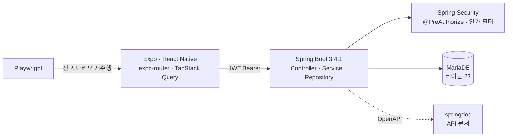
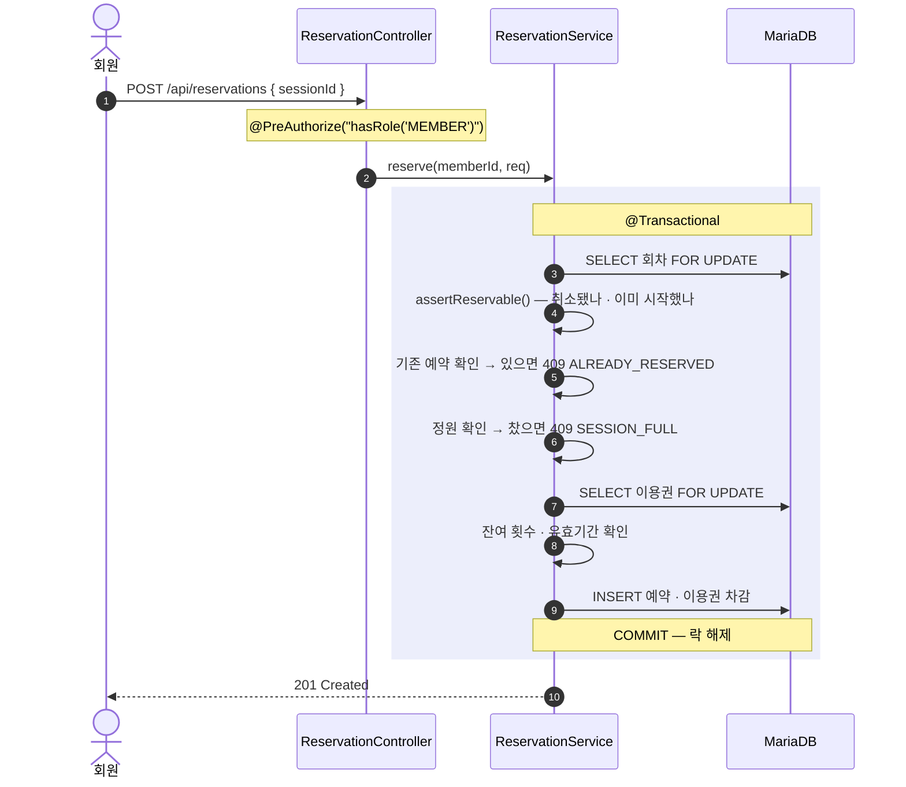

<a id="top"></a>

# 짐꽁 — 피트니스 수업 예약·출석·결제 관리

> **End-to-End Product Case Study**
> 문제 정의 → 요구사항 → 시스템 설계 → 구현 → 검증 → 결과

[`← 경력 상세로`](../experience.md) &nbsp;·&nbsp; [`저장소 ↗`](https://github.com/beyond-sw-camp/be23-1st-team1-GymKKong)

---

## A. Executive Summary

피트니스 센터의 지점·회원·트레이너를 통합 관리하는 **수업 예약·출석·결제 시스템**입니다. 회원은 이용권을 사서 수업을 예약하고, 트레이너는 강습을 열고 출석을 체크하며, 관리자는 지점과 환불을 관리합니다.

이 도메인의 난이도는 기능 수가 아니라 **세 역할이 같은 자원을 다른 권한으로 만진다**는 점, 그리고 **정원이 한 자리 남았을 때 두 사람이 동시에 누른다**는 점에 있습니다. 이 둘을 어떻게 다루느냐가 예약 시스템의 신뢰도를 결정합니다.

인증 주체를 하나로 두고, 예약을 한 트랜잭션에서 락으로 직렬화하고, 권한 강제 지점을 네 층으로 나눠 문서화했습니다. 그리고 그 흐름이 실제로 돈다는 것을 **E2E 28/28 · 스모크 22/22**와 **재생 가능한 증적**으로 남겼습니다.

<sub>실측 기준 — 저장소 직접 파싱(`git shortlog` · 애노테이션 수 · 테스트 수).
`main` 기준 100커밋 중 **73커밋**이 제 커밋입니다.</sub>

---

## 01. Project Overview

```text
PROJECT
짐꽁 (GymKKong)

ONE-LINER
피트니스 센터의 수업 예약 · 출석 · 결제를 회원 · 트레이너 · 관리자 세 역할이
하나의 앱에서 처리하는 통합 관리 시스템

PROBLEM
세 역할이 같은 자원(수업 · 예약 · 이용권)을 다른 권한으로 만지고,
인기 수업의 마지막 한 자리에서 동시 요청이 겹친다

SOLUTION
인증 주체를 하나로 두고 권한 강제를 4층으로 분리 ·
예약을 한 트랜잭션에서 락으로 직렬화 ·
전 시나리오를 E2E 로 재현 검증

ROLE
백엔드 · 앱 · 데이터 모델 · 검증 체계 (팀 3인 중 커밋 73/100)

STACK
Backend   Java · Spring Boot 3.4.1 · Spring Data JPA · Spring Security · JWT
Database  MariaDB
App       Expo · React Native · expo-router · TanStack Query · react-native-web
Test      Playwright (E2E) · 스모크 스크립트
Infra     Docker Compose
```

| | |
|---|---|
| **기간** | `2025.12 – 2026.08` · 한화 SW CAMP |
| **팀** | 3인 · `main` 100커밋 중 **73커밋** 기여 |
| **백엔드** | Java 76파일 · 컨트롤러 7 · **엔드포인트 68** · 엔티티 22 · 서비스 8 |
| **앱** | TS/TSX 33파일 |
| **DB** | 테이블 **23** |
| **검증** | E2E 스펙 3 · 테스트 31 · **E2E 28/28 · 스모크 22/22** |
| **문서** | mermaid 다이어그램 **34개** · 화면정의서 22장 |

---

## 02. Background & Problem Definition

### Business Context

피트니스 센터 운영은 예약·출석·결제가 서로 물려 있습니다. 회원이 수업을 예약하면 이용권 잔여가 줄고, 취소하면 복원돼야 하며, 정원을 넘겨 받으면 현장에서 사고가 납니다. 이 계산이 어긋나면 곧바로 금전 문제가 됩니다.

### Problem Statement

```text
현재 상황
  지점 · 회원 · 트레이너 · 수업 · 이용권 · 결제가 각각 따로 관리된다

      ↓
사용자가 겪는 문제
  ① 회원  — 잔여 횟수와 예약 가능 여부를 한눈에 알 수 없다
  ② 트레이너 — 강습별 예약 현황과 출석을 수기로 관리한다
  ③ 관리자 — 지점별 결제 · 환불 이력이 흩어져 있다

      ↓
문제가 발생하는 원인
  세 역할이 같은 자원을 다루는데, 그 자원을 담는 하나의 시스템이 없다

      ↓
비즈니스 영향
  정원 초과 · 중복 예약 · 이용권 오차가 현장 분쟁으로 이어진다

      ↓
해결해야 할 핵심 문제
  세 역할을 하나의 시스템에 담되,
  권한과 동시성을 구조로 보장한다
```

### 이 도메인의 진짜 난이도

| 어려운 지점 | 왜 |
|---|---|
| **권한** | 세 역할이 **같은 자원**을 만진다. 트레이너가 연 강습의 예약은 회원의 자원이고, 그 결제는 관리자의 자원이다 |
| **동시성** | 인기 수업의 마지막 한 자리. 둘 다 성공하면 정원 초과, 둘 다 실패하면 불필요한 거절 |
| **되돌리기** | 예약 취소는 이용권 복원을 동반한다. 한쪽만 되면 데이터가 깨진다 |

---

## 03. Research & Discovery

> ⚠️ **사용자 인터뷰·설문·사용성 테스트는 수행하지 않았습니다.**
> 요구사항은 팀의 도메인 조사와 요구사항 명세로 정의했습니다.

---

## 04. User Definition

| Role | 목적 | 주요 행위 |
|---|---|---|
| **회원 (MEMBER)** | 원하는 시간에 수업을 듣는다 | 이용권 구매 · 수업 예약/취소 · 출석 확인 · 게시판 |
| **트레이너 (TRAINER)** | 강습을 열고 회원을 관리한다 | 강습 개설 · 예약 현황 조회 · 출석 체크 |
| **관리자 (ADMIN)** | 지점을 운영한다 | 지점·강습실 관리 · 결제/환불 승인 |

---

## 08. Feature Definition

### 수업 예약 · 취소

```text
Problem       정원 · 중복 · 이용권 잔여가 서로 얽혀 있어 한 곳만 틀려도 데이터가 깨진다
   ↓
Feature       한 트랜잭션에서 회차 잠금 → 검증 → 예약 생성 → 이용권 차감
              취소 시 이용권 복원
   ↓
Value         정원 초과와 중복 예약이 구조적으로 발생하지 않는다
```

### 이용권 구매 · 환불

```text
Problem       금전이 걸린 상태 전이라 되돌리기 비용이 크다
   ↓
Feature       구매·환불을 회원 전용으로 제한하고, 환불은 관리자 승인 경로로
   ↓
Value         권한 없는 주체가 금전 상태를 바꿀 수 없다
```

### 트레이너 강습 개설 · 출석

```text
Problem       강습은 트레이너가 열지만, 그 강습의 예약은 회원의 자원이다
   ↓
Feature       역할별로 접근 가능한 자원과 액션을 분리
   ↓
Value         같은 엔드포인트라도 역할에 따라 다루는 범위가 달라진다
```

---

## 15. System Architecture



| 레이어 | 선택 | 이유 |
|---|---|---|
| 앱 | Expo / React Native | 모바일이 주 사용처. `react-native-web`으로 **동일 코드를 브라우저에서 E2E 검증** |
| 서버 상태 | TanStack Query | 예약 후 시간표·이용권·알림이 함께 바뀜 → 무효화를 한 곳에서 관리 |
| 인증 | JWT + `expo-secure-store` | 무상태 인증. 토큰은 안전 저장소에 |
| 인가 | Spring Security `@PreAuthorize` | 권한 검사를 비즈니스 로직에서 분리 |
| DB | MariaDB | 관계형 제약(유일키·FK)을 정합성 보증에 적극 사용 |

---

## 16. Architecture Decision

### ADR-1 · 인증 주체를 하나로

```text
Problem   회원 · 트레이너 · 관리자 세 역할이 같은 앱에 로그인한다.
          JWT 의 subject 가 무엇을 가리켜야 하는가?

Options
  (A) 역할별 사용자 테이블 3종   얻는 것: 역할별 속성을 바로 담을 수 있음
                                 잃는 것: 토큰 검증이 역할마다 갈라지고 역할 겸임 불가
  (B) 단일 테이블에 모든 속성    얻는 것: 조인 없음
                                 잃는 것: 역할별로 안 쓰는 컬럼이 대량 발생
  (C) app_user + 역할별 프로필 ✓

Decision  app_user 하나가 인증을 책임지고 role 컬럼으로 구분한다.
          역할별 속성은 member_profile · trainer_profile · place_admin 이 갖는다.
          JWT 의 subject 는 app_user.id 하나로 고정된다.

Reason    인증 주체가 하나여야 토큰 설계가 단순해진다.
          한 사람이 회원이면서 트레이너인 경우도 표현할 수 있다.

Trade-off 프로필 조회에 조인이 한 번 더 붙는다.
```

### ADR-2 · 동시성 — 락과 유일키 두 겹

```text
Problem   정원이 1자리 남았을 때 두 사람이 동시에 예약을 누른다.

Options
  (A) 애플리케이션 카운터 검사   얻는 것: 단순
                                 잃는 것: 조회와 갱신 사이에 경합 창 (정원 초과)
  (B) 낙관적 락(버전)            얻는 것: 락 대기 없음
                                 잃는 것: 인기 수업은 충돌이 잦아 재시도가 폭증
  (C) 비관적 락 + 유일키 ✓

Decision  두 겹으로 막는다.
          1차  SELECT ... FOR UPDATE  (회차 · 이용권) — 순서를 직렬화
          2차  UNIQUE (session_id, member_user_id) — 락을 벗어난 경로까지 차단

Reason    정확한 정원 관리가 이 기능의 본질이다.
          충돌 빈도가 높은 자원이라 낙관적 락은 재시도 비용이 더 크다.

교착 회피  락 순서를 항상 회차 → 이용권으로 고정한다.

오류 번역  2차에서 걸린 DataIntegrityViolationException 을 그대로 500 으로
          내보내지 않고 ALREADY_RESERVED 도메인 오류로 바꾼다.

Trade-off 처리량이 떨어진다. 락 대기가 생기고, 정원이 큰 수업일수록 손해다.
```

---

## 14. Core Feature Deep Dive — 수업 예약

### Business Logic

정원·중복·이용권이 서로 얽혀 있어 **하나의 트랜잭션**에서 처리합니다.



### 경합 상황에서 실제로 일어나는 일

```text
A: SELECT session FOR UPDATE   → 잠금 획득 (reserved 9/10)
B: SELECT session FOR UPDATE   → A 커밋까지 대기
A: increaseReserved() → 10/10
A: INSERT reservation · COMMIT
B: 잠금 인계 (reserved 10/10)
B: isFull() → 409 SESSION_FULL
```

**둘 다 성공하지도, 둘 다 실패하지도 않습니다.** 먼저 잠근 쪽이 성공하고 나중이 정확한 사유로 거절됩니다.

### 거절에도 이유가 있어야 한다

예약 실패 사유는 여러 가지입니다 — 이미 예약했거나, 정원이 찼거나, 이용권이 없거나, 수업이 이미 시작했거나. 전부 "예약 실패"로 내려보내면 사용자는 다음에 무엇을 해야 할지 모릅니다.

그래서 **사유를 코드로 구분**했고, DB 제약 위반도 500이 아니라 도메인 오류로 번역합니다.

### 취소 — 되돌리기

취소 시 예약 상태를 바꾸고 **이용권 잔여를 복원**합니다. 이때도 같은 락 순서(회차 → 이용권)를 지켜 교착을 피합니다.

---

## 14-B. Core Feature Deep Dive — RBAC 4단 방어

세 역할이 같은 자원을 다른 권한으로 만지므로, **어디에서 권한을 강제하는지**를 문서로 고정했습니다.

| 층 | 강제 지점 | 막는 것 |
|---|---|---|
| 1 | 앱 화면 | 역할에 없는 메뉴를 렌더하지 않음 |
| 2 | API 진입 (`@PreAuthorize`) | 역할이 다른 요청을 컨트롤러에서 차단 |
| 3 | 서비스 로직 | "내 자원인가" — 소유권 검증 |
| 4 | DB 제약 | 최종 차단 (유일키 등) |

**1층은 편의이지 방어가 아닙니다.** 앱에서 버튼을 안 그려도 API를 직접 호출하면 되므로, 실제 방어선은 2~4층입니다. 이 구분을 문서에 명시했습니다.

> 실제로 개발 중 **이용권 구매·환불이 회원 전용으로 제한되지 않은 것**을 발견해 고쳤습니다. 화면에는 버튼이 없었지만 API는 열려 있었습니다 — **1층만 있고 2층이 없던 사례**입니다. 4층으로 나눠 점검하지 않았으면 못 찾았을 구멍입니다.

---

## 25. QA / Testing

### E2E — 역할별 전 시나리오

```text
app/e2e/
├── 01-member.spec.ts     회원  — 로그인 · 예약 · 취소 · 구매 · 환불 · 게시판
├── 02-trainer.spec.ts    트레이너 — 강습 개설 · 예약 현황 · 출석
├── 03-admin.spec.ts      관리자 — 지점 관리 · 환불 승인
├── global-setup.ts       DB 리셋 + 시드
└── helpers.ts
```

Playwright로 `react-native-web` 빌드를 브라우저에서 구동해 **모바일 앱과 같은 코드**를 검증합니다.

| 구분 | 결과 |
|---|---|
| **E2E** | **28 / 28** |
| **스모크(API)** | **22 / 22** |
| 테스트 정의 수 | 31 |

### 재현 가능한 초기 상태

`db/reset-seed.sh`로 스키마 리셋 + 시드를 한 번에 돌립니다. E2E `global-setup`이 매 실행 전에 이걸 호출해, **테스트가 이전 실행의 잔여 상태에 의존하지 않습니다.**

### 증적 — 통과했다는 말 대신 기록

| 산출물 | 수량 |
|---|---|
| 시나리오 스크린샷 | **46장** |
| 시나리오 녹화 (mp4 · webm) | **58개** |
| Playwright HTML 리포트 | 저장소 포함 |

**녹화까지 저장소에 넣은 이유** — "테스트가 통과했다"는 문장은 읽는 사람이 검증할 수 없지만, 화면이 도는 영상은 열어보면 됩니다.

> ⚠️ **단위 테스트 커버리지는 측정하지 않았습니다.** 검증은 E2E·스모크 시나리오에 집중했습니다.

---

## 23. Implementation

### 흐름을 먼저 통과시키고 화면을 붙였다

스모크 스크립트(`backend/scripts/smoke-test.sh`)로 API 레벨에서 전 흐름을 먼저 통과시킨 뒤 앱을 연결했습니다. 화면부터 만들면 어디가 막힌 건지 좁히기 어렵습니다.

### 문서를 코드 옆에 뒀다

| 문서 | 내용 |
|---|---|
| `architecture.md` | 전체 구성 · 레이어 · 시퀀스 5종 · 동시성 · 검증 파이프라인 (mermaid 17) |
| `erd.md` | 데이터 모델 (mermaid 10) |
| `rbac.md` | 역할 · 4단 방어 · 권한 매트릭스 · **우회 시도와 차단** · 한계 (mermaid 7) |
| `schema-v2.md` | 스키마 설계 근거 |
| `화면정의서.pdf` | 22장 |

`rbac.md`에 **"우회 시도와 차단"** 절을 따로 둔 것이 실제로 도움이 됐습니다. "이 경로로 들어오면 막히는가"를 목록으로 두니 빠진 층이 보였습니다.

---

## 27. Result

| 항목 | 값 | 확인 방법 |
|---|---|---|
| 커밋 기여 | **73 / 100** (`main`) | `git shortlog` |
| 백엔드 | Java 76파일 · 컨트롤러 7 · **엔드포인트 68** · 엔티티 22 | 애노테이션 실측 |
| 앱 | TS/TSX 33파일 | 파일 수 실측 |
| DB | 테이블 **23** | `CREATE TABLE` 실측 |
| E2E | **28 / 28** | Playwright 리포트 |
| 스모크 | **22 / 22** | 스모크 스크립트 |
| 증적 | 스크린샷 46 · 녹화 58 | 저장소 포함 |
| 문서 | mermaid **34개** · 화면정의서 22장 | 실측 |

> ⚠️ **사용자 수·성능 지표는 없습니다.** 교육 과정 프로젝트이며 실서비스 운영 단계가 아닙니다.
> ⚠️ **동시성은 설계와 코드로 보장했으나 부하를 걸어 측정하지는 않았습니다.**

---

## 29. Reflection

### 무엇을 잘했는가

**정확성이 본질인 지점에서 처리량을 내줬습니다.** 예약은 빠른 것보다 정확한 것이 중요합니다. 비관적 락은 처리량 손해가 분명하지만, 정원 초과가 나면 그건 현장 분쟁입니다. 무엇을 지킬지 먼저 정하고 그 대가를 받아들였습니다.

**권한을 층으로 나눠 문서화했습니다.** 그 덕분에 "화면에는 버튼이 없는데 API는 열려 있는" 구멍을 발견해 고칠 수 있었습니다. 층을 나누지 않았으면 "화면에서 안 보이니 괜찮다"로 넘어갔을 겁니다.

**증명 가능한 형태로 남겼습니다.** E2E 결과를 숫자로만 적지 않고 스크린샷 46장과 녹화 58개를 저장소에 넣었습니다.

### 무엇이 부족했는가

**단위 테스트가 없습니다.** E2E는 흐름을 보장하지만 느리고, 깨졌을 때 어디가 문제인지 좁혀주지 못합니다. 동시성 로직처럼 중요한 부분은 단위 테스트로 고정했어야 합니다.

**동시성을 부하로 검증하지 않았습니다.** 락 설계는 문서와 코드로 정리했지만, 실제로 동시 요청을 걸어 정원 초과가 안 나는지 측정하지 않았습니다. 지금은 "설계상 막힌다"까지입니다.

**권한 점검이 뒤늦었습니다.** 구매·환불의 역할 제한 누락은 개발 후반에 발견했습니다. 엔드포인트를 추가할 때마다 4층 체크리스트를 돌렸어야 합니다.

### 배운 것

| 관점 | 배운 것 |
|---|---|
| **동시성** | 정확성이 본질인 기능에서는 처리량을 내주고 락을 잡는 편이 낫다. 대신 **락 순서를 고정**해야 교착이 안 난다 |
| **오류 설계** | 실패에도 종류가 있다. DB 제약 위반을 그대로 500으로 올리면 사용자는 다음 행동을 정할 수 없다 |
| **보안** | 화면에서 안 보이는 것은 방어가 아니다. 실제 방어선은 API·서비스·DB에 있다 |
| **검증** | "통과했다"는 문장보다 **열어볼 수 있는 기록**이 강하다 |

---

## F. Portfolio Summary

```text
PROBLEM
  세 역할이 같은 자원(수업 · 예약 · 이용권)을 다른 권한으로 만지고,
  인기 수업의 마지막 한 자리에서 동시 요청이 겹친다

SOLUTION
  인증 주체를 하나로 두고 권한 강제를 4층으로 분리
  예약을 한 트랜잭션에서 락으로 직렬화 (FOR UPDATE + 유일키)
  전 시나리오를 E2E 로 재현 검증하고 증적을 저장소에 포함

MY ROLE
  백엔드 · 앱 · 데이터 모델 · 검증 체계 (팀 3인 중 커밋 73/100)

KEY DECISIONS
  app_user 단일 인증 주체 + 역할별 프로필 분리
  비관적 락 + 유일키 두 겹 · 락 순서 고정으로 교착 회피
  DB 제약 위반을 도메인 오류(ALREADY_RESERVED)로 번역
  RBAC 강제 지점을 4층으로 나눠 문서화

TECH STACK
  Java · Spring Boot 3.4.1 · Spring Data JPA · Spring Security · JWT · MariaDB
  Expo · React Native · expo-router · TanStack Query
  Playwright · Docker Compose

RESULT
  main 100커밋 중 73커밋 · 엔드포인트 68 · 테이블 23 ·
  E2E 28/28 · 스모크 22/22 · 증적(스크린샷 46 · 녹화 58) · mermaid 34
```

---

<p align="right">

[`← 경력 상세로`](../experience.md) &nbsp;·&nbsp; [↑ 맨 위로](#top)

</p>
