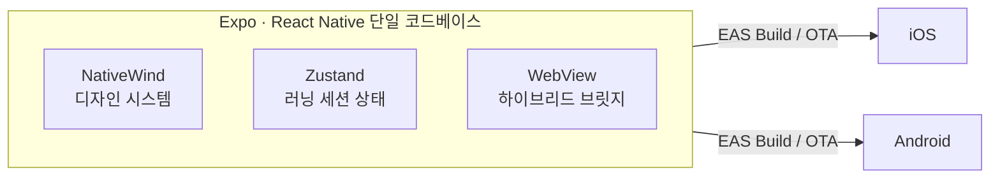

<a id="top"></a>

# 신규 사업부 모바일 러닝 MVP

> **Case Study**
> Expo / React Native 크로스 플랫폼 — 2개월 내 iOS · Android 동시 배포

[`← 경력 상세로`](../experience.md)

---

## A. Executive Summary

신규 사업부의 러닝 앱 MVP입니다. **2개월 안에 iOS와 Android 양쪽에 올려서 가설을 검증하는 것**이 목표였습니다.

MVP에서 중요한 것은 완성도가 아니라 **검증 사이클의 길이**입니다. 스토어 심사를 매번 기다리면 한 달에 두세 번밖에 못 고칩니다. 그래서 Expo/RN 단일 코드베이스로 양 플랫폼을 동시에 만들고, **EAS Build + OTA로 심사 없이 수정을 반영**할 수 있게 했습니다.

---

## 01. Project Overview

```text
PROJECT      신규 사업부 모바일 러닝 MVP
ONE-LINER    러닝 기록·세션을 다루는 모바일 앱 MVP (iOS · Android)
PROBLEM      신규 사업 가설을 2개월 안에 양 플랫폼에서 검증해야 한다
SOLUTION     크로스 플랫폼 단일 코드베이스 + OTA 로 검증 사이클 단축
ROLE         앱 구조 설계 · 코어 플로우 개발
STACK        Expo · React Native · TypeScript · Zustand · NativeWind · EAS
```

| | |
|---|---|
| **기간** | `2025.07 – 2025.08` (약 2개월) |
| **성격** | MVP — 가설 검증 |

---

## 02. Problem Definition

```text
현재 상황
  신규 사업부가 러닝 앱 가설을 검증하려 한다. 기한은 2개월

      ↓
문제
  ① 네이티브로 iOS · Android 를 따로 만들면 2개월 안에 불가능
  ② 만들어도 수정마다 스토어 심사를 기다리면 검증 횟수가 부족

      ↓
원인
  MVP 의 성패는 기능 수가 아니라 "몇 번 고쳐볼 수 있는가"에 달려 있는데
  배포 경로가 그 횟수를 제한한다

      ↓
해결해야 할 핵심 문제
  양 플랫폼을 동시에 만들고, 수정 반영 주기를 스토어에서 분리한다
```

---

## 03. Research & Discovery

> ⚠️ **사용자 조사·사용성 테스트는 수행하지 않았습니다.** MVP 범위와 코어 플로우는 사업부 요구에서 정의됐습니다.

---

## 07. Product Strategy — MVP Scope

```text
Business Goal   신규 사업 가설을 빠르게 검증한다
       ↓
Product Goal    코어 플로우(러닝 기록·세션)만 우선 완성한다
       ↓
Constraint      2개월 · 양 플랫폼 · 검증 반복 필요
       ↓
Decision        크로스 플랫폼 + OTA (완성도보다 반복 횟수 우선)
```

**무엇을 잘랐는가** — 플랫폼별 네이티브 최적화, 세밀한 애니메이션, 오프라인 동기화를 MVP 범위에서 제외했습니다. 가설 검증에 필요한 것은 러닝 세션이 제대로 기록되는가였습니다.

---

## 16. Architecture Decision — 왜 크로스 플랫폼인가

```text
Problem   2개월 안에 iOS · Android 양쪽에서 가설을 검증해야 한다

Options
  (A) 네이티브 2벌      얻는 것: 최고의 성능·플랫폼 일관성
                        잃는 것: 2개월에 불가능. 인력도 2배
  (B) 웹앱              얻는 것: 배포가 가장 빠름
                        잃는 것: 센서·백그라운드 등 러닝 앱 핵심 기능 제약
  (C) Expo / RN ✓       단일 코드베이스 + OTA

Decision  (C)

Reason    MVP 의 목적은 완성도가 아니라 검증 횟수다.
          OTA 로 스토어 심사를 우회할 수 있다는 점이 결정적이었다.

Trade-off ① 네이티브 대비 성능·플랫폼 고유 UX 손해
          ② Expo 관리형 워크플로의 제약 (네이티브 모듈 자유도)
          ③ 제품이 커지면 이 선택을 재검토해야 함
```

---

## 15. Architecture



---

## 20. Frontend Architecture

| 선택 | 이유 |
|---|---|
| **Zustand** | 러닝 세션 상태는 구조가 단순하다. MobX·Redux는 이 규모에 과함 |
| **NativeWind** | 스타일 일관성을 빠르게 확보 — MVP에서 디자인 시스템을 새로 만들 시간이 없음 |
| **WebView 하이브리드** | 웹 콘텐츠를 그대로 가져오고 네이티브 브릿지로 통신 — 중복 구현 회피 |
| **컴포넌트 단위 개발** | 기능을 작게 쪼개 빠르게 검증하고 재작업 리소스 최소화 |

> 💡 상태 관리 선택이 승부사(MobX 29 스토어)와 정반대인데, **규모와 요구가 달라서**입니다. 초당 여러 건의 실시간 이벤트가 없는 앱에서 MobX의 세밀한 반응성은 필요 없습니다.

---

## 22. Infrastructure / DevOps — 배포가 곧 전략

```text
개발 → EAS Build → 스토어 제출 (최초 · 네이티브 변경 시)
     → OTA 업데이트 → 심사 없이 즉시 반영 (JS 변경 시)
```

**OTA가 이 프로젝트의 핵심입니다.** JS 레이어 수정은 스토어 심사 없이 반영되므로, 검증 → 수정 → 재검증 주기가 며칠이 아니라 몇 시간이 됩니다.

> ⚠️ **한계** — OTA는 JS 레이어만 갱신합니다. 네이티브 모듈이 바뀌면 스토어 제출이 필요하고, 스토어 정책상 OTA로 바꿀 수 있는 범위에도 제약이 있습니다.

---

## 27. Result

| 항목 | 내용 |
|---|---|
| **2개월 내 iOS · Android 동시 배포** | 단일 코드베이스로 달성 |
| 배포 사이클 | OTA로 스토어 심사 없이 수정 반영 |
| 구조 | 크로스 플랫폼 단일 코드베이스 |

> ⚠️ **사용자 수·리텐션 등 MVP 검증 지표는 이 문서에 없습니다.** 사업부 자산이며 제 담당 범위(개발) 밖입니다.

---

## 29. Reflection

**잘한 것** — 기술 선택을 "무엇이 좋은가"가 아니라 **"MVP에서 무엇이 병목인가"**로 판단했습니다. 병목은 개발 속도가 아니라 배포 주기였고, OTA가 그걸 풀었습니다.

**부족한 것** — MVP가 검증하려던 가설이 실제로 검증됐는지는 제가 확인하지 못했습니다. 만드는 사람이 검증 지표까지 따라가지 않으면, 결국 "만들었다"까지만 남습니다.

**배운 것** — 상태 관리든 프레임워크든 **정답은 규모와 요구에 따라 달라집니다.** 같은 사람이 같은 해에 MobX 29 스토어와 Zustand를 둘 다 쓴 이유가 그것입니다.

---

## F. Portfolio Summary

```text
PROBLEM     신규 사업 가설을 2개월 안에 양 플랫폼에서 검증해야 한다
SOLUTION    Expo/RN 단일 코드베이스 + EAS Build · OTA 로 검증 사이클 단축
MY ROLE     앱 구조 설계 · 러닝 코어 플로우 개발
KEY POINT   병목이 개발 속도가 아니라 배포 주기임을 파악하고 OTA 를 도입
STACK       Expo · React Native · TypeScript · Zustand · NativeWind · EAS
RESULT      2개월 내 iOS · Android 동시 배포 · 스토어 심사 없이 수정 반영
```

---

<p align="right">

[`← 경력 상세로`](../experience.md) &nbsp;·&nbsp; [↑ 맨 위로](#top)

</p>
