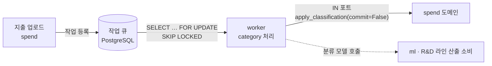
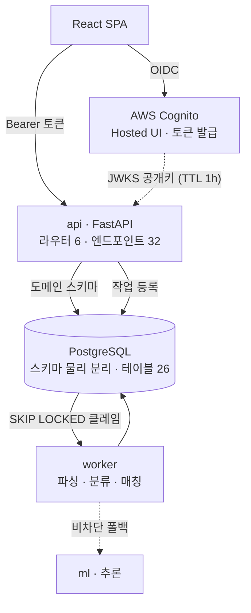
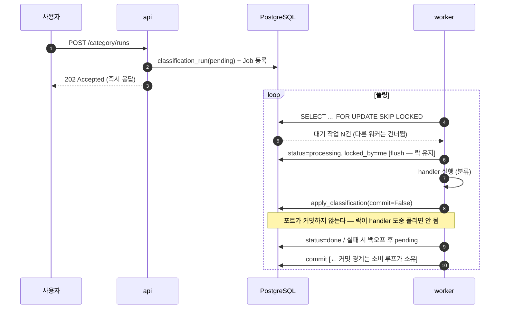
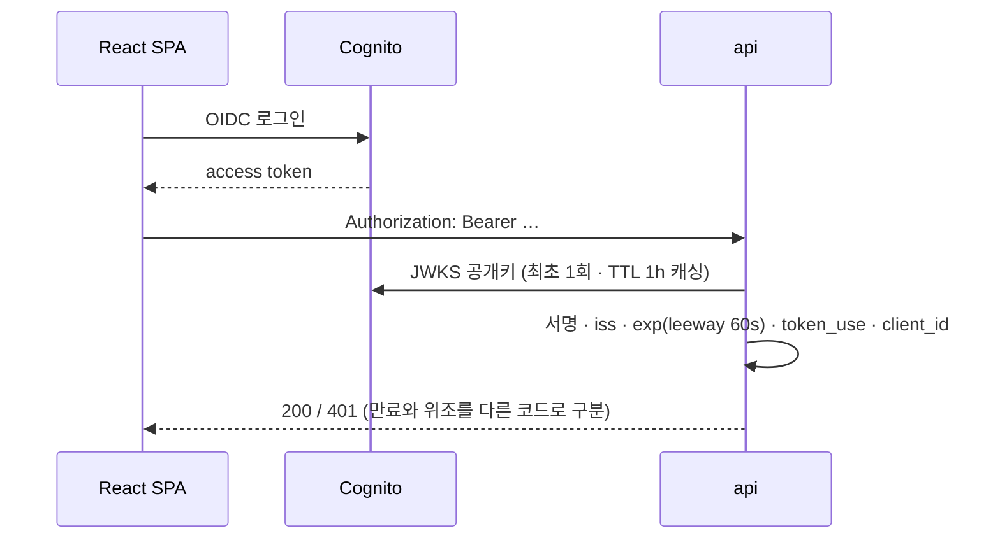

<a id="top"></a>

# PLYN — AI-Native SRM 플랫폼

> **End-to-End Product Case Study**
> 문제 정의 → 요구사항 → UX → 시스템 설계 → 구현 → 검증 → 결과

[`← 경력 상세로`](../experience.md) &nbsp;·&nbsp; [`사이트 ↗`](https://plynai.com)

---

## A. Executive Summary

기업의 구매 지출 데이터를 받아 **품목을 표준 체계로 분류하고 → 절감 기회를 찾고 → 공급사를 매칭·선정**하는 B2B SaaS입니다. 2026년 6월부터 8월까지 3개월간 기획·설계·개발·QA를 단독으로 수행했습니다.

이 프로젝트의 중심 과제는 기능을 많이 만드는 것이 아니라 **9개 도메인을 혼자 3개월에 다루면서도 나중에 분해할 수 있는 구조를 남기는 것**이었습니다. 그래서 물리적으로는 모놀리스, 논리적으로는 MSA 규약이라는 절충을 택했고, 그 규약이 지켜지는지를 사람이 아니라 CI 게이트가 검사하게 만들었습니다.

결과적으로 Phase 1에서 5개 도메인을 구현했고(설계는 9종), REST 엔드포인트 32종·도메인 테이블 26개·테스트 308개를 남겼습니다. 도메인 경계 위반은 `import-linter` 계약 2건이 커밋 전에 잡고, 물리 FK가 없다는 사실은 테스트가 단언합니다.

<sub>모든 수치는 제품 저장소 백업 스냅샷(2026-08-20)을 직접 파싱해 확인한 값입니다.
제품 내부 구성·데이터 모델 상세는 전 직장 자산이므로 이 문서에서는 설계 판단 위주로 정리했습니다.</sub>

---

## 01. Project Overview

```text
PROJECT
PLYN — AI-Native SRM (Supplier Relationship Management)

ONE-LINER
기업 구매 지출을 분류·분석해 절감 기회를 찾아내고, 그에 맞는 공급사를 매칭·선정까지 잇는 B2B SaaS

PROBLEM
구매 데이터가 표준화되지 않아 "무엇을 얼마에 사고 있는지"가 집계되지 않고,
그래서 절감 기회도 공급사 선택도 담당자의 경험에 의존한다

SOLUTION
지출 인테이크 → 품목 분류 → 절감 발굴 → 공급사 매칭·선정을 하나의 실행 시스템으로 연결하고,
각 단계의 산출에 판단 근거를 함께 붙인다

TARGET
제조·유통 기업의 구매팀 (실무 담당자 · 구매 관리자)

ROLE
기획 · 설계 · 개발 · QA 단독 전담 (엔지니어 1인)

STACK
Backend        Python · FastAPI · SQLAlchemy 2.0 · Alembic
Database       PostgreSQL (도메인별 스키마 물리 분리)
Auth           AWS Cognito (Resource Server)
Frontend       React SPA
Infra          Docker Compose · Terraform · AWS
AI             LLM 프로바이더 추상화 (품목 분류 R&D 라인)
```

| | |
|---|---|
| **기간** | 2026.06 – 2026.08 (3개월) |
| **팀 구성** | 엔지니어 1인(본인) + 기획·디자인 협업, 품목 분류 R&D는 별도 라인 |
| **배포 단위** | `api` · `worker` · `ml` 3개 |
| **플랫폼** | Web (데스크톱 우선) |

---

## 02. Background & Problem Definition

### Business Context

기업 구매(Procurement)에서 절감 컨설팅은 전통적으로 사람이 한다. 컨설턴트가 지출 데이터를 받아 엑셀로 정리하고, 품목을 분류하고, 단가를 비교해 절감 후보를 뽑는다. 이 과정이 **프로젝트 단위로 반복**되고, 끝나면 분류 기준과 판단 근거가 담당자와 함께 사라진다.

### Existing Process — As-Is

```text
고객사 ERP 지출 데이터 export (엑셀)
        ↓
컨설턴트가 수작업으로 품목명 정규화 · 분류
        ↓
품목군별 단가 비교 · 절감 후보 도출
        ↓
공급사 후보를 개인 네트워크 · 검색으로 수집
        ↓
견적 요청 · 비교 · 선정
        ↓
프로젝트 종료 → 분류 기준과 판단 근거 소실
```

### Problem Statement

```text
현재 상황
  구매 지출 데이터가 고객사마다 다른 형식으로 존재하고, 품목 명칭이 표준화돼 있지 않다

      ↓
사용자가 겪는 문제
  "무엇을 얼마에 사고 있는가"를 집계하려면 매번 수작업 정규화가 선행돼야 한다.
  그래서 분석 착수까지의 리드타임이 길고, 담당자가 바뀌면 처음부터 다시 한다

      ↓
문제가 발생하는 원인
  ① 품목 분류가 사람의 판단이라 재현되지 않는다
  ② 분류 기준과 판단 근거가 산출물에 남지 않는다
  ③ 절감 분석과 공급사 선정이 서로 다른 도구·문서에서 이뤄져 흐름이 끊긴다

      ↓
비즈니스 영향
  절감 컨설팅이 인력 투입량에 비례해서만 확장된다 (제품이 아니라 용역)

      ↓
해결해야 할 핵심 문제
  분류 → 절감 → 공급사 선정을 하나의 시스템 안에서 재현 가능하게 만들고,
  각 산출에 "왜 그렇게 판단했는지"를 함께 남긴다
```

### Technical Constraint

프로젝트 시작 시점의 제약이 설계를 크게 규정했습니다.

| 제약 | 내용 | 설계에 미친 영향 |
|---|---|---|
| **인력** | 엔지니어 1인 | 운영 대상을 늘리는 선택지를 사실상 배제 |
| **기간** | 3개월 (Phase 1) | 9개 도메인을 다 만들 수 없음 → 범위 분할 필요 |
| **비용** | 초기 단계 스타트업 | Redis/ElastiCache 등 추가 매니지드 서비스 회피 |
| **가역성** | 이후 인원 증가·서비스 분리 가능성 | 지금 편한 구조가 나중에 족쇄가 되면 안 됨 |

### Project Goal

> Phase 1에서 **지출 인테이크 → 품목 분류 → 절감 발굴 → 공급사 매칭**의 한 줄기를 실제로 관통시키고,
> 이후 도메인이 추가되거나 서비스로 분리될 때 **기계적인 작업**이 되도록 경계를 남긴다.

---

## 03. Research & Discovery

> ⚠️ **본 프로젝트에서는 정량적 사용자 조사(인터뷰·설문·사용성 테스트)를 수행하지 않았습니다.**
> 문제 정의는 사내 구매 컨설팅 도메인 지식과 고객사 지출 데이터 샘플 분석에 근거했습니다.
> 아래는 실제로 수행한 것만 기록합니다.

| 수행 | 내용 | 산출물 |
|---|---|---|
| ✅ **도메인 리서치** | 구매(SRM) 업무 프로세스를 9개 도메인으로 분해하고 경계를 정의 | L2 도메인 문서 6종 |
| ✅ **데이터 분석** | 고객사 지출 데이터 샘플의 컬럼 구조·품목명 표기 편차 프로파일링 | 파서 요구사항 (헤더 별칭·통화·날짜 6종) |
| ✅ **분류 체계 검토** | 품목 분류를 자재·원자재·설비 3계열로 나눠야 하는 근거 확인 | 프롬프트 전략 3종 설계 |
| ❌ 사용자 인터뷰 | 미수행 | — |
| ❌ 설문·VOC | 미수행 | — |
| ❌ 경쟁 서비스 분석 | 미수행(문서화된 산출물 없음) | — |

> 💡 조사를 하지 않은 것은 한계입니다. 특히 "구매 담당자가 실제로 어느 단계에서 가장 오래 막히는가"는 데이터가 아니라 관찰로만 알 수 있는데, 그걸 확인하지 못한 채 설계했습니다.

---

## 04. User Definition

B2B 업무 시스템이므로 인구통계 기반 페르소나 대신 **업무 역할(User Role)** 기준으로 정의했습니다.

| Role | 업무 목적 | 주요 프로세스 | Pain Point | 필요한 기능 |
|---|---|---|---|---|
| **구매 실무 담당자** | 품목을 제때, 적정 단가에 확보 | 지출 등록 → 견적 요청 → 비교 → 발주 | 품목명이 제각각이라 같은 물건인지 판단이 어려움 | 자동 분류 + **분류 근거 노출** |
| **구매 관리자** | 지출 구조 파악, 절감 기회 식별 | 지출 집계 → 품목군별 분석 → 절감 과제 선정 | 집계 전 정규화에 시간을 다 씀 | 인테이크 자동화 · 절감 후보 목록 |
| **공급망 담당자** | 신규 공급사 발굴·평가 | 후보 수집 → 스크리닝 → 온보딩 | 후보 수집이 개인 네트워크에 의존 | 발굴 후보 + 판단 근거 |

**Stakeholder** — 고객사 구매 조직(사용자), 사내 컨설팅 조직(도메인 오너), 품목 분류 R&D 라인(모델 공급)

> ⚠️ 위 Role 정의는 도메인 문서와 사내 논의에 근거한 것이며, **실제 사용자를 대상으로 검증하지 않았습니다.**

---

## 05. User Journey & Current Flow

가장 병목이 큰 **지출 데이터 인테이크 → 분류** 구간을 As-Is로 놓고 봤습니다.

```text
Trigger    고객사가 ERP 지출 데이터를 엑셀로 전달
   ↓
Action     담당자가 엑셀을 연다
   ↓
System     (없음 — 도구가 개입하지 않는 구간)
   ↓
Decision   헤더가 지난번과 다르다 → 어떤 컬럼이 단가인지 판단
   ↓
Action     품목명을 눈으로 보고 분류를 부여
   ↓
Decision   "SUS304 판재"와 "스테인리스 판 304"가 같은 품목인가?
   ↓
Result     분류된 시트 (다음 프로젝트에 재사용되지 않음)
```

| 단계 | Pain Point | Friction | Opportunity |
|---|---|---|---|
| 엑셀 열기 | 고객사마다 헤더·단위·날짜 형식이 다름 | 매번 수작업 매핑 | **헤더 별칭 사전 + 관용 파서** |
| 분류 부여 | 판단 기준이 사람마다 다름 | 재현 불가 | **분류 자동화 + 근거 기록** |
| 동일 품목 판정 | 표기 편차를 사람이 흡수 | 시간 소모 | 표준 코드 체계 매핑 |
| 종료 | 기준이 남지 않음 | 다음 프로젝트에서 반복 | **분류 이력을 데이터로 축적** |

---

## 06. UX & Product Insight

리서치와 As-Is에서 나온 것을 제품 요구사항으로 변환한 부분입니다. **이 문서에서 가장 중요한 연결 고리입니다.**

### Insight 1 — 자동화보다 "왜 그렇게 분류했는가"가 먼저다

```text
Finding
  분류를 자동화해도, 담당자가 결과를 믿지 못하면 결국 원본을 다시 열어 확인한다.
  그러면 자동화한 의미가 사라진다.

Insight
  사용자에게 필요한 건 "정답"이 아니라 "검토 가능한 답"이다.

Opportunity
  값과 함께 판단 근거를 같이 제공한다.

Requirement
  분류·매칭 응답은 값만 반환하지 않고 판단 근거를 함께 내려보내는 형태를 계약으로 고정한다.
```

→ 이 요구사항이 **응답 스키마 설계**(18. API Design)와 **LLM 응답 계약**(14. Core Feature)으로 이어집니다.

### Insight 2 — 일부 행의 실패가 전체를 막으면 안 된다

```text
Finding
  1만 행짜리 지출 파일에서 3행의 형식이 깨져 있는 일은 흔하다.

Insight
  전체 실패로 처리하면 담당자는 파일을 고칠 때까지 아무것도 못 한다.
  반대로 조용히 버리면 무엇이 빠졌는지 모른다.

Opportunity
  행 단위 실패를 비차단으로 처리하되, 실패 사실은 반드시 보이게 한다.

Requirement
  파싱 실패 행은 error_summary에 누적하고, 원본은 raw jsonb로 통째 보존해
  파서를 고친 뒤 원본으로 재처리할 수 있게 한다.
```

### Insight 3 — 빈 값에도 종류가 있다

```text
Finding
  분류가 아직 안 된 항목과, 분류를 시도했지만 실패한 항목과,
  애초에 분류 대상이 아닌 항목이 화면에서 똑같이 비어 보인다.

Insight
  원인이 다르면 담당자가 할 일이 완전히 다르다.

Opportunity
  "값이 없음"을 사유별로 구분해 표기한다.

Requirement
  분류 실행 상태(classification_run)를 별도 엔티티로 두고,
  확정 상태(done/failed)에서만 미분류를 이상으로 취급한다.
```

→ 이 요구사항이 **논리 참조 정찰 러너의 비동기 seam 게이트**(17. Domain Model)로 직결됩니다.

---

## 07. Product Strategy

```text
Business Goal    절감 컨설팅을 인력 비례가 아닌 제품으로 확장한다
       ↓
User Goal        정규화·분류에 쓰는 시간을 줄이고, 판단에 시간을 쓴다
       ↓
Product Goal     분류 → 절감 → 공급사 선정을 하나의 시스템에서 재현 가능하게 만든다
       ↓
Feature          지출 인테이크 · 품목 분류 · 절감 발굴 · 공급사 매칭/선정
       ↓
Metric           (Phase 1에서는 사용 지표를 수집하지 않았습니다 — 아래 참조)
```

### MVP Scope — Phase 1에서 무엇을 자르고 무엇을 남겼는가

3개월·1인이라는 제약에서 **9개 도메인을 전부 만드는 것은 불가능**했습니다. 그래서 "한 줄기를 관통시키는 것"을 기준으로 잘랐습니다.

```text
남긴 것 (구현 5)   인증 · 지출 인테이크 · 품목 분류 · 절감 발굴 · 공급사 매칭
                   → 데이터가 들어와서 값이 되고 선택으로 이어지는 한 줄기

자른 것 (설계 3)   선정 이후 단계 · 데이터 축적 후에 의미가 생기는 것 ·
                   단일 사용자 검증 단계에서 불필요한 것
                   → 설계와 계약까지만 하고 구현은 다음 Phase 로

보류 (stub 1)      추론 계층 — 룰 baseline 만 두고 R&D 라인 산출을 소비하도록
```

**자르는 기준은 "중요도"가 아니라 "지금 없으면 줄기가 끊기는가"였습니다.** 알림이나 분석은 중요하지만 없어도 인테이크 → 분류 → 매칭이 돌아갑니다. 반대로 인테이크가 없으면 뒤가 전부 멈춥니다.

> ⚠️ 각 도메인의 이름과 구현 상태는 전 직장 제품의 구성이므로 이 문서에서는 성격 수준으로만 적습니다.

> ⚠️ **Success Metric / KPI는 설정하지 않았습니다.** Phase 1은 내부 검증 단계로 종료됐고, 사용률·Task Completion 등 제품 지표를 수집하는 단계까지 가지 않았습니다. 지어낸 수치를 적지 않습니다.

---

## 08. Feature Definition

각 기능을 "어떤 문제에서 나왔는가"와 함께 정의합니다.

### 지출 인테이크 (`spend`)

```text
Problem       고객사마다 엑셀 헤더·단위·날짜 형식이 다르다
   ↓
User Need     파일을 그대로 올려도 시스템이 알아서 읽어줬으면 한다
   ↓
Feature       관용 파서 — 한/영 헤더 별칭, 통화기호, 날짜 6종 포맷 수용
   ↓
Value         매번 반복하던 컬럼 매핑 작업이 사라진다
```

**Non-functional Requirement** — 행 단위 실패는 배치를 중단시키지 않는다. 실패 사유는 `error_summary`에 누적하고 원본은 `raw jsonb`로 보존한다.

### 품목 분류 (`category`)

```text
Problem       같은 품목이 표기 편차 때문에 다른 품목으로 집계된다
   ↓
User Need     표준 체계로 자동 분류하되, 그 판단을 검토할 수 있어야 한다
   ↓
Feature       비동기 분류 파이프라인 + 근거를 붙인 응답
   ↓
Value         집계가 가능해지고, 분류 기준이 데이터로 축적된다
```

### 절감 발굴 (`savings`) · 공급사 매칭 (`sourcing`)

```text
Problem       절감 기회 식별과 공급사 선택이 담당자 경험에 의존한다
   ↓
User Need     후보와 근거를 같이 제시받고, 최종 결정은 사람이 한다
   ↓
Feature       절감 후보 도출 · 공급사 매칭 점수 + 근거
   ↓
Value         판단의 출발점이 생기고, 결정 이력이 남는다
```

> 🔒 **Acceptance 기준의 원칙** — 매칭 점수는 시스템이 내지만 **최종 선정(`PATCH … → selected`)은 사람이 누른다.** 되돌리기 비용이 큰 액션을 모델에 맡기지 않는다는 판단입니다.

---

## 09. Information Architecture

```text
PLYN
├── 인증 · 조직
│   ├── 로그인 (Cognito Hosted UI)
│   ├── 조직 생성 · 초대
│   └── 멤버 관리
├── 지출 (Spend)
│   ├── 업로드 · 인테이크 배치
│   ├── 지출 목록 · 상세
│   └── 파싱 실패 내역
├── 분류 (Category)
│   ├── 분류 실행 이력
│   └── 분류 결과 · 근거
├── 절감 (Savings)
│   ├── 절감 후보 목록
│   └── 후보 상세 · 근거
└── 공급사 (Sourcing)
    ├── 발굴 후보
    ├── 공급사 상세
    └── 선정
```

IA는 05에서 본 As-Is 흐름(**데이터 투입 → 정규화 → 분석 → 선택**)을 그대로 좌→우 순서로 옮긴 구조입니다. 사용자가 이미 갖고 있는 업무 순서를 화면 구조가 거스르지 않게 하는 것이 목적이었습니다.

> ⚠️ 상세 사이트맵·네비게이션 명세는 별도 문서로 관리했으며, 이 케이스 스터디에는 골격만 정리했습니다.

---

## 10. User Flow

핵심 시나리오 하나 — **지출 파일 업로드부터 분류 결과 확인까지**.

```text
로그인 (Cognito)
   ↓
지출 업로드
   ↓  [System] 파일 파싱 · 행 단위 정규화
   ↓  [System] 실패 행은 error_summary에 누적 (배치는 계속)
인테이크 결과 확인 ─── Error State: 실패 행 목록 · 사유 표시
   ↓
분류 실행 요청
   ↓  [System] 작업 큐에 등록 (classification_run: pending)
   ↓  [Async] 워커가 클레임 → 분류 → 결과 역주입
분류 진행 중 ─────── Loading State: "분류 중" (미분류는 이상 아님)
   ↓
분류 완료 (done)
   ↓
분류 결과 + 판단 근거 확인
   ↓
Decision: 담당자가 분류를 수용 / 수정
   ↓
절감 후보 · 공급사 매칭으로 이어짐
```

| 지점 | 설계 포인트 |
|---|---|
| **Error State** | 파싱 실패를 "조용한 누락"이 아니라 목록으로 노출 |
| **Loading State** | 분류 진행 중의 빈 값은 정상 — 실패와 시각적으로 구분 |
| **Decision Point** | 최종 수용은 사람이 함 (자동 확정하지 않음) |
| **Alternative Flow** | 파서를 고친 뒤 `raw jsonb` 원본으로 재처리 가능 |

---

## 11. UX Design

시퀀스 플로우·와이어프레임·프로토타입을 직접 설계했습니다. 화면 산출물은 사내 자산이라 이 문서에 포함하지 않고, **결정과 이유**만 기록합니다.

```text
Decision   분류 결과 화면에 "값"과 "근거"를 같은 행에 배치
Reason     담당자가 값을 의심할 때 화면을 벗어나지 않고 확인할 수 있어야 함 (Insight 1)
Trade-off  행이 길어져 한 화면에 보이는 항목 수가 줄어듦
```

```text
Decision   파싱 실패를 모달 경고가 아니라 목록 화면의 별도 영역으로
Reason     경고는 닫으면 사라진다. 실패 내역은 나중에 다시 봐야 하는 정보
Trade-off  화면에 영역이 하나 늘어남
```

```text
Decision   분류 미완료 상태를 "빈 값"이 아니라 진행 상태로 표기
Reason     비어 있는 것과 실패한 것과 대상이 아닌 것을 구분해야 함 (Insight 3)
Trade-off  상태 어휘를 UI·API·DB 세 곳에서 일치시켜야 하는 유지 비용
```

> ⚠️ **사용성 테스트(Usability Test)는 수행하지 않았습니다.** 위 결정들은 도메인 판단에 근거한 것이며 사용자 검증을 거치지 않았습니다.

---

## 12. UI Design · 13. Branding / Design System

> ⚠️ **이 케이스 스터디에서는 생략합니다.**
> 고해상도 UI·브랜딩·디자인 시스템 산출물은 회사 자산이며, 공개 가능한 형태로 정리된 것이 없습니다.
> 프론트엔드는 React SPA로 구현했고, 컴포넌트 규칙은 프로젝트 내부 컨벤션을 따랐습니다.

---

## 14. Core Feature Deep Dive — 품목 분류 파이프라인

이 제품의 핵심 기능이자, UX 요구사항이 시스템 구조로 내려간 가장 긴 사슬입니다.

### Problem

품목명 표기 편차 때문에 집계가 되지 않는다. 자동 분류가 필요하지만, **분류는 CPU·외부 API를 쓰는 느린 작업**이라 요청-응답 안에서 처리할 수 없다.

### User

구매 관리자 — 지출 파일을 올린 뒤 분류 결과를 검토한다.

### Goal

업로드한 지출 데이터를 표준 품목 체계로 분류하고, **각 분류에 판단 근거를 붙여** 담당자가 검토할 수 있게 한다.

### UX Flow

업로드 → (비동기) 분류 → 진행 상태 표시 → 완료 후 결과+근거 확인 → 수용/수정

### Business Logic

- 분류는 **배치에 붙는 후속 작업**이지 사용자가 직접 호출하는 기능이 아니다 → 전용 HTTP 라우터를 두지 않는다
- 분류 실행은 `classification_run` 엔티티로 추적하고, 상태는 `pending / processing / done / failed`
- **확정 상태(`done`, `failed`)에서만** 미분류를 이상으로 취급한다 (진행 중 빈 값은 정상)

### Architecture — 왜 라우터가 없는가



`app/category/routers/` 디렉터리에는 `.gitkeep`만 있습니다. **"여기에 라우터가 없다"는 사실 자체를 저장소에 드러내기 위해** 빈 디렉터리를 남겼습니다.

### Data

| 엔티티 | 역할 |
|---|---|
| `classification_run` | 분류 실행 단위 · 상태 추적 |
| 지출 라인 (`spend`) | 분류 결과가 역주입되는 대상 |
| 작업 큐 (`Job`) | `status` · `attempts` · `max_attempts` · `available_at` · `locked_by` · `last_error` |

### Result

분류가 API 응답 시간과 분리되어, 대용량 배치가 들어와도 사용자 요청이 막히지 않습니다. 그리고 분류 실행이 엔티티로 남아 **"언제 무엇을 어떤 상태로 분류했는가"가 추적 가능**해졌습니다.

---

## 15. System Architecture



### 왜 이 구조인가

| 레이어 | 선택 | 이유 |
|---|---|---|
| 인증 | Cognito Resource Server | 토큰 발급을 직접 만들지 않는다 — 인증은 우리 제품의 차별점이 아님 |
| 애플리케이션 | 모듈러 모놀리스 | 1인·3개월에서 배포 파이프라인 9벌은 비용이 이득을 넘음 (→ 16) |
| 배포 | api / worker / ml 3단위 | 워커가 죽어도 API가 살아 있어야 함. ml은 소유자·릴리스 주기가 다름 |
| 큐 | PostgreSQL SKIP LOCKED | 작업 상태와 도메인 데이터를 **같은 트랜잭션**에 둬야 함 (→ 16) |
| 데이터 | 도메인별 스키마 물리 분리 | 나중에 서비스로 뽑을 때 기계적 작업이 되도록 |

---

## 16. Architecture Decision

이 프로젝트에서 되돌리기 비용이 가장 컸던 결정 4건입니다.

### ADR-1 · 모듈러 모놀리스

```text
Problem   도메인 9개를 엔지니어 1인이 3개월에 다뤄야 한다.
          동시에 이후 인원이 늘면 서비스로 분리할 가능성이 있다.

Options
  (A) MSA              얻는 것: 독립 배포 · 서비스별 스케일링
                       잃는 것: 배포 파이프라인 9벌 운영 — 그걸 만들 시간에 도메인을 못 만듦
  (B) 단일 모놀리스     얻는 것: 착수가 가장 빠름
                       잃는 것: 분해 시점에 DB 레벨 강결합이 발목을 잡음
  (C) 모듈러 모놀리스 ✓ 물리는 모놀리스, 논리는 MSA 규약

Decision  (C). 한 프로세스 · 도메인 패키지 6종 · 배포 단위 3개.
          도메인별 PostgreSQL 스키마를 물리 분리하고, 교차 호출은 port를 경유한다.

Reason    조건이 "단독 · 3개월"이었다. 운영 비용을 늘리지 않으면서 가역성을 사는 선택.

Trade-off ① 독립 배포와 서비스별 스케일링을 포기했다
          ② 참조 무결성을 DB가 아니라 앱 계층이 책임지게 됐다 (→ ADR-3)

유효 조건  이 판단은 "소수 인원 · 단일 릴리스 주기"를 전제한다.
          인원이 늘고 릴리스 주기가 갈라지면 재검토 대상이다.
```

### ADR-2 · 작업 큐를 PostgreSQL로

```text
Problem   분류·매칭은 CPU 바운드 + 외부 API 호출이라 요청-응답 안에서 처리할 수 없다.

Options
  (A) Celery + Redis   얻는 것: 성숙한 생태계 · 팬아웃 · 스케줄링
                       잃는 것: 운영 대상 하나 추가 + "DB는 커밋됐는데 큐는 실패" 가능성
  (B) 인메모리 큐       얻는 것: 외부 의존 없음
                       잃는 것: 재시작 시 작업 유실
  (C) PostgreSQL SKIP LOCKED ✓

Decision  (C). SELECT … FOR UPDATE SKIP LOCKED 로 워커가 서로 다른 행을 집는다.

Reason    결정적 요인은 트랜잭션이었다. 작업 상태와 도메인 데이터가 같은 트랜잭션에
          있어야 "처리는 됐는데 기록이 없다"가 원천적으로 안 생긴다.
          비용 절감(Redis/ElastiCache 제거)은 부수 효과.

Trade-off ① 폴링이라 지연이 폴링 주기만큼 생긴다
          ② 수만 TPS급으로 가면 DB가 병목이 된다
          ③ 팬아웃·토픽 같은 메시징 패턴이 없다

한계 명시  지수 백오프는 30s → 60s → 120s (base 30 × 2^(attempts-1)) 이며 지터가 없다.
          워커를 늘리면 thundering herd 대비가 필요하다.
```

### ADR-3 · 물리 FK 배제 + 논리 참조 정찰

```text
Problem   도메인 스키마를 물리 분리하고 Soft Delete를 쓰면서
          DB FK가 일관되게 동작하지 않게 됐다.

Options
  (A) 물리 FK 유지      얻는 것: DB가 무결성을 보장
                       잃는 것: 서비스 추출 시 족쇄 · 스키마 분리와 충돌
  (B) 검증 없음         얻는 것: 비용 0
                       잃는 것: 고아 참조를 아무도 모름
  (C) 논리 참조 + 정찰 러너 ✓

Decision  (C). FK를 전면 배제하고, 도메인 간 참조를 안정키(org_id · category_code)로만 한다.
          무결성은 두 겹으로 지킨다.
          ① test_no_db_foreign_keys 가 "FK가 없다"는 사실 자체를 단언한다
          ② 참조맵 16행을 코드 레지스트리 51관계(활성 48)로 전개하고,
             러너가 hard orphan / dangling reference를 탐지한다

Reason    도메인 추출 가역성이 목적. FK가 있으면 분리가 스키마 수술이 된다.

Trade-off 레지스트리와 러너를 계속 유지해야 한다. 앱 계층이 책임을 진다.

솔직한 평가 단일 서비스로 계속 갈 거라면 FK를 쓰는 편이 훨씬 싸고 안전하다.
          가역성에 값을 지불한 선택이며, 그 값이 회수되는지는 이후 조직 규모에 달렸다.
```

### ADR-4 · 도메인 경계를 CI가 강제

```text
Problem   도메인 경계를 문서로만 정하면 지켜지지 않는다.
          실제로 3주쯤 지나자 내가 스스로 경계를 넘고 있었다.

Options
  (A) 코드 리뷰로 관리   리뷰어가 없다 (엔지니어 1인)
  (B) 문서 규약만        이미 실패를 확인함
  (C) import-linter CI 게이트 ✓

Decision  (C). pyproject.toml에 계약 2건을 걸어 lint 단계에서 검사한다.
          · independence — 도메인 간 상호 import 금지 (auth · spend · category · sourcing)
          · forbidden    — 공유 모듈이 상위(app) 계층을 참조하지 못하게

Result    lint-imports 2 kept · 0 broken. 경계 위반이 커밋 전에 잡힌다.

한계 명시  savings 도메인이 Phase 1 후반에 추가되면서 independence 계약 목록에 빠졌다.
          게이트가 있어도 계약이 코드보다 늦으면 새는 구간이 생긴다 — 다음 과제.
```

---

## 17. Domain Model

> ⚠️ **엔티티 관계도는 전 직장 제품의 데이터 모델이므로 이 문서에서 제외했습니다.**
> 여기서는 그 모델을 만들 때 적용한 **설계 규칙**만 정리합니다.

| 설계 규칙 | 내용 |
|---|---|
| **물리 FK 없음** | 도메인 간 관계는 논리 참조. 안정키(조직 식별자 · 분류 코드)로만 연결 |
| **스키마 물리 분리** | 도메인별 PostgreSQL 스키마 — 이후 서비스 추출을 위한 가역성 |
| **원본 보존** | 파싱 전 원본을 `raw jsonb`로 통째 보관 → 파서 수정 후 재처리 가능 |
| **마이그레이션** | Alembic 단일 트리 (리비전 21개) — 멀티 head 를 만들지 않음 |
| **규모** | 도메인 테이블 26개 (실측) |

### 비동기 seam 게이트 — 참조 검증의 핵심 설계

논리 참조 레지스트리는 단순히 "부모가 있는가"만 보지 않습니다.

```python
Relation(
    child="<자식 도메인>.<테이블>.<컬럼>",
    parent="<부모 도메인>.<테이블>.<컬럼>",
    status_col="<비동기 실행 상태 컬럼>",
    confirmed_statuses=("done", "failed"),   # ← 확정 상태에서만 orphan 판정
)
```

분류가 **진행 중일 때 자식 행에 값이 없는 것은 정상**입니다. 그걸 orphan으로 세면 매번 거짓 경보가 납니다. Insight 3에서 나온 "빈 값에도 종류가 있다"가 데이터 검증 계층까지 내려온 지점입니다.

---

## 18. API Design

> ⚠️ **엔드포인트 목록은 전 직장 제품의 API 표면이므로 이 문서에서 제외했습니다.**
> 실측 규모는 **HTTP 라우터 6개 · REST 엔드포인트 32종**이며, 여기서는 설계 원칙만 정리합니다.

| 원칙 | 내용 |
|---|---|
| **비동기 작업은 즉시 응답** | 분류처럼 오래 걸리는 작업은 `202`로 받고 실행 상태를 별도 조회 |
| **되돌리기 비용이 큰 액션은 사람이** | 매칭 점수는 시스템이 내지만 **최종 선정은 사용자가 확정** |
| **값과 근거를 함께** | 아래 응답 계약 참조 |
| **인증** | 모든 보호 엔드포인트가 Bearer 토큰 + 5가지 검증 통과 → 24절 |

### 응답 계약 — 값과 근거를 함께

Insight 1의 요구사항이 스키마로 고정된 부분입니다.

```jsonc
{
  "category_code": "<표준 분류 코드>",
  "confidence": 0.87,
  "rationale": {                  // ← 값만 주지 않는다
    "matched_terms": ["<매칭된 근거 용어>"],
    "strategy": "material",       // 어떤 프롬프트 전략이 판단했는지
    "source": "llm"               // 룰 baseline인지 모델인지
  }
}
```

### 인증

모든 보호 엔드포인트는 Bearer 토큰을 요구하고, **5가지 검증을 모두 통과**해야 합니다 → 24. Technical Challenges

---

## 19. Sequence Diagram

### 비동기 분류 — 커밋 경계가 어디에 있는가



`flush()`와 `commit()`의 구분이 이 다이어그램의 핵심입니다. `flush()`는 SQL을 보내되 트랜잭션을 끝내지 않아 **행 락이 유지**되고, `commit()`이 락을 풉니다. 이 구분을 잘못 잡아 생겼던 문제는 24절에 있습니다.

### 인증 — Resource Server



---

## 20. Frontend Architecture

React SPA. 이 프로젝트에서 프론트엔드는 백엔드 계약을 소비하는 얇은 층으로 두었고, 복잡도는 대부분 서버에 있습니다.

```text
Page
 ↓
Feature (도메인 단위 — spend · category · savings · sourcing)
 ↓
Component
 ↓
API Layer (Bearer 토큰 자동 첨부 · 401 분기)
```

| 결정 | 이유 |
|---|---|
| 401을 만료/위조로 분기 처리 | 만료면 토큰 갱신, 위조면 로그아웃 — 뭉치면 무한 갱신 루프에 빠짐 |
| 분류 진행 상태를 폴링으로 표시 | 실시간 채널을 도입할 만큼 빈번한 이벤트가 아님 |

> ⚠️ 상태 관리 라이브러리 선택·컴포넌트 설계 세부는 이 문서에서 생략합니다. 프론트엔드 심화 사례는 [승부사 온라인 케이스 스터디](adventurer.md)를 참조하십시오.

---

## 21. Backend Architecture

```text
Router (FastAPI)
   ↓
Application Service        ← 유스케이스 · 트랜잭션 경계
   ↓
Domain                      ← 순수 상태 전이 (apply_failure 등)
   ↓
Repository / Port           ← 타 도메인은 port 경유
   ↓
PostgreSQL (도메인별 스키마)
```

### 패키지 구조와 경계

```text
app/
├── 도메인 패키지 × 6      ← 각각 독립된 PostgreSQL 스키마 소유
│   └── (라우터를 가진 도메인 4 · 큐·포트로만 동작하는 도메인 1)
└── queue/                 ← SKIP LOCKED 클레임 · 지수 백오프

shared/                    ← 하위 계층. app 을 참조하지 못한다 (CI 계약으로 강제)
├── auth/                  ← JWKS 검증 · 의존성 주입
└── reconcile/             ← 논리 참조 레지스트리(51관계) · 고아 참조 정찰 러너
```

> 💡 **라우터가 없는 도메인의 디렉터리를 지우지 않고 남겼습니다.** 비어 있는 `routers/`가
> "이 도메인은 HTTP로 진입하지 않는다"는 설계 의도를 저장소에서 바로 읽히게 합니다.

**규칙 — 도메인 간 허용되는 통신은 두 가지뿐입니다.**
① HTTP(포트 경유) ② 안정키로만 참조. 타 도메인 DB 직접 접근은 금지이며, 유일한 예외인 공유 패키지의 정찰 러너는 읽기 전용이고 그 예외성을 코드 주석에 명시했습니다.

### 순수 상태 전이 — 테스트 가능한 도메인

```python
BASE_BACKOFF_SECONDS = 30

def backoff_seconds(attempts, *, base=BASE_BACKOFF_SECONDS):
    """지수 백오프 — attempts 1→base, 2→2·base, 3→4·base …"""
    return base * (2 ** max(0, attempts - 1))

def apply_failure(job, error, *, now):
    """실패 1회 반영(순수 상태 전이). 락 소유는 해제한다."""
    job.attempts += 1
    job.last_error = (error or "")[:1000]
    job.locked_at = None
    job.locked_by = None
    if job.attempts >= job.max_attempts:
        job.status = "failed"
    else:
        job.status = "pending"
        job.available_at = now + timedelta(seconds=backoff_seconds(job.attempts))
```

DB나 시각에 의존하지 않는 순수 함수라 단위 테스트가 쉽고, 재시도 정책 변경이 한 곳에서 끝납니다.

---

## 22. Infrastructure / DevOps

```text
로컬 · dev       Docker Compose (멀티 서비스 · 스키마 격리)
인증 인프라       Terraform (Cognito User Pool · Resource Server 코드화)
마이그레이션      Alembic 단일 트리 (리비전 21)
품질 게이트       lint-imports (import-linter) · pytest
```

| 결정 | 이유 |
|---|---|
| Alembic **단일** 트리 | 멀티 head는 병합 순서를 사람이 기억해야 함. 스키마가 여러 개여도 트리는 하나 |
| 인증만 Terraform | 전체 IaC보다, 재현이 어렵고 수작업 실수가 치명적인 부분부터 |
| 셋업 스크립트 멱등 | 몇 번 돌려도 같은 상태 — "제 컴퓨터에서는 됩니다"를 막기 위해 |

---

## 23. Implementation

구현에서 실제로 시간을 쓴 지점들입니다.

### 관용 파서 — 실패를 설계하기

고객사마다 다른 엑셀을 읽는 일은 "정상 케이스"가 없는 작업입니다. 그래서 **성공 경로가 아니라 실패 경로를 먼저 설계**했습니다.

- 한/영 헤더 별칭 사전, 통화기호 제거, 날짜 6종 포맷 수용
- 행 단위 실패는 비차단 — `error_summary`에 누적
- 원본은 `raw jsonb`로 통째 보존 → 파서를 고친 뒤 **원본으로 재처리 가능**

마지막 항목이 중요합니다. 원본을 버리면 파서 버그를 고쳐도 이미 들어온 데이터는 복구할 수 없습니다.

### 도메인 문서 선행 — spec-driven

구현 전에 **L2 도메인 문서 6종과 L3 물리 스키마**를 스펙으로 고정했습니다. `sourcing`·`savings`·`rfq`의 상태 전이를 문서에 명세하고 구현이 그 명세를 따르게 했습니다.

3개월밖에 없는데 문서를 먼저 쓴 이유는 하나입니다 — **스키마와 도메인 경계는 나중에 못 바꾸기 때문입니다.** 나중에 고칠 수 있는 건 미루고, 못 바꾸는 것에 앞쪽 시간을 썼습니다.

### LLM 프로바이더 추상화 (품목 분류 R&D 라인)

> ⚠️ 이 구현은 제품 저장소가 아니라 **품목 분류 R&D 저장소**에 있습니다.

```text
app/infrastructure/clients/
├── llm_client.py            # 호출부가 보는 유일한 얼굴 (LLMClientInterface)
└── providers/
    ├── base.py
    ├── claude_provider.py
    ├── gemini_provider.py
    └── gpt_provider.py
```

- **3종 프로바이더** — 분류 품질 비교가 필요했고, 한 벤더의 장애·rate limit에 묶이지 않기 위해
- **재시도 판정을 클라이언트 레벨에** — 벤더마다 에러 형태가 다른데 그 차이를 호출부로 올리면 분기가 번짐
- **프롬프트 전략 3종** — 자재·원자재·설비. `ClassificationPromptStrategy`(ABC) 상속 + `PromptStrategyFactory` 디스패치. 신규 품목군은 전략 추가만으로 확장
- **실패 비차단** — 타임아웃·재시도 판정·예외 계층·Stub 폴백으로 LLM 장애 시에도 파이프라인이 멈추지 않음

추상화의 기준은 하나였습니다 — **"프로바이더를 하나 더 붙일 때 호출부를 고쳐야 하는가."** GPT를 세 번째로 붙일 때 호출부가 그대로였으니 그 기준은 통과했습니다.

> ⚠️ **정량 평가 체계는 완성하지 못했습니다.** 골든셋 문서를 두고 비교했지만 프로바이더별 정확도를 수치로 확정하는 데까지 가지 못했습니다.

---

## 24. Technical Challenges & Solutions

### Challenge 1 — 목 토큰은 통과하는데 실제 토큰은 401

```text
Problem
  자체 인증 서버를 걷어내고 Cognito Resource Server로 전환했는데,
  목(mock) 토큰 테스트는 전부 통과하고 실제 발급 토큰은 401이었다.
  만료도 위조도 아닌데 거부됐다.

Cause
  ① access 토큰에는 aud 클레임이 없다 (id 토큰에만 있음).
     표준 검증만으로는 "이 토큰이 우리 클라이언트 것인가"를 확인할 수 없었다.
  ② 발급 직후 토큰이 시계 오차로 거부됐다.

Investigation
  실제 발급 토큰을 디코드해 클레임 구조를 목과 1:1 대조.
  목이 실제 발급자의 구조를 반영하지 않고 있었던 것이 근본 원인이었다.

Solution
  검증 항목을 5개로 고정하고, 만료와 위조를 다른 에러 코드로 분리.
```

```python
payload = pyjwt.decode(
    token, signing_key,
    algorithms=["RS256"],           # ① 서명 — Cognito JWKS 공개키
    issuer=issuer,                  # ② iss — User Pool URL
    leeway=leeway,                  # ③ exp·iat — 시계 오차 허용(기본 60s)
    options={"verify_aud": False},  # access 토큰엔 aud 가 없다 → client_id 로 별도 검증
)
except pyjwt.ExpiredSignatureError:            # 만료와 위조를 분리
    raise AppException(code="AUTH_TOKEN_EXPIRED", status_code=401)
if payload.get("token_use") != "access":       # ④ 용도 — id 토큰 오용 차단
    raise AppException(code="AUTH_TOKEN_INVALID", status_code=401)
if payload.get("client_id") != client_id:      # ⑤ 대상 클라이언트
    raise AppException(code="AUTH_TOKEN_INVALID", status_code=401)
```

```text
Trade-off
  verify_aud를 끄고 client_id를 직접 비교하므로, 검증 책임이 라이브러리에서
  우리 코드로 옮겨왔다. 이 5줄이 곧 인증의 전부라 테스트로 고정해야 한다.

Result
  프론트가 만료면 토큰 갱신, 위조면 로그아웃으로 다르게 처리할 수 있게 됐다.
  401 하나로 뭉치면 무한 갱신 루프에 빠지거나 정상 사용자를 로그아웃시킨다.

배운 것
  목이 실제 발급자의 클레임 구조를 반영하지 않으면 "통과"는 아무 의미가 없다.
  그 뒤로 테스트가 통과하는 것 자체를 신호로 보지 않는다.
```

**부가 결정 — 초대 · 신원 연결**
피초대자가 자신의 `sub`를 요청 본문으로 보내는 원안을 폐기하고, `sub`는 **오직 검증된 Bearer 토큰에서만** 추출하도록 바꿨습니다. 공격 시나리오를 그려보니 남의 `sub`를 주장해 조직에 침투할 수 있었습니다.

**부가 결정 — JWKS 지연 로딩**
공개키는 `COGNITO_JWKS_CACHE_TTL`(기본 3600초) 캐싱 + 지연 로딩입니다. 부팅 시점에 Cognito를 호출하면 **Cognito가 늦게 뜰 때 앱이 못 뜹니다.**

### Challenge 2 — worker 행 락이 처리 도중 풀린다

```text
Problem
  category 분류 결과를 spend로 역주입하는 IN 포트 apply_classification()이
  포트 내부에서 db.commit()을 호출하고 있었다.

Cause
  실제 호출자는 SKIP LOCKED 소비 루프였다. commit 순간 워커가 걸어둔
  FOR UPDATE 행 락이 handler 도중에 풀려, 처리 중인 배치를 다른 소비자가
  재클레임할 수 있는 경합 창이 생겼다.

Investigation
  런타임 사고가 아니라 L2 설계 단계에서 포트 계약을 정리하다 발견했다.
  "이 포트가 트랜잭션 경계를 가진다"는 가정이 호출자와 맞지 않았다.

Solution
  apply_classification(commit=False) 로 바꿔 커밋 책임을 worker 루프로 상향.
  클레임 → handler → done/실패가 한 트랜잭션에서 끝나고,
  커밋 경계는 소비 루프가 소유한다.

Trade-off
  트랜잭션이 길어진다. handler가 느리면 락을 오래 잡으므로
  배치 크기를 작게(기본 1) 유지해야 한다 — 락 홀드 시간 vs 처리량.

Result
  SKIP LOCKED의 멱등 보장이 서 있는 전제("락이 handler 끝까지 유지된다")를
  실제 경합이 발생하기 전에 복원했다.
```

> ⚠️ **정직하게 —** 이것은 재현된 사고가 아니라 설계 단계에서 닫은 구멍입니다. 실제로 중복 처리가 관측된 적은 없습니다.

**배운 것** — 경계를 설계할 때 **"누가 트랜잭션을 소유하는가"를 명시하지 않으면** 이런 구멍이 생깁니다. 포트를 "혼자 완결되는 유스케이스"로 생각한 것이 원인이었습니다.

### Challenge 3 — '1 신원 = 1 조직' 제약이 기능을 막다

```text
Problem
  '1 신원 = 1 조직' 제약 때문에 "이미 등록된 회사에 담당자를 추가"하는
  요구가 구현될 수 없었다.

Options
  (A) 없는 sub를 만들어내 우회      → 신원 체계가 무너짐. 폐기
  (B) 제약 자체를 해제             → 조직 격리 모델을 다시 설계해야 함
  (C) 기존 로그인 흐름 재사용 ✓

Solution
  (C). 신규 담당자가 정상 로그인 흐름을 타게 하고, 그때 검증된 sub로
  멤버를 생성하는 경로를 만들었다.

Result
  제약을 깨지 않고 요구를 충족했다. 제약을 우회하는 대신
  제약 안에서 성립하는 경로를 찾는 쪽이 대개 더 싸다.
```

---

## 25. QA / Testing

| 구분 | 실측 |
|---|---|
| 테스트 수 | **308개** / 49개 파일 |
| 유형 | unit(순수 상태 전이) · integration(DB) |
| 경계 검사 | `lint-imports` — **2 kept · 0 broken** |
| 설계 단언 | `test_no_db_foreign_keys` — FK 부재를 단언하는 테스트 |

### 이 프로젝트의 테스트 원칙 — "형식보다 무엇을 잡는가"

리뷰어가 없는 조건에서, 테스트는 회귀 방지 장치일 뿐 아니라 **설계 규칙을 지키는 장치**여야 했습니다.

- `test_no_db_foreign_keys` — FK가 **없다는 사실 자체를 단언**합니다. 누가 실수로 FK를 추가하면 테스트가 깨집니다. 일반적인 "동작 검증" 테스트가 아니라 아키텍처 제약을 코드로 고정한 사례입니다.
- 도메인 로직을 순수 함수(`apply_failure`, `backoff_seconds`)로 분리해 DB·시각 의존 없이 상태 전이를 검증합니다.

> ⚠️ **테스트 커버리지는 측정하지 않았습니다.** 대신 "어떤 테스트인가"를 기준으로 삼았습니다. 커버리지 게이트는 다음 단계 과제입니다.
> ⚠️ E2E 테스트·사용성 테스트·성능 테스트는 수행하지 않았습니다.

---

## 26. Performance / Optimization

> 이 프로젝트에서는 **정량적 성능 개선 사례가 없습니다.** Phase 1은 기능 관통과 구조 확립이 목표였고, 부하 상황을 만들 만한 데이터 규모에 도달하지 않았습니다.
>
> 구조적으로 대비한 것은 두 가지입니다.
> ① CPU 바운드 작업을 워커로 격리해 API 응답 시간과 분리
> ② 도메인 스키마 물리 분리로 이후 읽기 부하 분산 여지 확보
>
> 쿼리 성능 최적화 사례는 [국제운송 정시성 PoC 케이스 스터디](shipping-visibility.md)에 있습니다.

---

## 27. Result

### Engineering — 검증 가능한 산출

| 항목 | 값 | 확인 방법 |
|---|---|---|
| 도메인 설계 / Phase 1 구현 | 9종 / **5종** | L2 도메인 문서 · 패키지 실측 |
| 도메인 패키지 | 6종 | 패키지 구조 |
| HTTP 라우터 / REST 엔드포인트 | 6개 / **32종** | `@router.*` 데코레이터 실측 |
| 도메인 테이블 | **26개** | `__tablename__` 실측 |
| Alembic 리비전 | 21 (단일 트리) | 마이그레이션 디렉터리 |
| 테스트 | **308개** / 49파일 | `def test_` 실측 |
| 경계 게이트 | 2 kept · 0 broken | `lint-imports` 실행 |
| 논리 참조 레지스트리 | 51관계 (활성 48) | `reconcile/registry.py` |
| 배포 단위 | 3 (api · worker · ml) | — |

### Product / UX / Business

> ⚠️ **사용자 수·사용률·Task Completion·비용 절감 등 제품 지표는 없습니다.**
> Phase 1은 내부 검증 단계에서 종료됐고 실사용 데이터를 수집하는 단계까지 가지 않았습니다.
> 지어낸 수치를 적지 않습니다.

### 구조적 결과 — 이 프로젝트가 실제로 남긴 것

- **서비스 추출이 기계적 작업이 됐다** — 스키마 물리 분리 + FK 부재 + port 경유로, 도메인을 컨테이너로 뽑는 일이 "패키지 → 컨테이너" 이동이 됩니다
- **규칙이 사람에서 시스템으로 옮겨갔다** — 경계는 CI가, FK 부재는 테스트가, 재시도 정책은 순수 함수가 지킵니다
- **다음 사람이 이어받을 수 있다** — 설계 결정과 트러블슈팅을 개발원장에 커밋 해시·파일:라인 단위로 앵커했습니다

---

## 28. Before / After

```text
BEFORE  ─ 프로세스
  엑셀 수작업 정규화 → 사람이 분류 → 산출물만 남고 기준은 소실

DESIGN / DEVELOPMENT
  관용 파서 + 원본 보존(raw jsonb)
  비동기 분류 파이프라인 + 근거를 붙인 응답
  분류 실행을 엔티티로 추적

AFTER   ─ 프로세스
  파일 업로드 → 자동 분류 → 근거와 함께 검토 → 기준이 데이터로 축적
```

```text
BEFORE  ─ 아키텍처 관점
  "빨리 만들면 나중에 못 쪼갠다 / 제대로 쪼개면 지금 못 만든다"의 이분법

DESIGN
  물리는 모놀리스, 논리는 MSA 규약
  경계를 문서가 아니라 CI 게이트가 강제

AFTER
  운영 대상을 늘리지 않으면서 분해 가역성을 확보
  (대가: 독립 배포 포기 · 앱 계층이 참조 무결성 책임)
```

---

## 29. Reflection

### 무엇을 잘했는가

**되돌릴 수 없는 것에 앞쪽 시간을 썼습니다.** 3개월밖에 없는데 도메인 문서와 물리 스키마를 구현 전에 고정한 것이 그 판단입니다. 스키마를 급하게 잡으면 그 위에 데이터가 쌓이고, 그때는 못 고칩니다.

**리뷰어가 없다는 조건을 인정하고 대체 장치를 만들었습니다.** import-linter 계약과 `test_no_db_foreign_keys`는 "혼자 일하는 사람이 3주 뒤에 스스로 규칙을 깬다"는 실제 관찰에서 나왔습니다.

### 무엇이 부족했는가

**사용자 조사를 하지 않았습니다.** 도메인 지식으로 문제를 정의했지만, "담당자가 실제로 어디서 가장 오래 막히는가"는 관찰해야 알 수 있습니다. UX 결정 대부분이 검증되지 않은 가설 위에 있습니다.

**제품 지표를 설계하지 않았습니다.** 무엇이 성공인지 정의하지 않은 채 만들었습니다. 엔지니어링 산출은 셀 수 있지만 제품이 잘 됐는지는 말할 수 없습니다.

**게이트가 코드보다 늦었습니다.** `savings` 도메인이 import-linter 계약에서 빠졌습니다. 자동 검사를 만들어놓고도 계약 갱신을 잊으면 새는 구간이 생깁니다.

**LLM 평가 체계를 완성하지 못했습니다.** 프로바이더를 3종 붙였는데 어느 쪽이 우리 데이터에 맞는지 수치로 답하지 못합니다.

### 어떤 의사결정이 가장 중요했는가

**ADR-1(모듈러 모놀리스)입니다.** 나머지 결정 대부분이 여기서 파생됐습니다 — FK를 뺀 것도, 큐를 DB에 둔 것도, 경계를 CI로 강제한 것도 "나중에 쪼갤 수 있게"라는 하나의 기준에서 나왔습니다.

다만 이 결정에는 **유효 조건이 있습니다.** 소수 인원·단일 릴리스 주기를 전제하며, 조건이 바뀌면 재검토 대상이라는 걸 ADR에 함께 적었습니다.

### 예상과 달랐던 것

**내가 내 규칙을 가장 먼저 어겼습니다.** 경계를 정한 사람이 3주 만에 그 경계를 넘고 있었습니다. 규칙은 타인을 위한 것이 아니라 미래의 나를 위한 것이라는 걸 이때 배웠습니다.

**목 테스트의 통과가 아무 의미가 없을 수 있었습니다.** Cognito 401 사고에서, 통과하던 테스트가 실제 사고를 전혀 잡지 못했습니다.

### 다시 만든다면

- **최소한의 사용자 관찰이라도 하겠습니다.** 담당자 한 명이 실제로 엑셀을 다루는 걸 30분만 봐도 UX 가설의 절반은 검증되거나 뒤집혔을 겁니다.
- **성공 지표를 Phase 1 시작 시점에 정의하겠습니다.** 나중에 붙이면 그건 지표가 아니라 사후 합리화입니다.
- **계약(import-linter)을 도메인 추가 체크리스트에 넣겠습니다.** 게이트는 만든 시점이 아니라 유지되는 동안만 유효합니다.
- **큐 백오프에 지터를 넣겠습니다.** 워커가 하나일 때는 문제가 없지만, 늘리는 순간 필요해집니다.

### 배운 것

| 관점 | 배운 것 |
|---|---|
| **기술** | 트랜잭션 경계는 "누가 커밋을 소유하는가"를 명시하지 않으면 반드시 어긋난다. `flush`와 `commit`의 차이가 곧 락 수명의 차이다 |
| **제품** | 자동화의 값어치는 정확도가 아니라 **검토 가능성**에서 나온다. 근거 없는 정답은 결국 사람이 다시 확인한다 |
| **UX** | "빈 값"에도 종류가 있다. 원인을 구분해 표기하지 않으면 사용자는 무엇을 해야 할지 알 수 없다 |
| **일하는 방식** | 말로 합의한 규칙은 깨진다. **깨졌을 때 알려주는 장치**가 있어야 규칙이다 |

---

## F. Portfolio Summary

```text
PROBLEM
  구매 지출이 표준화되지 않아 집계·절감·공급사 선정이 사람의 경험에 의존한다

SOLUTION
  지출 인테이크 → 품목 분류 → 절감 발굴 → 공급사 매칭을 하나의 시스템으로 잇고,
  각 산출에 판단 근거를 함께 붙인다

MY ROLE
  엔지니어 1인 — 기획 · 설계 · 개발 · QA 단독 전담 (3개월)

KEY FEATURES
  관용 지출 파서(실패 비차단 · 원본 보존) / 비동기 품목 분류 파이프라인 /
  절감 후보 · 공급사 매칭(근거 병기) / Cognito 기반 인증

UX CONTRIBUTION
  "값이 아니라 검토 가능한 답" 원칙을 응답 계약으로 고정
  빈 값을 사유별로 구분해 표기 — 데이터 검증 계층까지 일관 적용

ENGINEERING CONTRIBUTION
  모듈러 모놀리스 설계 · 도메인 경계 CI 게이트화 · 물리 FK 배제와 논리 참조 정찰 ·
  PostgreSQL SKIP LOCKED 큐 · Cognito Resource Server 전환

ARCHITECTURE
  api · worker · ml 3배포 단위 / 도메인별 스키마 물리 분리 /
  도메인 간 통신은 port 경유 또는 안정키 참조

TECH STACK
  Python · FastAPI · SQLAlchemy 2.0 · Alembic · PostgreSQL ·
  AWS Cognito · Terraform · Docker · React

RESULT
  Phase 1 구현 5도메인 · REST 32종 · 테이블 26 · 테스트 308 ·
  경계 게이트 2 kept·0 broken · 논리 참조 51관계
  (제품 사용 지표는 수집 단계에 이르지 못함)
```

---

<p align="right">

[`← 경력 상세로`](../experience.md) &nbsp;·&nbsp; [↑ 맨 위로](#top)

</p>
