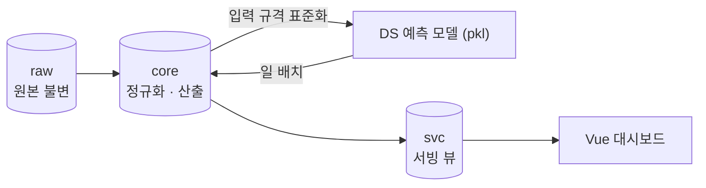
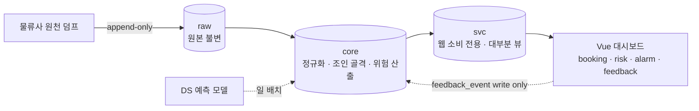
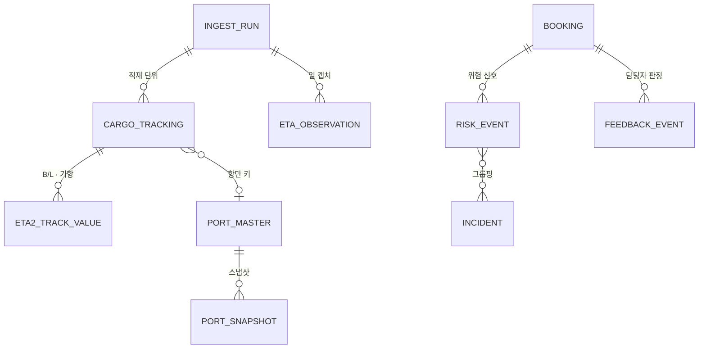
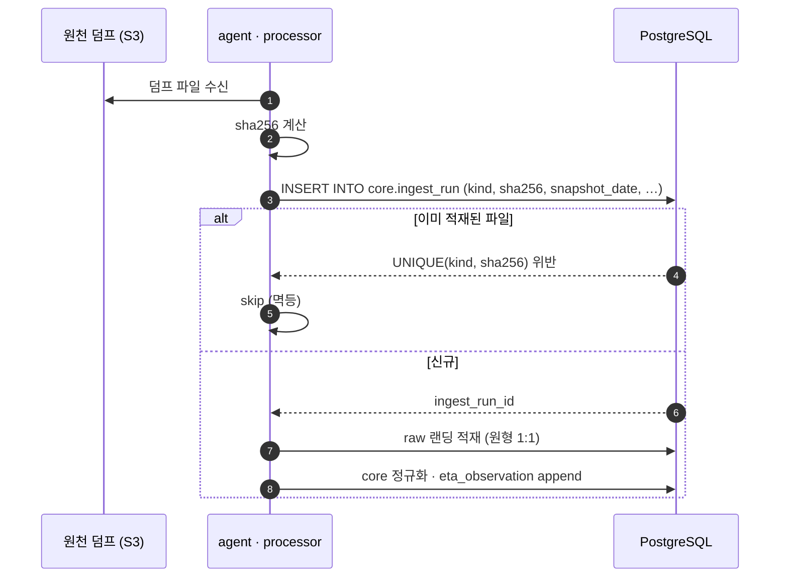
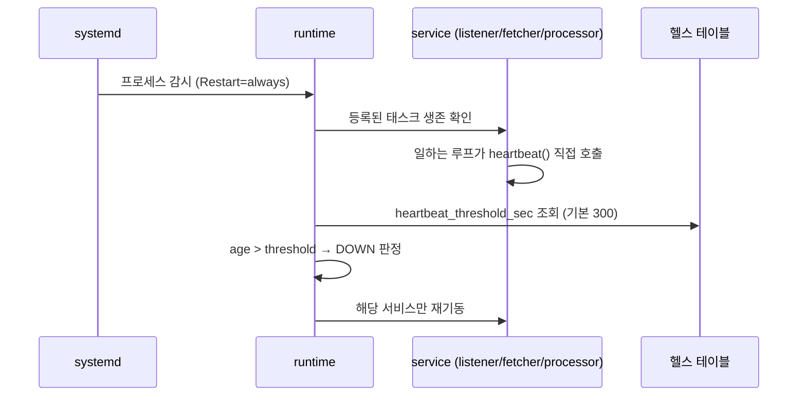

<a id="top"></a>

# 국제운송 정시성 Visibility PoC

> **End-to-End Product Case Study**
> 문제 정의 → 요구사항 → UX → 시스템 설계 → 구현 → 검증 → 결과

[`← 경력 상세로`](../experience.md)

---

## A. Executive Summary

해상 국제운송에서 **화물이 예정대로 도착하지 못할 위험을 조기에 감지하는** 정시성 Visibility 플랫폼입니다. 물류사 원천 시스템 덤프를 받아 적재·정규화하고, 도착 예정일(ETA)을 산출하고, 위험 화물을 모니터링 대시보드에 올리는 구간을 백그라운드·웹 양쪽에서 단독 담당했습니다.

이 프로젝트의 중심 과제는 예측 정확도를 높이는 것이 아니라 **"이 데이터로 무엇을 약속할 수 있는가"를 정하는 일**이었습니다. 원천은 하루 한 번 던져지는 스냅샷이고, **원천 시스템 간 결합에 실질적인 한계가 있었습니다** — 일부 축은 결합률이 낮았고, 일부 식별키는 사실상 붙지 않았습니다.

그래서 "정확한 도착시각 하나"를 약속하는 대신 **산식을 두 트랙으로 나누고, 값 옆에 근거를, 못 낸 자리에는 사유를** 붙였습니다. 결과적으로 ETA2(구간 누적) 98.13%, ETA3(모델 산출) 85.56%의 커버리지를 확보했고, 못 낸 14.44%는 "왜 못 냈는지"가 이름으로 남아 있습니다.

<sub>수치는 담당 기간 중 개발원장·작업현황 기록에서 확인한 값입니다.
고객사·원천 시스템 식별정보와 데이터 품질 상세는 대외비이므로 이 문서에서 제외했습니다.
PoC 전체 기간은 2026.12까지이며, 본 문서는 제가 담당한 구간을 다룹니다.</sub>

---

## 01. Project Overview

```text
PROJECT
국제운송 정시성 Visibility PoC

ONE-LINER
해상 화물의 지연 리스크를 도착 전에 감지해, 담당자가 대응할 시간을 확보하는 모니터링 플랫폼

PROBLEM
원천 시스템이 하루 한 번 스냅샷만 던져주는 조건에서
"이 화물이 늦을 것 같다"를 언제, 어떤 근거로 말할 수 있는가

SOLUTION
ETA 산식을 두 트랙으로 분리해 각각의 근거와 함께 제공하고,
값을 못 내는 경우는 사유를 세 갈래로 구분해 표기한다

TARGET
화주 물류 담당자 (지연 화물 조기 파악 · 선제 대응)

ROLE
데이터 적재 파이프라인 · ETA 산출 배선 · 모니터링 대시보드 단독
(예측 모델 자체는 DS 담당 — 아래 역할 경계 참조)

STACK
Backend       Python · FastAPI · SQLAlchemy · Alembic · psycopg
Database      PostgreSQL (raw · core · svc 3스키마 · 롤 3종)
Frontend      Vue 3
Infra         Docker Compose · AWS S3 · EKS
```

| | |
|---|---|
| **기간** | `2026.06 – 2026.08` (담당 구간 / PoC 전체는 2026.12까지) |
| **팀 구성** | agent·web 단독(본인) + DS(예측 모델) + 고객사 담당 |
| **실측 규모** | Python 160파일 · Alembic 리비전 63 · 테이블 50(core 49 · raw 1) |

### 역할 경계 — 무엇이 내 몫이 아니었는가

> 정직하게 구분합니다. **지연 예측 모델(pkl)은 DS가 만들었고, 제가 한 것은 그 모델을 실제로 값이 나오게 배선한 일**입니다.
> 아래 문서에서 "모델"이라고 쓴 부분은 전부 DS 산출물이며, 제 기여는 입력 규격 표준화·실행 환경 정합·서빙 뷰 구성입니다.

---

## 02. Background & Problem Definition

### Business Context

해상 국제운송에서 화물 한 건은 출발 항만 → 환적 1~3회 → 목적 항만을 거칩니다. 각 구간마다 지연이 누적되고, 도착이 늦어지면 생산 라인 정지·긴급 항공 전환 같은 비용이 발생합니다. **늦는다는 사실을 도착 직전에 알면 대응할 수단이 없습니다.**

### Existing Process — As-Is

```text
물류사 원천 시스템에서 지연 정보를 개별 조회
        ↓
담당자가 화물 단위로 상태를 눈으로 확인
        ↓
"이상하다" 싶은 건을 개별 문의
        ↓
회신을 받고 나서야 지연 확정
        ↓
대응 시간이 이미 지난 뒤
```

### Problem Statement

```text
현재 상황
  화물 상태 정보가 여러 원천 시스템에 흩어져 있고, 통합된 위험 뷰가 없다

      ↓
사용자가 겪는 문제
  어떤 화물이 위험한지 알려면 건별로 확인해야 하고,
  건수가 많아 사실상 전수 확인이 불가능하다

      ↓
문제가 발생하는 원인
  ① 원천이 실시간 스트림이 아니라 하루 한 번 스냅샷이다
  ② 원천 시스템 간 화물 식별키가 서로 붙지 않는다
  ③ 도착 예정일이 원천마다 다르게 들어오고, 그 근거를 알 수 없다

      ↓
비즈니스 영향
  지연 대응이 사후 처리가 되고, 긴급 전환 비용이 반복 발생한다

      ↓
해결해야 할 핵심 문제
  스냅샷 데이터로 감당할 수 있는 범위 안에서
  "지금 손대야 할 화물"을 근거와 함께 좁혀준다
```

### Technical Constraint — 이 프로젝트를 규정한 두 가지

| 제약 | 실측 | 설계에 미친 영향 |
|---|---|---|
| **원천이 스냅샷** | 하루 1회 덤프. 시계열 관측이 아님 | 관측 이력은 **소급 불가** → 캡처 체계를 기능보다 먼저 구축 |
| **원천 간 결합 한계** | 시스템 간 매칭률이 낮은 축이 다수였고,<br/>일부 식별키는 사실상 결합되지 않음<br/><sub>(고객사 확인 회신으로 검증)</sub> | 붙지 않는 축으로 정밀 예측을 약속할 수 없음 → **산출물 재정의** |

> 🔴 두 번째 제약이 이 프로젝트의 모든 설계 결정을 지배했습니다.

---

## 03. Research & Discovery

> ⚠️ **사용자 인터뷰·설문·사용성 테스트는 수행하지 않았습니다.**
> 요구사항은 고객사가 제공한 업무 요건과, 제가 직접 수행한 **데이터 프로파일링**에 근거합니다.

| 수행 | 내용 | 결과 |
|---|---|---|
| ✅ **원천 데이터 프로파일링** | export 항목을 업무 요건과 매핑, 수급 범위·주기·필수 컬럼 확정 | 데이터정의서 · 랜딩 12테이블 설계 |
| ✅ **엔티티 키 검증** | 원천 간 조인 가능성을 키 쌍별로 실측 | 축마다 결합률 편차가 크고, 일부는 사실상 결합 불가 |
| ✅ **조인 축 실측 비교** | 기항 축 vs 화물 축의 커버리지 대조 | **5.8% → 99.9%** (축 전환 근거) |
| ✅ **접기 안전성 검증** | B/L 단위로 접었을 때 정보 손실 여부 | 경로 갈림 59건(0.065%) · 출항 실적 갈림 262건(0.29%) |
| ❌ 사용자 인터뷰 | 미수행 | — |
| ❌ 경쟁 서비스 분석 | 미수행 | — |

> 💡 **이 프로젝트의 "리서치"는 사용자 조사가 아니라 데이터 조사였습니다.** 그리고 그 데이터 조사가 제품 정의를 통째로 바꿨습니다(→ 06).

---

## 04. User Definition

| Role | 업무 목적 | Pain Point | 필요한 것 |
|---|---|---|---|
| **화주 물류 담당자** | 지연 화물을 도착 전에 파악해 대응 | 건수가 많아 전수 확인 불가 | 위험 화물을 좁혀주는 **우선순위 뷰** |
| **물류 운영 관리자** | 지연 패턴 파악·개선 | 지연 원인이 사후에만 보임 | 구간별 리드타임 · 지연 근거 |
| **데이터 사이언스(DS)** | 예측 모델 개발·운영 | 입력 규격이 불안정하면 모델이 못 돌아감 | 표준화된 입력 · 명확한 핸드오프 계약 |

> ⚠️ 위 정의는 고객사 요건과 프로젝트 내 논의에 근거하며, **실사용자 대상 검증은 하지 않았습니다.**

**핵심 인사이트** — 담당자에게 필요한 것은 "모든 화물의 정확한 도착시각"이 아니라 **"지금 손대야 할 소수의 화물"**입니다. 이 구분이 산출물 정의를 바꿨습니다.

---

## 05. User Journey & Current Flow

```text
Trigger    아침에 출근해 오늘 처리할 화물을 확인해야 한다
   ↓
Action     원천 시스템에 접속
   ↓
System     화물 목록을 보여준다 (위험도 정보 없음)
   ↓
Decision   무엇부터 볼 것인가? → 판단 근거가 없다
   ↓
Action     눈에 띄는 건을 개별 조회
   ↓
Decision   이 ETA를 믿어도 되는가? → 근거를 알 수 없다
   ↓
Result     불확실한 상태로 다음 건으로 넘어감
```

| 단계 | Pain Point | Opportunity |
|---|---|---|
| 목록 확인 | 무엇이 위험한지 표시가 없음 | **위험 등급으로 정렬** |
| 개별 조회 | 건수 대비 시간 부족 | 전수 확인이 아니라 **좁혀주기** |
| ETA 판단 | 값의 근거를 알 수 없음 | **값 옆에 근거 병기** |
| 값이 빈 경우 | 왜 없는지 모름 | **사유를 구분해 표기** |

---

## 06. UX & Product Insight

> 📌 **이 절이 이 케이스 스터디의 핵심입니다.** 데이터 리서치 결과가 어떻게 제품 정의를 바꿨는지를 다룹니다.

### Insight 1 — 약속할 수 없는 것을 약속하면 안 된다

```text
Finding
  원천 간 결합률이 축마다 크게 달랐고, 일부 식별키는 사실상 붙지 않았다.
  스냅샷 한 장으로는 "이 화물은 3일 뒤 도착합니다"를 뒷받침할 수 없다.

Insight
  정밀도를 약속하는 순간, 남은 프로젝트 기간을 정확도와 씨름하는 데 다 쓰게 된다.
  그리고 결국 아무것도 못 낸다.

Opportunity
  "정답 하나"가 아니라 "검토 가능한 값 여럿"으로 약속의 단위를 바꾼다.

Requirement
  ETA 산식을 성질이 다른 두 트랙으로 나누고, 화면에서 전환할 수 있게 한다.
  각 값에는 그 값이 어떻게 나왔는지를 함께 낸다.
```

→ **14. Core Feature Deep Dive**로 이어집니다.

### Insight 2 — 빈칸에도 종류가 있다

```text
Finding
  값이 비어 있는 이유가 최소 세 가지였다.
  ① 이 환경에 서빙 뷰가 없다  ② 모델에 넣을 입력이 없다  ③ 산출 트랙이 돌지 않았다

Insight
  원인이 다르면 담당자가 할 일이 완전히 다르다.
  전부 "—"로 표기하면 "어디를 고쳐야 값이 늘어나는가"가 표에서 사라진다.

Opportunity
  빈칸을 사유별로 다른 이름으로 적는다.

Requirement
  상태 어휘를 정의하고, UI · 서빙 뷰 · DB에서 같은 어휘를 쓴다.
```

### Insight 3 — 정상적인 무응답과 장애를 구분해야 한다

```text
Finding
  원천 중에는 수동 수집이라 며칠 갱신이 없어도 정상인 소스가 있다(FTV 등).

Insight
  "데이터가 안 들어옴"을 장애 판정 기준으로 쓰면 거짓 경보가 쏟아진다.
  거짓 경보가 쏟아지면 담당자는 경보를 보지 않게 된다.

Opportunity
  수집기의 생존과 데이터의 유무를 다른 축으로 분리한다.

Requirement
  헬스 판정은 서비스 생존(하트비트)으로 하고, last_data_at은 표시용으로만 쓴다.
```

→ **24. Technical Challenges (AIS)**로 이어집니다.

### Insight 4 — 받은 값과 만든 값을 섞으면 안 된다

```text
Finding
  원천도 ETA를 준다. 우리도 ETA를 만든다.

Insight
  덮어쓰면 나중에 어느 것이 어느 것인지 아무도 모른다.

Requirement
  받은 자료의 ETA와 우리 산출값을 별개 열로 병기한다.
```

---

## 07. Product Strategy

```text
Business Goal   지연 대응을 사후 처리에서 선제 대응으로 옮긴다
       ↓
User Goal       전수 확인 없이 "지금 손대야 할 화물"을 알아낸다
       ↓
Product Goal    데이터가 감당할 수 있는 범위에서, 근거를 붙인 위험 신호를 제공한다
       ↓
Feature         ETA 2트랙 산출 · 위험 등급 · 인시던트 그룹핑 · 모니터링 대시보드
       ↓
Metric          커버리지(값을 낼 수 있었던 비율) · 회피 권고 묶음의 정밀도
```

### 산출물 재정의 — 이 프로젝트에서 가장 중요한 제품 결정

| | Before (원안) | After (재정의) |
|---|---|---|
| 산출 | 정확한 도착시각 1개 | **ETA2(구간 누적) + ETA3(모델 산출) 2트랙** |
| 근거 | 없음 | 값마다 실적/예측 구분 · 항로 포함 여부 · 표본 수 · 확정 시각 |
| 빈 값 | `—` | **사유 3분류** |
| 위험 등급 | (ETA를 대체) | **ETA와 병행하는 경보 축** |
| 평가 기준 | 예측 정확도 | 커버리지 + 회피 권고 묶음의 정밀도 |

> ⚠️ **주의** — 재정의는 "ETA를 포기한 것"이 아닙니다. 정밀값 하나를 약속하지 않았을 뿐, ETA는 두 트랙으로 실제 산출됩니다.

---

## 08. Feature Definition

### 일 스냅샷 멱등 적재

```text
Problem       관측 이력(eta_observation)은 append-only라 오늘 캡처를 놓치면 그 시점이 영원히 소실된다
   ↓
User Need     (내부 요구) 백필이 불가능한 데이터를 안전하게 매일 쌓아야 한다
   ↓
Feature       파일 해시 기반 멱등 적재 — 같은 파일 재적재는 skip
   ↓
Value         재적재를 두려워하지 않아도 되고, 중복 없이 이력이 쌓인다
```

> 이 기능을 **다른 어떤 기능보다 먼저** 만들었습니다. 소급 불가한 데이터이기 때문입니다.

### ETA 2트랙 산출

```text
Problem       스냅샷으로 정밀 ETA를 약속할 수 없다
   ↓
User Need     그래도 "언제쯤 오는가"에 대한 답은 필요하다
   ↓
Feature       구간 누적(ETA2) · 모델 산출(ETA3) 두 산식 + 근거 병기 + 빈칸 사유 분류
   ↓
Value         값을 의심할 때 화면 안에서 근거를 확인할 수 있다
```

### 위험 등급 · 인시던트 그룹핑

```text
Problem       한 선박에서 지연 신호가 여러 개 동시에 뜨면 같은 사건으로 알람이 반복된다
   ↓
User Need     사건 단위로 한 번만 알고 싶다
   ↓
Feature       trigger-count 기반 등급(0 진행 · 1 주의 · 2+ 회피) + 동일 선박 신호 그룹핑
   ↓
Value         경보 폭포가 사라지고 등급 인플레이션이 억제된다
```

> **등급 산출의 핵심 규칙** — 물리 통과를 업무키로 dedup합니다. **한 통과 = 한 트리거**로 정규화하지 않으면 같은 사건이 여러 번 세어져 전부 "회피"가 됩니다.

---

## 09. Information Architecture

```text
정시성 Visibility
├── 대시보드 (위험 보드)
│   ├── 위험 등급별 요약
│   └── 임계값별 시각화
├── 화물 (Booking / B/L)
│   ├── 목록 — 다중 검색 · 필터
│   └── 상세 — ETA2 · ETA3 전환 · 근거 · 경로
├── 경보 (Alarm)
│   └── 인시던트 단위 목록
└── 피드백 (Feedback)
    └── 담당자 판정 수집
```

IA가 05의 As-Is를 뒤집은 구조입니다. 기존에는 **목록 → 개별 조회 → 판단**이었는데, **위험 보드(무엇을 볼지 알려줌) → 상세(근거 확인) → 피드백**으로 바꿨습니다.

---

## 10. User Flow

```text
대시보드 진입
   ↓  [System] 위험 등급별로 화물을 정렬해 제시
"회피" 등급 화물 확인 ─── 우선순위가 이미 매겨져 있음
   ↓
화물 상세 진입
   ↓  [System] ETA2 · ETA3 두 값과 각각의 근거 표시
Decision: 이 값을 믿을 수 있는가?
   ↓  근거 확인 — 실적/예측 구분 · 항로 포함 여부 · 표본 수
   ↓
   ├─ 값이 있음 → 대응 판단
   └─ 값이 없음 → 사유 확인 (서빙 뷰 없음 / 모델 입력 없음 / 트랙 미실행)
   ↓
피드백 등록 (선제 대응 여부 포함)
   ↓  [System] preventive 건은 오탐 집계에서 제외
```

| 지점 | 설계 포인트 |
|---|---|
| **Decision Point** | 값을 믿을지 판단하는 데 필요한 정보를 화면 안에 둠 |
| **Empty State** | 빈 값을 사유별로 다르게 표기 |
| **Feedback Loop** | 선제 대응 건을 오탐에서 제외해 지표 왜곡 방지 |

---

## 11. UX Design

```text
Decision   ETA2와 ETA3를 합치지 않고 화면에서 스위치로 전환
Reason     성질이 다르다. ETA2는 구간별 근거를 낼 수 있고 ETA3는 통짜라 근거 줄이 없다.
           담당자가 값을 의심할 때 확인할 수 있는 것이 서로 다르다
Trade-off  사용자가 "어느 쪽을 봐야 하나"를 학습해야 함
```

```text
Decision   ETA3에 ETA2의 어휘를 빌려 채우지 않음
Reason     통짜 예측에 "구간별 근거"를 억지로 만들면 거짓 정보가 된다
Trade-off  화면이 트랙에 따라 다르게 보임 (일관성 손해)
```

```text
Decision   「항로 빠짐」을 오류가 아니라 속성으로 표기
Reason     그 항로 표본이 얇아 선사 평균·전체 평균으로 산출했다는 뜻이지 잘못된 값이 아니다
Trade-off  표기 어휘가 하나 늘어남
```

```text
Decision   받은 ETA와 산출 ETA를 별개 열로 병기 (덮어쓰지 않음)
Reason     출처가 섞이면 나중에 되짚을 수 없다
Trade-off  열이 늘어 화면 밀도가 올라감
```

> ⚠️ **사용성 테스트는 수행하지 않았습니다.** 위 결정은 도메인 판단과 데이터 특성에 근거합니다.

---

## 12. UI Design · 13. Branding

> ⚠️ **생략합니다.** 화면 산출물은 고객사·회사 자산이며, 공개 가능한 형태로 정리된 것이 없습니다.
> 프론트엔드는 Vue 3로 구현했으며, 위험 보드는 B/L 목록·경로·상태·ETA 기준 위험구간을 임계값별로 시각화하고 다중 검색·필터 조합 환경에서 조회 성능을 확보하는 데 초점을 뒀습니다.

---

## 14. Core Feature Deep Dive — ETA 2트랙 산출

### Problem

스냅샷 한 장으로 "정확한 도착시각 하나"를 약속할 수 없다. 그런데 담당자에게는 "언제쯤 오는가"에 대한 답이 필요하다.

### Goal

약속할 수 있는 범위 안에서 최대한 많은 화물에 값을 내고, **값의 신뢰도를 사용자가 스스로 판단할 수 있게** 한다.

### Business Logic — 두 산식

| | **ETA2 — 구간 누적** | **ETA3 — 모델 산출** |
|---|---|---|
| 방식 | 기점 출항 실적(ATD)에 구간별 3개월 평균 리드타임을 누적 | 화물 한 건을 통짜로 예측 |
| 동기화 | 구간에 실제 도착(ATA)이 찍히면 그 값으로 동기화 | — |
| 부가 산출 | 구간별 값 | **지연 확률** |
| 근거 | 실적/예측 구분 · 항로 포함 여부 · 표본 수 · 산출 확정 시각 | (근거 줄 없음) |
| **커버리지** | **98.13%** (담당 구간 전수 기준) | **85.56%** (담당 구간 전수 기준) |

### 그레인과 축 — 설계 중 바뀐 지점

그레인은 **(B/L, 기항 순번)**입니다. 그런데 기항 목록을 어디서 얻느냐가 설계 도중 바뀌었습니다.

```text
원안   기항 축(선박 기준)으로 조립
       → 붙는 범위가 5.8%밖에 안 됨

발견   화물 축 테이블이 이미 출발 · 환적1~3 · 목적 5칸과
       각각의 ATA · ATD를 갖고 있음

전환   축을 화물 축으로 변경
       → 99.9% (담당 구간 전수 기준)
```

> 💡 **막혔을 때 방법을 바꾼 게 아니라 축을 바꿨습니다.** 같은 데이터에서 다른 통로를 찾은 것이 17배 커버리지 차이를 만들었습니다.

### B/L 단위로 접어도 되는가 — 감이 아니라 실측

```text
B/L 안에서 기항 경로가 갈리는 건    59건  (0.065%)
B/L 안에서 출항 실적이 갈리는 건   262건  (0.29%)
→ 접어도 안전하다고 판단
```

접는 규칙(화물 축 최소 ID 기준)은 **설정 행 하나에 두고 러너와 서빙 뷰가 같은 값을 읽게** 했습니다. 두 곳에 각각 적으면 반드시 갈립니다.

### 빈칸의 사유 분류 — `no_model_input`을 왜 새로 만들었나

ETA2 A의 상태 어휘 다섯은 전부 **구간 조립** 관점입니다.

```text
computed · not_shipped · no_leg_path · no_baseline_leg · not_applicable
```

ETA3(B 트랙)는 통짜라 구간을 쪼개지 않으므로 `no_leg_path` · `no_baseline_leg`를 쓸 수 없습니다. 그리고 B가 값을 못 내는 압도적 다수는 **"모델에 넣을 입력행이 아예 없다"**였습니다 — **전체의 14.44%**.

여기에 `not_applicable`을 쓰면 **"원래 대상이 아니다"로 읽혀서, "원천을 붙이면 값이 나온다"는 사실이 사라집니다.** 그래서 `no_model_input`이라는 이름을 따로 만들었습니다.

원인은 계보 차이입니다 — 모델이 쓰는 원천 테이블과 A 트랙이 선 테이블의 적재 계보가 달라 커버리지가 어긋납니다.

### Architecture — 모델 배선



> **제가 한 일은 배선입니다.** 오프라인에서 `pandas 2.3.3` · `scikit-learn 1.7.2`(pkl 학습 버전과 동일) · `holidays 0.102`를 맞춰 넣고, 초기화 46.8초 + 예측 배치 327.9초(건당 4.2ms)로 값을 채웠습니다.
>
> scikit-learn 버전을 맞춘 이유 — pickle은 클래스 구조를 저장하므로 버전이 다르면 **에러 없이 조용히 다른 값**이 나올 수 있습니다.
>
> 그날의 결론은 **"모델이 없는 게 아니라 배선이 없었다"**였습니다.

### 데이터 누출 방지

AIS는 **위치만**, ETA는 **예약 시점 `reference_eta`만** 사용합니다. 실제 도착은 피처에서 금지했습니다. 예측 대상이 피처에 들어가면 성능이 좋아 보이지만 실전에서 무너집니다.

### Result

| | |
|---|---|
| ETA2 커버리지 | 0 → **98.13%** |
| ETA3 커버리지 | 0 → **85.56%** |
| 못 낸 사유 | 이름으로 구분되어 남음 (`no_model_input` 14.44% 등) |

---

## 15. System Architecture

### 데이터 계층 — raw · core · svc



**왜 3계층인가** — 이유는 하나입니다. **원본이 깨져서 들어온 건지, 우리가 가공하다 깨뜨린 건지를 나중에도 구분하기 위해서**입니다. 원본이 불변으로 남아 있으면 "이 위험 등급이 왜 이렇게 나왔지?"라는 질문에 raw까지 거슬러 올라가 답할 수 있습니다.

### 권한 경계 — 롤 3종

| 롤 | 소유 | 접근 |
|---|---|---|
| `agent` | raw · core | 적재·정규화 |
| `ds` | — | core 읽기 → svc 변환 |
| `web` | — | **svc만 읽기**, write는 `feedback_event` 한정 |

코드로 강제하기 전에 **롤 경계로 실수할 수 있는 범위 자체를 좁혔습니다.**

### 에이전트 모듈 분리 — 데이터 종류가 아니라 "누가 커넥션을 여는가"

> 💡 이 프로젝트에서 가장 차별적인 구조 결정입니다.

```text
listener    외부가 밀어준다        (AIS 스트림)
fetcher     우리가 당긴다          (태풍 · 수위 API · 메일)
processor   외부 연결이 없다        (순수 적재 · 연산)
```

이렇게 나누면 **죽는 단위(내부 asyncio 태스크)와 감시 단위가 일치**합니다. 데이터 종류로 나눴다면 이 정렬이 생기지 않았을 것이고, 24절의 AIS 사고를 구조적으로 해결할 수 없었습니다.

### 계층 간 결합

세그먼트끼리 코드로 호출하지 않고 **DB로만** 결합합니다. agent가 raw·core를 소유하고, DS가 core→svc 변환을 하고, 웹은 svc만 조회합니다. 원천이 바뀌어도 svc 계약 뒤에서 흡수됩니다.

**대가** — 계층 간 적재 파이프라인 유지 비용이 듭니다.

---

## 16. Architecture Decision

### ADR-1 · 원본 불변 3계층

```text
Problem   스냅샷 기반 데이터에서 "원본이 이미 훼손돼 들어왔는지,
          우리가 가공하다 훼손했는지"를 나중에 구분할 수 없어진다.

Options
  (A) 단일 스키마 · 덮어쓰기   얻는 것: 단순함 / 잃는 것: 원인 추적 불가
  (B) 이력 테이블만 추가       얻는 것: 변경 추적 / 잃는 것: 원본과 가공의 경계는 여전히 모호
  (C) raw · core · svc 분리 ✓

Decision  (C). raw는 append-only 불변, core가 정규화·산출, svc는 웹 소비 전용.

Reason    "왜 이 값이 이렇게 나왔지?"에 답할 수 있어야 한다는 것이 이 프로젝트의 기준.

Trade-off 계층 간 적재 파이프라인을 유지해야 하고, 저장 용량이 늘어난다.
```

### ADR-2 · 멱등 적재를 기능보다 먼저

```text
Problem   eta_observation 같은 관측 이력은 append-only라
          오늘 캡처를 놓치면 그 시점이 영원히 소실된다. 백필이 불가능하다.

Decision  ingest_run 메타 구조를 최우선 구축.

          CREATE TABLE core.ingest_run (
              kind            text NOT NULL,   -- 소스 종류
              snapshot_date   date NOT NULL,   -- 덤프 업무일자(적재 일시가 아님)
              source_filename text NOT NULL,
              sha256          text NOT NULL,
              ...
              CONSTRAINT uq_ingest_run_kind_sha256 UNIQUE (kind, sha256)
          );

Reason    판정 축이 파일 이름이 아니라 내용(해시)이다.
          이름이 같고 내용이 다르면 다른 적재로, 이름이 달라도 내용이 같으면 skip된다.

          snapshot_date를 적재 일시와 분리한 이유 —
          하루 늦게 받아도 그 데이터는 어제 것이다. 섞으면 시계열이 통째로 어긋난다.

Result    동일 파일 중복 적재 0건

Trade-off 적재 전 해시 계산 비용. 대용량 파일에서는 무시할 수 없다.
```

### ADR-3 · 산출물 재정의 (제품 결정)

```text
Problem   원천 결합률이 낮고 일부 축은 붙지 않는 데이터로 정밀 ETA를 약속해야 하는가?

Options
  (A) 단일 정밀값 약속   얻는 것: 사용자에게 가장 명확
                        잃는 것: 데이터로 감당 불가 — 못 지킬 약속
  (B) 산출 포기          얻는 것: 틀릴 일이 없음
                        잃는 것: 정직하지만 쓸모가 없음
  (C) 2트랙 + 근거 병기 ✓

Decision  (C). 산식을 둘로 나눠 각자 칸에 담고, 값 옆에 근거를, 빈칸에 사유를 적는다.

Reason    "할 수 없다"와 "아무것도 안 한다" 사이에 넓은 공간이 있다.
          그 공간을 찾는 것이 이 프로젝트의 제품 과제였다.

Trade-off 사용자가 두 트랙의 차이를 학습해야 한다. 화면이 복잡해진다.

Result    98.13% / 85.56% 커버리지 확보. 못 낸 자리에도 사유가 남았다.
```

### ADR-4 · 헬스 판정 축을 데이터가 아니라 생존으로

```text
Problem   수집기가 살아 있는지 어떻게 판정할 것인가?

Options
  (A) last_data_at 기준   얻는 것: 구현이 가장 단순
                          잃는 것: 수동 수집 원천은 며칠 무응답이 정상 → 거짓 경보 폭주
  (B) 프로세스 생존 기준   systemd active — 실제로 이게 사각지대를 만들었다(→ 24)
  (C) 서비스 하트비트 ✓

Decision  (C). 일하는 루프가 직접 하트비트를 찍고, 그 나이로 판정한다.
          last_data_at은 판정에 쓰지 않고 표시용으로만 둔다.

임계값     코드가 아니라 헬스 테이블 컬럼(heartbeat_threshold_sec, 기본 300)이 권위.
          값을 바꾸는 데 배포가 필요하면 그건 설정이 아니라 상수다.

Trade-off 서비스가 하트비트를 찍는 책임을 지므로, 구현 규약을 지켜야 한다.
```

---

## 17. Domain Model / ERD



| 설계 규칙 | 내용 |
|---|---|
| **append-only** | `eta_observation` — 소급 불가한 관측 이력 |
| **멱등키** | `uq_ingest_run_kind_sha256 UNIQUE (kind, sha256)` |
| **업무일자 분리** | `snapshot_date` ≠ 적재 일시 |
| **랜딩 1:1** | 외부 덤프를 원형 그대로 적재하는 랜딩 12테이블 |
| **규모** | 테이블 50 (core 49 · raw 1) · Alembic 리비전 63 |

### 조인 일치율 — 무엇을 측정한 수치인가

> ⚠️ **높은 일치율을 확보한 것은 항만 키 한 쌍이고, 전체 조인이 아닙니다.**
> 잔여 불일치는 원천의 부분정보 분할 방출이 원인임을 규명하고 대체 판정 로직을 제안했습니다.
>
> **전체 결합에는 한계가 있었습니다.** 축마다 결합률 편차가 컸고 일부 식별키는 사실상 붙지 않았으며, 이 사실은 고객사 확인 회신으로 검증했습니다.
> 구체적인 키 쌍과 결합률 수치는 고객사 데이터 특성이므로 이 문서에서 제외했습니다.

---

## 18. API Design

웹은 `svc` 스키마만 조회하고, 쓰기는 `feedback_event` 하나로 한정됩니다.

| Method | Endpoint | 설명 |
|---|---|---|
| `GET` | `/booking` | 화물 목록 — 다중 검색·필터, 위험 등급 정렬 |
| `GET` | `/booking/{blNo}` | 상세 — ETA2 · ETA3 값과 각각의 근거 |
| `GET` | `/risk` | 위험 보드 — 등급별 요약 |
| `GET` | `/alarm` | 인시던트 단위 경보 목록 |
| `POST` | `/feedback` | 담당자 판정 등록 (preventive 플래그 포함) |

### 응답 계약 — 값 옆의 근거

```jsonc
{
  "eta2_a_date": "2026-09-14",
  "eta2_a_status": "computed",
  "evidence": {
    "kind": "actual|forecast",       // 실적인가 예측인가
    "route_included": false,          // 「항로 빠짐」 — 오류가 아니라 속성
    "sample_size": 37,                // 표본 수
    "computed_at": "2026-08-19T..."   // 산출 확정 시각
  },
  "eta2_b_date": null,
  "eta2_b_status": "no_model_input",  // ← "—" 가 아니라 사유
  "eta2_b_delay_probability": null,
  "source_eta": "2026-09-12"          // 받은 값은 별개 열로 병기
}
```

---

## 19. Sequence Diagram

### 일 스냅샷 멱등 적재



### 헬스 판정 — 2단 계층



---

## 20. Frontend Architecture

Vue 3 기반 모니터링 대시보드.

```text
Page (대시보드 · 화물 목록 · 상세)
 ↓
Feature (booking · risk · alarm · feedback)
 ↓
Component (위험 보드 · ETA 전환 패널 · 근거 표시)
 ↓
API Layer (svc 스키마 조회 전용)
```

| 결정 | 이유 |
|---|---|
| ETA 트랙 전환을 상세 화면 내 스위치로 | 두 값을 동시에 나열하면 어느 것이 기준인지 모호해짐 |
| 대량 목록에서 서버 사이드 필터링 | 다중 검색·필터 조합에서 클라이언트 필터링은 조회 성능이 무너짐 |
| 빈 값을 사유별로 다른 표기 | Insight 2 — UI·API·DB가 같은 어휘를 씀 |

---

## 21. Backend Architecture

### 에이전트 (백그라운드)

```text
runtime
├── listener   (외부가 밀어줌 — AIS)
├── fetcher    (우리가 당김 — 태풍 · 수위 API · 메일)
└── processor  (외부 연결 없음 — 적재 · 연산)
```

각 서비스는 `compute_status()`로 자기 상태를 판정합니다.

```python
def compute_status(self, *, now=None) -> ServiceStatus:
    """up / down / n/a 를 판정한다. last_data_at 은 어느 규칙에도 쓰지 않는다."""
    if self._state.disabled:                 return STATUS_DISABLED   # 우리가 껐다
    if self.run_mode == RUN_MODE_ON_DEMAND:  return STATUS_NA
    if not self._state.running:              return STATUS_DOWN
    if not self.is_alive():                  return STATUS_DOWN       # 등록 태스크 전멸
    age = self.heartbeat_age_sec(now=now)
    if age is None or age > self._state.heartbeat_threshold_sec:
        return STATUS_DOWN
    return STATUS_UP
```

### 웹 백엔드

`booking` · `risk` · `alarm` · `feedback` 도메인을 내부 HTTP 계약으로 분리한 **모듈러 모놀리식** 구조이며, 멀티 스키마 Alembic으로 마이그레이션을 관리합니다.

### agent–DS 핸드오프 계약

| 담당 | 범위 |
|---|---|
| **agent (본인)** | 적재·정규화의 물리 골격 — 빈 테이블 · Alembic 마이그레이션 · 멱등 적재 틀 |
| **DS** | 등급·근거 산식 · 예측 모델 |
| **결합** | PostgreSQL 단일 결합 (코드 호출 없음) |

경계를 먼저 정의하고 나서 각자 안쪽을 채우는 방식이라, 상대 진행을 기다리지 않고 병행할 수 있었습니다.

---

## 22. Infrastructure / DevOps

```text
로컬 · dev   docker-compose (PostgreSQL 16) — 동일 구조로 세팅
스키마 초기화 initdb 스크립트로 스키마 · 롤을 1회 생성
원본 보관    AWS S3
배포        단일 이미지 컨테이너 · EKS 배포 토폴로지 설계
운영 위생    포트 분리 · 시크릿 커밋 방지
```

**로컬과 dev를 같은 구조로 만든 이유** — 스키마·롤 경계가 환경마다 다르면 "로컬에서는 되는데 dev에서 권한 오류"가 납니다. 권한 설계 자체가 이 프로젝트의 안전장치라 환경 간 동형이 중요했습니다.

---

## 23. Implementation

### 소급 불가 데이터를 먼저 지킨다

기능보다 `ingest_run`을 먼저 만들었습니다. 이유는 하나입니다 — **다른 건 나중에 만들 수 있지만, 오늘 놓친 관측은 영원히 못 만듭니다.**

### 상태 어휘를 세 곳에서 일치시키기

`no_model_input` 같은 상태 어휘는 DB 컬럼 값 · 서빙 뷰 · UI 표기 세 곳에서 같아야 합니다. 한 곳만 바꾸면 화면에는 사유가 뜨는데 필터가 안 먹는 식의 어긋남이 생깁니다.

### 설정을 코드가 아니라 데이터로

`heartbeat_threshold_sec`을 헬스 테이블 컬럼에 뒀습니다. 운영 중에 임계값을 조정하려면 배포가 필요한 구조는 사실상 조정이 안 됩니다.

> 💡 이 원칙은 이전 회사(잼퍼블릭)의 Remote Config 경험에서 가져온 것입니다 — [승부사 온라인 케이스 스터디](adventurer.md) 참조.

---

## 24. Technical Challenges & Solutions

### Challenge 1 — 살아있는 감시자가 죽은 일꾼 대신 정상 보고를 하고 있었다

```text
Problem
  AIS 실시간 위치 수집기가 13시간 동안 데이터를 0건 받았다.
  그런데 systemd 기준으로는 active (running) 이라
  Restart=always 도 발동하지 않았고 경보도 울리지 않았다.

Cause
  감시 단위와 죽는 단위가 달랐다.
  systemd 는 프로세스를 본다. 실제로 죽은 건 내부 asyncio 태스크였다.
  태스크가 죽어도 프로세스는 await self._stop.wait() 에서 계속 살아 있다.

Investigation
  프로세스는 살아 있는데 수신이 0이라는 조합에서 출발.
  runtime 내부 태스크 상태를 확인해 등록 태스크가 죽어 있음을 특정했다.
  asyncio.create_task() 로 만든 태스크의 예외는 태스크 객체 안에 갇히고,
  아무도 await 하지 않으면 조용히 사라진다는 것이 근본 원인.

Solution
  ① 감시를 systemd → runtime → 각 서비스 2단 계층으로 내림
  ② 하트비트를 일하는 루프가 직접 찍게 함
  ③ 판정 축을 데이터 유무가 아니라 서비스 생존으로 (ADR-4)
```

```python
async def _consume(self) -> None:
    async for pos in self.client.stream():
        self.heartbeat()          # ★ 일하는 루프가 직접 찍는다
        ...
        self.mark_data()
```

```text
Trade-off
  각 서비스가 하트비트를 찍는 책임을 진다. 구현 규약을 어기면 오탐이 난다.
  마이크로서비스로 쪼개면 감시가 쉬워지지만 운영 대상이 늘어난다 →
  배포는 단일 유닛을 유지하고 감시 계층만 내리는 쪽을 택했다.

Result
  죽은 태스크를 30초 내 감지하고 해당 서비스만 재기동.
  운영 비용을 늘리지 않고 사각지대만 제거했다.

부수 문제
  up ↔ down 진동이 있었다. 재연결 대기(5분)를 한 번에 자면
  그동안 하트비트가 안 찍혀 살아있는 루프가 down 으로 판정됐다.
  → 대기를 조각으로 나눠 조각마다 idle tick 을 흘리도록 수정.
```

> 🔥 **회귀 테스트를 "고쳤다"로 끝내지 않았습니다.** 옛 client를 같은 시나리오에 넣어 **실제로 죽는 것을 확인**했습니다.
> 테스트가 통과하는 것보다 **그 테스트가 실제 사고를 잡는지**가 중요합니다. 죽은 검증은 조용하니까요.

### Challenge 2 — 조인이 2시간 8분에도 끝나지 않는다

```text
Problem
  화물 여정을 잇는 사다리 조인(B/L → 기항 → 다음 기항)이
  2시간 8분에도 완료되지 않았다. 배치 스케줄에 올릴 수 없는 상태.

Cause
  NULL 키까지 매칭하려고 조인 조건에 IS NOT DISTINCT FROM (NULL-안전 등호)을 썼다.
  이 연산자는 btree 인덱스를 타지 못한다.
  옵티마이저가 seq scan 으로 떨어지면서 대용량에서 O(n²)에 근접했다.

Investigation
  EXPLAIN 으로 스캔 방식과 버퍼 사용량 확인.
  seq scan 과 과도한 버퍼가 관측됐다.

Solution
  ① 조인을 UNION ALL 2분기로 분리
     · 양쪽 키가 모두 있는 경우 → 순수 equi-join (인덱스 사용)
     · NULL 이 있는 경우       → 별도 분기
  ② 분기 전제(키 NULL 규칙)를 마이그레이션 CHECK 제약으로 스키마가 보증
  ③ B/L 단위 청킹으로 배치 분할
```

```text
Trade-off
  쿼리가 길어지고 분기가 늘어 가독성이 떨어진다.
  COALESCE 표현식 인덱스로 우회할 수도 있었지만,
  NULL 을 sentinel 값으로 치환해야 하고 그 값이 실데이터와 충돌할 위험이 있다.
  UNION ALL 이 의미를 더 정확히 보존한다고 판단했다.

Result
  2h 8m(미완료) → 15초 · 약 500배
  버퍼 109 → 5
  결과가 동일하다는 것을 별도로 증명해 커밋에 함께 남겼다.

배운 것
  같은 결과를 내는 조건식이라도 실행 계획은 전혀 다르다.
  그리고 속도를 위해 결과를 바꾸면 그건 최적화가 아니라 버그다.
```

### Challenge 3 — 조인 축이 5.8%밖에 안 붙는다

```text
Problem
  ETA 산출에 필요한 기항 목록을 기항 축(선박 기준)에서 가져오려 했는데
  화물과 붙는 범위가 5.8%였다.

Investigation
  다른 테이블의 컬럼 구조를 전수 확인.
  화물 축 테이블이 이미 출발·환적·목적 5칸과
  각각의 실제 도착·출발 시각을 갖고 있음을 발견.

Solution
  축을 화물 축으로 전환. 그리고 B/L 단위로 접어도 되는지를 실측으로 검증
  (경로 갈림 59건 0.065% · 출항 실적 갈림 262건 0.29%).
  접는 규칙은 설정 행 하나에 두고 러너와 서빙 뷰가 같은 값을 읽게 함.

Trade-off
  기항 축이 가진 선박 단위 정보(선박 스케줄 변경 등)를 직접 쓸 수 없게 됐다.

Result
  5.8% → 99.9% (담당 구간 전수 기준)
```

---

## 25. QA / Testing

| 구분 | 내용 |
|---|---|
| **회귀 테스트** | AIS 헬스체크 — **옛 client를 넣어 실제로 죽는지 확인**하는 방식 |
| **결과 불변 검증** | 조인 최적화 전후 결과가 동일함을 증명해 커밋에 첨부 |
| **멱등성 검증** | 동일 파일 재적재 시 skip 확인 — 중복 적재 0건 |
| **정합성 스코어카드** | 조인 키 일치율을 문서화된 스코어카드로 관리 |

> ⚠️ **단위 테스트 커버리지는 측정하지 않았습니다.** PoC 성격상 검증은 데이터 정합성과 회귀 시나리오에 집중했습니다.
> ⚠️ 사용성 테스트·부하 테스트는 수행하지 않았습니다.

---

## 26. Performance / Optimization

```text
Problem   사다리 조인 배치가 2시간 8분에도 완료되지 않음

Cause     IS NOT DISTINCT FROM 이 btree 인덱스를 무력화 → seq scan

Solution  UNION ALL 2분기 (equi-join + NULL 분기)
          + CHECK 제약으로 분기 전제 보증
          + B/L 단위 청킹

Result    2h 8m (미완료) → 15초   ·   약 500배
          버퍼 109 → 5
          결과 불변 증명 포함
```

| 최적화 항목 | 접근 |
|---|---|
| 쿼리 | 실행 계획 기반 — 인덱스를 탈 수 있는 형태로 조건식 재작성 |
| 배치 | B/L 단위 청킹으로 장시간 트랜잭션 회피 |
| 대량 목록 조회 | 서버 사이드 필터링 · 다중 검색 조합에서 조회 성능 확보 |

---

## 27. Result

### Engineering — 검증 가능한 산출

| 항목 | 값 | 확인 방법 |
|---|---|---|
| ETA2 커버리지 | 0 → **98.13%** (담당 구간 전수 기준) | 개발원장 작업현황 2026-08-09 |
| ETA3 커버리지 | 0 → **85.56%** (담당 구간 전수 기준) | 〃 |
| 조인 배치 | 2h 8m(미완료) → **15초** | 실행 계획 · 버퍼 사용량 대조 |
| 조인 축 커버리지 | 5.8% → **99.9%** | 실측 (담당 구간 전수 기준) |
| AIS 무응답 감지 | 13시간 미감지 → **30초** | 헬스 계층 재설계 |
| 중복 재적재 | **0건** | `uq_ingest_run_kind_sha256` |
| 항만 키 조인 일치율 | **99.6%** | 정합성 스코어카드 |
| 규모 | Python 160파일 · Alembic 63 · 테이블 50 | 저장소 실측 |

### Product / Business

> ⚠️ **실사용 지표(사용자 수·Task Time·비용 절감)는 없습니다.** PoC 단계이며 프로토타입 시연까지 진행됐습니다.
> 지어낸 수치를 적지 않습니다.

### 프로젝트가 실제로 남긴 것

- **낼 수 없다고 여겨진 값을 냈습니다** — 산출물을 재정의한 결과 ETA 커버리지 98% / 85%를 확보했습니다
- **못 낸 것도 자산이 됐습니다** — `no_model_input` 14.44%는 "원천을 붙이면 값이 는다"는 지도입니다
- **감시 사각지대를 구조로 닫았습니다** — 죽는 단위와 감시 단위를 정렬시켰습니다

---

## 28. Before / After

```text
BEFORE  ─ 제품 정의
  "정확한 도착시각 1개"를 약속 → 결합률이 낮은 데이터로는 감당 불가

DESIGN
  산식을 두 트랙으로 분리 · 값 옆에 근거 · 빈칸에 사유

AFTER
  ETA2 98.13% · ETA3 85.56% 커버리지
  못 낸 14.44%는 "왜 못 냈는지"가 이름으로 남음
```

```text
BEFORE  ─ 운영 감시
  systemd: active (running)  ← 13시간째 정상 보고
    └ asyncio task: DEAD      ← 실제로 죽은 것
  수신 건수: 0 / 13h

AFTER
  systemd → runtime → service 2단 계층
  일하는 루프가 하트비트를 직접 기록
  → 30초 내 감지 · 해당 서비스만 재기동
```

```text
BEFORE  ─ 배치 성능
  사다리 조인 2h 8m 에도 미완료 (seq scan · 버퍼 109)

AFTER
  UNION ALL 2분기 + CHECK 제약 + 청킹
  15초 · 버퍼 5 · 결과 불변 증명
```

---

## 29. Reflection

### 무엇을 잘했는가

**약속의 단위를 바꾼 판단**입니다. "안 됩니다"로 끝냈으면 아무것도 못 냈고, "됩니다"로 갔으면 못 지킬 약속이 됐습니다. 그 사이에서 낼 수 있는 걸 찾은 것이 이 프로젝트의 핵심 기여라고 생각합니다.

**소급 불가한 것을 먼저 지켰습니다.** `ingest_run`을 기능보다 먼저 만든 것은 지금 봐도 옳은 순서였습니다.

**축을 바꿀 줄 알았습니다.** 5.8%에서 막혔을 때 같은 방법을 더 열심히 하는 대신 다른 통로를 찾았습니다.

### 무엇이 부족했는가

**사용자를 만나지 않았습니다.** 위험 등급 임계값도, 화면 우선순위도 전부 도메인 추론입니다. 담당자가 실제로 무엇을 보고 판단하는지 확인하지 않았습니다.

**모델 품질에 대해 말할 수 없습니다.** 배선은 했지만 예측이 실제로 맞는지는 제 검증 범위 밖이었고, 그걸 검증할 체계를 제안하지도 못했습니다.

**원천 결합 한계를 더 일찍 확인했어야 합니다.** 프로파일링을 먼저 했더라면 산출물 재정의가 더 앞당겨졌을 것이고, 그만큼 다른 데 시간을 쓸 수 있었습니다.

### 어떤 의사결정이 가장 중요했는가

**ADR-3(산출물 재정의)입니다.** 이후 모든 설계가 여기서 파생됐습니다 — 상태 어휘 분류도, 근거 병기 응답 계약도, 서빙 뷰 구조도 전부 "약속할 수 있는 범위 안에서 최대한 낸다"는 하나의 기준에서 나왔습니다.

기술적으로는 **에이전트 모듈을 "누가 커넥션을 여는가"로 나눈 것**입니다. 이 정렬이 없었다면 AIS 사고를 임시방편으로만 막았을 겁니다.

### 예상과 달랐던 것

**살아 있는 감시자가 죽은 일꾼 대신 정상 보고를 할 수 있다는 것.** 프로세스 생존이 서비스 생존이라고 암묵적으로 가정하고 있었습니다.

**데이터가 안 붙는다는 사실 자체가 산출물이 될 수 있다는 것.** 결합률 실측은 실패 보고처럼 보이지만, 고객사 입장에서는 "어느 키를 정비해야 하는가"라는 정보였습니다.

### 다시 만든다면

- **원천 프로파일링을 킥오프 첫 주에 하겠습니다.** 결합 한계를 알고 시작하는 것과 만들다 발견하는 것은 완전히 다릅니다.
- **담당자 관찰 30분이라도 확보하겠습니다.** 위험 등급 임계값은 데이터가 아니라 업무에서 나와야 합니다.
- **모델 평가 체계를 핸드오프 계약에 포함하겠습니다.** 입력 규격만 합의하고 "이 값이 맞는지 누가 어떻게 판단하는가"를 합의하지 않았습니다.

### 배운 것

| 관점 | 배운 것 |
|---|---|
| **기술** | 같은 결과를 내는 조건식이라도 실행 계획은 전혀 다르다. 그리고 감시 단위와 죽는 단위가 어긋나면 감시는 없는 것과 같다 |
| **제품** | "할 수 없다"와 "아무것도 안 한다" 사이에 넓은 공간이 있다. 약속의 단위를 바꾸면 낼 수 있는 것이 생긴다 |
| **UX** | 빈칸은 정보다. 사유를 구분해 적으면 사용자가 다음에 무엇을 할지 알 수 있다 |
| **협업** | 경계를 먼저 정의하면 상대 진행을 기다리지 않고 병행할 수 있다 (agent–DS 핸드오프) |

---

## F. Portfolio Summary

```text
PROBLEM
  하루 한 번 스냅샷과, 결합률이 낮은 원천으로
  "이 화물이 늦는다"를 언제 어떤 근거로 말할 수 있는가

SOLUTION
  ETA 산식을 두 트랙으로 분리하고 값 옆에 근거를, 빈칸에 사유를 붙임
  위험 등급은 ETA를 대체하지 않고 경보 축으로 병행

MY ROLE
  데이터 적재 파이프라인 · ETA 산출 배선 · 모니터링 대시보드 단독
  (예측 모델 자체는 DS 담당 — 제 몫은 배선과 상태 어휘 설계)

KEY FEATURES
  일 스냅샷 멱등 적재 / ETA2 · ETA3 2트랙 산출 /
  위험 등급 · 인시던트 그룹핑 / 정시성 모니터링 대시보드

UX CONTRIBUTION
  "정답 하나" 대신 "검토 가능한 값 여럿"으로 약속의 단위를 재정의
  빈 값을 사유 3분류로 구분해 UI · 서빙 뷰 · DB에서 같은 어휘 사용

ENGINEERING CONTRIBUTION
  raw·core·svc 3계층 + 롤 3종 권한 경계 /
  해시 기반 멱등 적재(uq_ingest_run_kind_sha256) /
  감시 계층 2단 재설계(30초 감지) / 조인 500배 개선

ARCHITECTURE
  agent(listener·fetcher·processor) — DB 단일 결합 — DS 변환 — svc 서빙 — Vue 대시보드
  모듈 분리 기준은 데이터 종류가 아니라 "누가 커넥션을 여는가"

TECH STACK
  Python · FastAPI · SQLAlchemy · Alembic · psycopg ·
  PostgreSQL 16 · Vue 3 · Docker · AWS S3 · EKS

RESULT
  ETA2 98.13% · ETA3 85.56% 커버리지 · 조인 2h8m → 15s ·
  AIS 무응답 13h → 30초 감지 · 중복 재적재 0건
  (실사용 지표는 PoC 단계로 미수집)
```

---

<p align="right">

[`← 경력 상세로`](../experience.md) &nbsp;·&nbsp; [↑ 맨 위로](#top)

</p>
