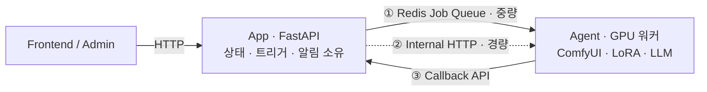

<a id="top"></a>

# 스토리지니 - AI 동화책 생성 서비스 인수인계

> **End-to-End Product Case Study**
> 이 케이스는 **0에서 만든 프로젝트가 아니라, 돌아가는 서비스를 이어받은 기록**입니다.

[`← 경력 상세로`](../experience.md)

---

## A. Executive Summary

아이 정보와 사진으로 LoRA를 학습해 **개인화된 삽화가 들어간 동화책**을 생성하고, 편집·PDF·인쇄까지 잇는 서비스입니다. App(웹)과 Agent(GPU 워커) 2프로세스로 구성돼 있습니다.

저는 이 서비스를 **전임자 퇴사 시점에 인수**했습니다. 서비스는 운영 중이었고 멈출 수 없었습니다. 그래서 이 케이스의 과제는 새 기능을 만드는 것이 아니라 **"만든 사람이 없는 시스템을 어떻게 이해하고 안전하게 이어받는가"**였습니다.

문서만 받지 않고 코드와 실행 경로를 직접 따라가 실패 지점을 특정했고, 외부 의존(GPU·ComfyUI 등 7종) 장애 시 잡이 유실되지 않도록 처리 경로를 보강했습니다. **사용자 영향 없이 이관을 완료**했고, 다음 담당자를 위한 온보딩 문서와 실행 절차를 남겼습니다.

<sub>실측 기준 - REST 엔드포인트 98개 · 외부 연동 7종 · 통신 3채널 (저장소 실측)</sub>

---

## 01. Project Overview

```text
PROJECT
스토리지니 - AI 맞춤형 동화책 생성 서비스

ONE-LINER
아이 정보·사진으로 LoRA를 학습해 개인화 삽화를 생성하고, 편집·PDF·인쇄까지 잇는 서비스

MY PROBLEM
서비스가 운영 중인 상태에서 담당자가 떠났고, 실패 경로가 문서화돼 있지 않았다

MY SOLUTION
코드와 실행 경로를 직접 따라가 실패 지점을 특정하고 호출 관계를 재문서화,
외부 의존 장애에서 잡이 유실되지 않도록 보강

ROLE
인수인계 · 생성 파이프라인 안정화 · 온보딩 문서 작성

STACK
Python 3.13 · FastAPI · PostgreSQL · Redis · ComfyUI · AIToolkit(LoRA)
```

| | |
|---|---|
| **기간** | `2026.06 – 2026.08` (담당 구간) |
| **성격** | **인수인계** - 설계·초기 구현은 전임자 |
| **규모** | App/Agent 2프로세스 · 통신 3채널 · REST 98개 · 외부 연동 7종 · 제작 6단계 |

> ⚠️ **역할 경계** - 이 서비스의 아키텍처 설계와 초기 구현은 제가 한 것이 아닙니다. 제 기여는 **인수·이해·안정화·문서화**입니다.

---

## 02. Background & Problem Definition

### 이 케이스의 문제는 제품이 아니라 인수인계였다

```text
현재 상황
  App(웹) · Agent(GPU 워커) 2프로세스로 돌아가는 서비스가 운영 중인데
  만든 사람이 퇴사한다

      ↓
내가 겪는 문제
  ① 통신이 3채널인데 어느 경로로 무엇이 오가는지 문서에 없다
  ② GPU·외부 API 장애 시 잡이 어떻게 되는지 알 수 없다
  ③ 서비스를 멈출 수 없으므로 "일단 다 읽고 시작" 이 불가능하다

      ↓
문제가 발생하는 원인
  구조는 남았지만 그 구조를 만든 판단은 남지 않았다

      ↓
비즈니스 영향
  담당자 부재 기간 동안 장애가 나면 대응할 사람이 없다

      ↓
해결해야 할 핵심 문제
  운영을 유지하면서 시스템을 이해하고, 다음 사람에게는 같은 일이 반복되지 않게 한다
```

---

## 03. Research & Discovery - 코드가 곧 리서치였다

> ⚠️ 사용자 조사는 수행하지 않았습니다. 이 단계의 "리서치"는 **코드베이스 조사**였습니다.

### 인수받을 때 무엇부터 봤는가

문서만 받으면 안 된다는 판단으로 **실행 경로를 직접 따라갔습니다.** 순서는 다음과 같았습니다.

| 순서 | 대상 | 왜 이것부터인가 |
|---|---|---|
| 1 | **배포 경로** | 어디서 어떻게 뜨는지 모르면 아무것도 못 고친다 |
| 2 | **데이터 흐름** | 무엇이 어디에 쌓이는지 알아야 상태를 읽을 수 있다 |
| 3 | **실패 경로** | 죽으면 무엇이 되는지가 운영의 전부다 |
| 4 | 기능 | 위 셋을 알고 나면 기능은 읽힌다 |

**기능을 마지막에 둔 것이 핵심입니다.** 기능부터 읽으면 코드는 이해되지만 장애 때 아무것도 못 합니다.

---

## 15. System Architecture - 이어받은 구조



### 통신 3채널 - 각각 왜 존재하는가

인수 과정에서 가장 먼저 문서화한 것이 이 표입니다. **어느 경로로 무엇이 오가는지가 어디에도 없었습니다.**

| 채널 | 용도 | 성격 |
|---|---|---|
| **① Redis Job Queue** | GPU 작업 등 중량 요청 | 비동기 · 재시도 대상 |
| **② Internal HTTP** | 경량 조회·제어 | 동기 · 즉시 응답 |
| **③ Callback API** | 진행·완료·실패 보고 | Agent → App 역방향 |

### 경계 원칙 - 이어받으면서 지킨 것

> **App이 모든 상태·트리거·알림을 단일 트랜잭션으로 소유하고, Agent는 GPU 작업만 수행한 뒤 콜백으로 보고한다.**

이 경계를 유지하면서 기능을 확장했습니다. 급하다고 Agent가 직접 DB 상태를 바꾸게 하면 **상태의 주인이 둘이 되어** 이후 어떤 장애도 추적할 수 없게 됩니다.

---

## 14. Core Feature Deep Dive - 생성 파이프라인 안정화

### Problem

제작은 **input → 승인 → 처리 → 검수 → 템플릿 → 다운로드 6단계**를 거칩니다. 이 중 '처리' 단계가 GPU와 외부 API 7종에 의존하는데, 어느 하나가 실패하거나 타임아웃되면 **잡이 어중간한 상태로 남았습니다.**

### 외부 의존 7종

```text
ComfyUI · AIToolkit(LoRA) · Gemini · Claude · Sendon · Naver · SMTP
```

이 중 어느 것도 우리가 통제할 수 없고, GPU 작업은 특히 길고 실패가 잦습니다.

### Investigation

App의 상태 전이와 Agent의 실제 작업 수명을 대조해, **상태는 '처리 중'인데 Agent에는 해당 작업이 없는 구간**을 찾았습니다. 콜백이 유실되거나 Agent가 중간에 죽으면 App은 영원히 기다립니다.

### Solution

- 외부 의존 실패·타임아웃을 **각각 다른 실패로 처리** - 재시도할 수 있는 것과 없는 것을 구분
- GPU·ComfyUI 장애 시에도 **잡이 유실되지 않도록** 처리 경로 보강
- 생성 실패·지연 구간에 대응 경로 확보

### Trade-off

재시도를 넣으면 GPU 자원을 다시 씁니다. 무한 재시도는 비용이고, 재시도 없음은 유실입니다. **어느 실패가 재시도할 가치가 있는지**를 구분하는 것이 실제 작업의 대부분이었습니다.

### Result

외부 의존 장애 상황에서 잡이 유실되지 않게 됐고, 실패가 어느 단계에서 났는지 추적할 수 있게 됐습니다.

---

## 23. Implementation - 인수인계에서 실제로 한 일

### 재문서화

실제 호출 관계를 따라가며 문서를 다시 만들었습니다. 받은 문서와 코드가 어긋나는 지점이 있었고, **코드를 정본으로** 삼았습니다.

### 다음 사람을 위한 산출물

이관을 끝내면서 **온보딩 문서와 실행 절차**를 남겼습니다. 제가 인수받을 때 겪은 것을 다음 사람이 겪지 않게 하는 것이 목적이었습니다.

> 💡 이 경험이 이후 제 퇴사 인수인계 방식에 그대로 반영됐습니다: 설계 문서·ADR·개발원장을 커밋 해시·파일:라인 단위로 앵커해 남겼습니다.

---

## 25. QA / Testing

> ⚠️ **이 프로젝트에서 제가 추가한 자동화 테스트는 없습니다.**
> 검증은 실제 제작 흐름(6단계)을 따라가는 시나리오 확인과, 외부 의존 장애를 유발한 상태에서의 동작 확인으로 했습니다.
> 인수 기간 동안 **사용자 영향이 발생하지 않은 것**이 실질적인 검증 결과입니다.

---

## 27. Result

| 항목 | 내용 |
|---|---|
| **이관** | 사용자 영향 없이 완료 (무중단) |
| **파악 규모** | REST 98개 · 외부 연동 7종 · 통신 3채널 · 제작 6단계 |
| **안정화** | 외부 의존 장애 시 잡 유실 방지 |
| **산출물** | 통신 채널 표 · 호출 관계 재문서화 · 온보딩 문서 · 실행 절차 |

> ⚠️ **정량적 개선 지표(장애율·실패율 감소 등)는 측정하지 않았습니다.** 담당 기간이 짧고 비교 기준선이 없었습니다.

---

## 28. Before / After

```text
BEFORE
  구조는 남았지만 판단은 남지 않음
  · 통신 3채널의 용도가 문서에 없음
  · 외부 의존 실패 시 잡이 어중간한 상태로 남음
  · 담당자 부재 시 대응 불가

AFTER
  · 채널별 용도·성격을 표로 고정
  · 재시도 가능/불가 실패를 구분해 유실 방지
  · 온보딩 문서와 실행 절차로 다음 사람이 이어받을 수 있는 상태
```

---

## 29. Reflection

### 무엇을 잘했는가

**기능보다 실패 경로를 먼저 봤습니다.** 배포 → 데이터 흐름 → 실패 경로 → 기능 순서는 지금도 낯선 코드를 볼 때 그대로 씁니다.

**경계를 지키면서 확장했습니다.** 급할 때 Agent가 DB를 직접 건드리게 하는 편법을 쓰지 않았습니다. 그렇게 했으면 당장은 빨랐겠지만 상태의 주인이 둘이 됐을 겁니다.

### 무엇이 부족했는가

**자동화 테스트를 남기지 못했습니다.** 시나리오 확인은 사람이 하는 것이라 제가 떠나면 사라집니다. 안정화를 했다면 그 안정성을 지키는 테스트도 함께 남겼어야 합니다.

**개선을 수치로 만들지 못했습니다.** "유실되지 않게 했다"는 말은 있는데 그 전에 얼마나 유실됐는지가 없습니다.

**담당 기간이 짧았습니다.** 3개월 안에 인수·안정화·재이관까지 일어났고, 구조적 개선까지는 가지 못했습니다.

### 어떤 의사결정이 가장 중요했는가

**문서를 믿지 않고 코드를 정본으로 삼은 것**입니다. 받은 문서와 실제 호출 관계가 어긋나는 지점이 있었고, 문서를 따랐다면 잘못된 이해 위에 기능을 얹었을 겁니다.

### 예상과 달랐던 것

**인수인계에서 가장 비싼 것은 코드가 아니라 "왜 이렇게 돼 있는지"였습니다.** 구조는 읽으면 알 수 있지만, 그 구조를 만든 판단은 읽어서 알 수 없습니다.

### 다시 만든다면

- **안정화한 지점마다 회귀 테스트를 남기겠습니다.** 사람이 확인한 것은 사람이 떠나면 사라집니다.
- **인수 첫 주에 기준선을 측정하겠습니다.** 개선을 말하려면 개선 전 숫자가 있어야 합니다.

### 배운 것

| 관점 | 배운 것 |
|---|---|
| **기술** | 상태의 주인은 하나여야 한다. 급할 때 그 원칙을 깨면 이후 모든 장애가 추적 불가능해진다 |
| **일하는 방식** | 낯선 시스템은 **배포 → 데이터 흐름 → 실패 경로 → 기능** 순서로 본다 |
| **협업** | 인수인계에서 넘겨야 할 것은 코드가 아니라 **판단의 근거**다. 이 경험이 내 퇴사 인수인계 방식을 바꿨다 |

---

## F. Portfolio Summary

```text
PROBLEM
  운영 중인 서비스의 담당자가 떠났고, 통신 경로와 실패 경로가 문서화돼 있지 않았다

SOLUTION
  코드와 실행 경로를 직접 따라가 실패 지점을 특정하고 호출 관계를 재문서화
  외부 의존 7종의 실패·타임아웃을 구분 처리해 잡 유실 방지

MY ROLE
  인수인계 · 파이프라인 안정화 · 온보딩 문서 작성 (설계·초기 구현은 전임자)

ENGINEERING CONTRIBUTION
  통신 3채널(Redis 큐 · Internal HTTP · Callback) 용도 정의 및 문서화
  App이 상태를 단독 소유하는 경계를 유지하며 기능 확장
  GPU · ComfyUI 장애 시 잡 유실 방지

TECH STACK
  Python 3.13 · FastAPI · PostgreSQL · Redis · ComfyUI · AIToolkit(LoRA)

RESULT
  사용자 영향 없이 이관 완료 · REST 98개 규모 파악 · 온보딩 문서 인계
  (정량 개선 지표는 기준선 부재로 미측정)
```

---

<p align="right">

[`← 경력 상세로`](../experience.md) &nbsp;·&nbsp; [↑ 맨 위로](#top)

</p>
