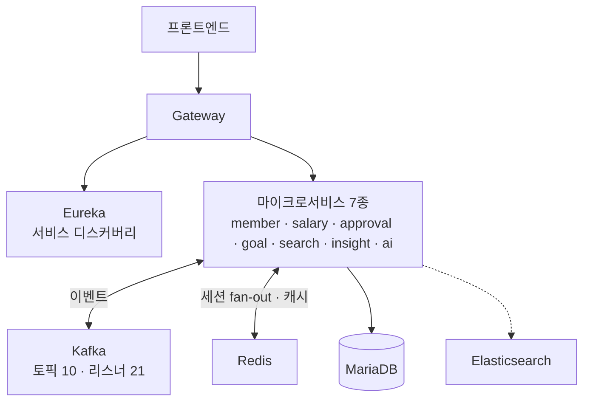

<a id="top"></a>

# Workforce - MSA 기반 통합 HRMS

> **End-to-End Product Case Study**
> 팀 프로젝트이므로 **git 이력으로 확인한 실제 기여**만 적습니다.

[`← 경력 상세로`](../experience.md) &nbsp;·&nbsp; [`저장소 ↗`](https://github.com/beyond-sw-camp/be23-fin-4team-workforce-be-devops)

---

## A. Executive Summary

근태·급여·결재·평가·조직을 하나의 플랫폼으로 통합한 마이크로서비스 HRMS입니다. 한화 SW CAMP 최종 프로젝트로 **4인 팀**이 약 2개월간 수행했습니다.

제가 담당한 것은 **목표·평가(OKR) 도메인 End-to-End**, **실시간 채팅**, **Kubernetes 무중단 배포 구성** 세 가지입니다. MSA 전체 설계·AI 챗봇·RBAC 권한·통합 검색은 다른 팀원이 맡았습니다.

가장 배운 것은 실시간 채팅이었습니다. 서버 1대에서는 정상이던 채팅이 인스턴스를 늘리자 일부 사용자에게만 도달했고, 원인은 **WebSocket 세션이 인스턴스별로 분리돼 있었다**는 것이었습니다. Redis Pub/Sub 패턴 구독으로 fan-out하는 과정에서 Spring 추상화의 함정(`MessageListenerAdapter`가 pattern subscribe 시 channel 대신 pattern을 넘김)까지 파고들어야 했습니다.

<sub>담당 범위는 저장소 이력으로 확인한 것만 적었습니다.
부하 테스트 수치는 팀 공용 클러스터 기준이라 제 성과로 기재하지 않았습니다.</sub>

---

## 01. Project Overview

```text
PROJECT
Workforce - MSA 기반 통합 HRMS

ONE-LINER
근태·급여·결재·평가·조직을 하나의 플랫폼으로 통합한 마이크로서비스 HR 시스템

PROBLEM
HR 데이터가 여러 도구에 흩어져 있고, 반복 업무와 단순 문의가 인사팀에 집중된다

SOLUTION
HR 모듈을 단일 플랫폼으로 통합하고, 이벤트 기반으로 서비스 간 결합을 낮춘다

TARGET
기업 인사팀 · 조직 관리자 · 임직원

MY ROLE
목표·평가(OKR) 도메인 E2E · 실시간 채팅 · K8s 무중단 배포 구성

STACK
Java · Spring Boot · Spring Cloud · Eureka · Kafka · Redis ·
STOMP · MariaDB · Elasticsearch · Kubernetes · AWS EKS
```

| | |
|---|---|
| **기간** | `2026.03 – 2026.05` (약 2개월) |
| **팀 구성** | 4인 (백엔드 · 프론트엔드 · DevOps 겸임) |
| **저장소** | `workforce-be` · `workforce-fe` · `workforce-be-devops` |
| **규모** | 마이크로서비스 7 · REST 엔드포인트 561 · Kafka 토픽 10 / 리스너 21 |

---

## 02. 담당 범위 - 무엇이 내 몫이고 무엇이 아닌가

> 📌 **팀 프로젝트에서 가장 중요한 정보는 "누가 무엇을 했는가"입니다.** 아래는 git 이력으로 확인한 값입니다.

### 내가 담당한 것

| 영역 | 내용 |
|---|---|
| **목표·평가(OKR) 도메인** | 목표 정렬·진척·평가를 도메인 설계부터 API·테스트까지 단독 담당 |
| **실시간 채팅** | STOMP + Redis Pub/Sub 으로 인스턴스 간 메시지 fan-out 구현 |
| **무중단 배포** | 7개 서비스에 RollingUpdate(maxUnavailable 0) + HPA · PDB 신설 |

### 내가 담당하지 않은 것

> MSA 전체 설계 · Common 공통 라이브러리 · RBAC 권한 시스템 · AI 챗봇(RAG) · Elasticsearch 통합 검색 · SSE 알림 · Kafka 브로커/토픽 설계 - **모두 다른 팀원 담당입니다.**

---

## 03. Background & Problem Definition

### Business Context

HR 업무는 근태·급여·결재·평가·조직이 서로 물려 있는데, 실제 현장에서는 각각 다른 도구(엑셀·그룹웨어·별도 SaaS)를 씁니다. 그래서 **데이터가 도구 경계에서 끊기고**, 담당자가 그 사이를 사람 손으로 잇습니다.

### Problem Statement

```text
현재 상황
  HR 데이터가 여러 도구에 분산돼 있다

      ↓
사용자가 겪는 문제
  ① 인사팀: 급여 검증을 엑셀에 의존하고 단순 문의가 집중된다
  ② 직원: 목표·평가 진행 상황을 확인하려면 여러 곳을 봐야 한다

      ↓
문제가 발생하는 원인
  도구가 기능 단위로 나뉘어 있고, 도구 간 데이터 연결이 사람의 작업이다

      ↓
비즈니스 영향
  담당자 시간이 반복 업무에 소모되고, 데이터 정합성이 사람에게 의존한다

      ↓
해결해야 할 핵심 문제
  HR 모듈을 하나의 플랫폼으로 통합하되,
  모듈이 서로를 직접 호출해 강결합되지 않게 한다
```

> ⚠️ **정량적 문제 진술(월 몇 시간·주 몇 건)은 확보하지 못했습니다.** 팀 프로젝트 특성상 실제 고객사 업무 데이터를 확보할 수 없었고, 문제 정의는 도메인 조사에 근거했습니다.

---

## 04. Research & Discovery

> ⚠️ **사용자 인터뷰·설문·사용성 테스트는 수행하지 않았습니다.**
> 요구사항은 HR 업무 도메인 조사와 팀 내 기능 정의 과정에 근거합니다.

---

## 05. User Definition - 내 담당 도메인 기준

| Role | 목적 | Pain Point | 필요한 기능 |
|---|---|---|---|
| **직원** | 내 목표와 진척을 관리 | 목표가 문서에만 있고 진행이 안 보임 | OKR 등록 · 진척 갱신 |
| **팀장** | 팀원 목표 정렬·평가 | 개인 목표가 조직 목표와 연결되지 않음 | 목표 트리 · 평가 |
| **임직원 전체** | 업무 소통 | 외부 메신저로 새어나감 | 사내 실시간 채팅 |

---

## 08. Feature Definition - 담당 기능

### 목표·평가(OKR) 도메인

```text
Problem       개인 목표가 조직 목표와 분리돼 있어 정렬이 안 된다
   ↓
User Need     내 목표가 팀·회사 목표의 어디에 붙는지 보이고, 진척이 갱신돼야 한다
   ↓
Feature       OKR 등록 · 목표 정렬 · 진척 관리 · 평가 연동
   ↓
Value         평가가 문서 작업이 아니라 시스템의 상태 변화가 된다
```

### 실시간 채팅

```text
Problem       사내 소통이 외부 메신저로 새어나가고, HR 컨텍스트와 분리된다
   ↓
User Need     조직/직원 정보와 이어진 사내 채팅
   ↓
Feature       STOMP 기반 실시간 채팅 + 인스턴스 간 메시지 fan-out
   ↓
Value         스케일아웃 환경에서도 메시지가 전원에게 도달한다
```

### 무중단 배포

```text
Problem       배포할 때마다 서비스가 끊긴다
   ↓
Need          (운영 요구) 배포 중에도 요청이 처리돼야 한다
   ↓
Feature       RollingUpdate(maxUnavailable 0) + HPA + PDB + graceful shutdown
   ↓
Value         배포가 릴리스 이벤트가 아니라 일상 작업이 된다
```

---

## 14. Core Feature Deep Dive - 실시간 채팅 fan-out

### Problem

서버 1대에서는 정상 동작하던 실시간 채팅이, **인스턴스를 늘리자 일부 사용자에게만 메시지가 도달**했습니다.

### Investigation

WebSocket 세션은 **연결을 수립한 인스턴스의 메모리에 있습니다.** A 인스턴스에 붙은 사용자와 B 인스턴스에 붙은 사용자는 같은 방에 있어도 서로를 볼 수 없습니다. Spring의 `SimpleBroker`는 프로세스 내부 브로커라 인스턴스 경계를 넘지 못합니다.

```text
BEFORE - 인스턴스별 세션 고립

  사용자 A ──→ [인스턴스 1] ──┐
                              ├─ SimpleBroker (프로세스 내부)
  사용자 B ──→ [인스턴스 2] ──┘        ↑ 서로 도달하지 못함
```

### Solution - Redis Pub/Sub 패턴 구독

```text
AFTER - Redis 를 경유한 인스턴스 간 fan-out

  사용자 A ──→ [인스턴스 1] ──publish──→ Redis ──subscribe──→ [인스턴스 1]
                                          │                    ↓ 로컬 세션에 push
  사용자 B ──→ [인스턴스 2] ←─subscribe───┘                  [인스턴스 2]
```

한 인스턴스가 받은 메시지를 `member-chat:room:{roomId}` 채널로 publish하고, **모든 인스턴스가 `member-chat:room:*` 패턴을 구독**해 자기한테 붙은 세션으로 밀어줍니다.

### 구현 중 막힌 지점 - 프레임워크 추상화의 함정

> 🔥 이 프로젝트에서 가장 오래 붙잡았던 문제입니다.

Spring의 `MessageListenerAdapter`는 편의를 위해 콜백 시그니처를 단순화해 주는데, **패턴 구독(pattern subscribe)에서는 실제 channel 대신 pattern을 넘겨줍니다.**

```text
기대   member-chat:room:42      → roomId = 42
실제   member-chat:room:*       → roomId 파싱 실패
```

`roomId`를 파싱할 수 없으니 어느 방으로 보낼지 알 수 없었습니다.

**해결** - `MessageListenerAdapter`를 걷어내고 `MessageListener`를 직접 구현해, Redis 원본 메시지에서 **channel과 pattern을 각각 꺼내 쓰도록** 했습니다.

```text
Trade-off
  프레임워크가 제공하는 역직렬화·메서드 디스패치 편의를 포기하고
  원본 Message 를 직접 다루게 됐다. 코드가 조금 길어졌다.
```

### 한계 - Redis Pub/Sub이 보장하지 않는 것

> ⚠️ **Redis Pub/Sub은 메시지를 저장하지 않습니다.** 구독자가 그 순간 없으면 유실됩니다.
> 따라서 채팅 이력은 별도로 DB에 저장해야 하고, Pub/Sub은 **실시간 전달 경로**로만 써야 합니다.
> 전달 보장이 필요하면 Redis Streams나 Kafka로 가야 합니다.

**검토했던 대안**

| 대안 | 얻는 것 | 잃는 것 |
|---|---|---|
| 외부 STOMP 브로커 (RabbitMQ) | 브로커가 fan-out을 대신함 | 운영 대상 추가 |
| Sticky Session | 구현 단순 | **방 단위 문제를 못 품** - 같은 방의 다른 사용자는 여전히 다른 인스턴스 |
| **Redis Pub/Sub ✓** | 이미 쓰는 Redis 재사용 · 방 단위 해결 | 전달 보장 없음 (이력은 DB 별도) |

### Result

인스턴스 수와 무관하게 메시지가 도달합니다. 이 패키지는 제가 단독으로 구현했습니다.

---

## 15. System Architecture



> 이 구조 전체는 **팀 공동 산출물**이며, MSA 분리 기준과 Kafka 토픽 설계는 다른 팀원이 주도했습니다. 제 담당은 `goal-service`와 `member-service/memberchat`, 그리고 배포 구성입니다.

### Kafka를 쓴 이유 (팀 결정)

결재가 끝나면 알림·조직 반영이 따라와야 하는데, 동기 호출로 엮으면 **알림 서비스가 죽을 때 결재가 막힙니다.** 이벤트로 끊으면 각 서비스가 독립적으로 실패할 수 있습니다.

> 소비자 관점에서 제가 다룬 부분 - Kafka는 at-least-once가 기본이라 **소비자가 멱등해야** 합니다. 그리고 순서는 파티션 단위로만 보장되므로 순서가 중요한 이벤트는 같은 키로 보내야 합니다.

---

## 22. Infrastructure / DevOps - 무중단 배포

**7개 서비스에 동일한 설정으로 일괄 적용**했습니다.

```yaml
replicas: 2                              # 기본 Pod 2개 유지
minReadySeconds: 10                      # Ready 10초 유지해야 배포 성공
strategy:
  type: RollingUpdate
  rollingUpdate:
    maxUnavailable: 0                    # 새 Pod Ready 전엔 기존 Pod 안 내린다
    maxSurge: 1                          # 배포 중 임시 +1
terminationGracePeriodSeconds: 60        # 종료 중 Pod 가 요청을 마무리할 시간
```

| 설정 | 없으면 무슨 일이 생기는가 |
|---|---|
| `maxUnavailable: 0` | 새 Pod가 Ready 되기 전에 기존 Pod가 내려가 순간적으로 가용 replica가 준다 |
| `minReadySeconds: 10` | Ready 직후 죽는 Pod를 걸러내지 못하고 다음 Pod로 넘어간다 |
| `terminationGracePeriodSeconds: 60` | SIGTERM 후 기본 30초에 SIGKILL → **처리 중인 요청이 잘린다** |
| **PDB** | 노드 드레인 같은 자발적 중단 때 Pod가 동시에 내려갈 수 있다 |
| **HPA** (CPU 80%, scale-down stabilization 300s) | 트래픽 출렁임에 Pod가 오르내리는 플래핑 |

> ⚠️ **주의 - 이 설정만으로 무중단이 완성되지 않습니다.** 앱이 SIGTERM을 받아 graceful shutdown을 하고, 동시에 readiness를 실패로 돌려 새 트래픽을 받지 않아야 합니다.
>
> ⚠️ **부하를 걸어놓고 배포하는 검증은 수행하지 못했습니다.** 팀 공용 클러스터라 부하 테스트 수치를 제 성과로 기재하지 않습니다. **설정 수준에서 무중단 조건을 갖췄다**는 것까지가 제가 말할 수 있는 범위입니다.

### Eureka와 Kubernetes의 중복

서비스 디스커버리를 Eureka와 K8s Service DNS 양쪽으로 갖게 된 구성입니다. 학습 목적과 Spring Cloud 스택 일관성 때문이었지만, **실무라면 둘 중 하나로 통일하는 게 맞습니다.**

---

## 25. QA / Testing

> ⚠️ **커버리지·E2E·부하 테스트 수치는 확보하지 못했습니다.**
> 제 담당 범위에서는 도메인 단위 테스트와 통합 시나리오 검증을 수행했으나, 정량 지표로 남긴 자료가 없어 수치를 적지 않습니다.

---

## 27. Result

### 담당 범위

| 영역 | 내용 |
|---|---|
| 목표·평가(OKR) 도메인 | 설계 · API · 테스트까지 단독 |
| 실시간 채팅 | STOMP + Redis Pub/Sub fan-out 구현 |
| 무중단 배포 | 7개 서비스 일괄 적용 (RollingUpdate · HPA · PDB) |

### 팀 전체 규모 (참고 - 공동 산출)

마이크로서비스 7 · REST 엔드포인트 561 · Kafka 토픽 10 / 리스너 21 · HPA 대상 서비스 7

---

## 29. Reflection

### 무엇을 잘했는가

**추상화가 감춘 것을 확인하러 한 단계 내려갔습니다.** `MessageListenerAdapter`가 pattern을 넘기는 것은 문서를 읽어서가 아니라 실제 값을 찍어보고 알았습니다. 편의 API가 편의를 제공하는 대신 무엇을 감추는지 확인하는 습관이 여기서 생겼습니다.

**배포 구성을 커밋 한 건으로 7개 서비스에 일관 적용했습니다.** 서비스마다 다르게 설정하면 나중에 어느 것이 표준인지 아무도 모릅니다.

### 무엇이 부족했는가

**무중단을 증명하지 못했습니다.** 설정은 갖췄지만 부하를 걸고 배포해 요청 유실 0을 확인하지 않았습니다. "무중단 배포를 구성했다"와 "무중단을 검증했다"는 다릅니다.

**Redis Pub/Sub의 유실 가능성을 구조로 보완하지 않았습니다.** 이력은 DB에 저장했지만, 전달 실패 시 재전송 경로는 만들지 않았습니다.

**팀 프로젝트에서 내 도메인 밖을 잘 몰랐습니다.** MSA 분리 기준이나 Kafka 토픽 설계 근거를 지금 설명하라면 개념 수준까지만 가능합니다.

### 어떤 의사결정이 가장 중요했는가

**Sticky Session이 아니라 Pub/Sub을 택한 것**입니다. Sticky Session은 구현이 훨씬 쉽지만 **같은 방의 다른 사용자가 다른 인스턴스에 붙는 문제를 전혀 풀지 못합니다.** 증상(사용자별 고착)이 아니라 원인(방 단위 브로드캐스트)을 봐야 나오는 선택이었습니다.

### 예상과 달랐던 것

**"서버 1대에서 됐다"가 아무 보증이 아니라는 것.** 분산 환경에서 깨지는 것들은 단일 인스턴스 테스트를 전부 통과합니다.

### 다시 만든다면

- **부하를 걸고 배포하는 검증을 반드시 하겠습니다.** 설정만으로는 무중단이라고 말할 수 없습니다.
- **디스커버리를 하나로 통일하겠습니다.** Eureka와 K8s Service를 둘 다 두는 구성은 학습에는 좋았지만 운영 관점에서는 중복입니다.
- **채팅 전달 보장이 필요한지 먼저 정의하겠습니다.** 필요하면 처음부터 Streams/Kafka로 갔을 겁니다.

### 배운 것

| 관점 | 배운 것 |
|---|---|
| **기술** | 분산 환경에서 상태(WebSocket 세션)를 프로세스 메모리에 두면 인스턴스 경계에서 반드시 깨진다 |
| **프레임워크** | 추상화가 편할수록 **무엇을 감추는지** 확인해야 한다 |
| **인프라** | `maxUnavailable: 0`은 무중단의 필요조건이지 충분조건이 아니다. 앱의 graceful shutdown이 짝을 이뤄야 한다 |
| **협업** | 팀 프로젝트에서 내 기여를 말하려면 **경계를 먼저 그어야** 한다. 안 한 것을 먼저 말하면 한 것이 믿어진다 |

---

## F. Portfolio Summary

```text
PROBLEM
  HR 데이터가 여러 도구에 흩어져 반복 업무가 인사팀에 집중된다

SOLUTION (팀)
  HR 모듈을 단일 플랫폼으로 통합하고 이벤트 기반으로 서비스 결합을 낮춤

MY ROLE
  목표·평가(OKR) 도메인 E2E · 실시간 채팅 · K8s 무중단 배포 구성
  (MSA 설계 · AI 챗봇 · RBAC · 통합 검색은 타 팀원 담당)

KEY CONTRIBUTION
  목표·평가(OKR) 도메인을 설계부터 API · 테스트까지 단독 담당
  실시간 채팅 STOMP + Redis Pub/Sub 인스턴스 간 fan-out 구현
  7개 서비스에 RollingUpdate + HPA · PDB 일괄 적용

ENGINEERING HIGHLIGHT
  MessageListenerAdapter 가 pattern subscribe 에서 channel 대신 pattern 을 넘기는
  프레임워크 함정을 MessageListener 직접 구현으로 해결

TECH STACK
  Java · Spring Boot · Spring Cloud · Eureka · Kafka · Redis · STOMP ·
  MariaDB · Elasticsearch · Kubernetes · AWS EKS

RESULT
  마이크로서비스 7 · Kafka 토픽 10 / 리스너 21 (팀 공동 산출)
  (무중단 배포는 설정 수준 구성까지 - 부하 검증 미수행)
```

---

<p align="right">

[`← 경력 상세로`](../experience.md) &nbsp;·&nbsp; [↑ 맨 위로](#top)

</p>
