

# 경력 상세 · Experience

> [← 프로필로 돌아가기](../README.md)
>
> 프로젝트별 상세 역할·성과와 아키텍처 도식입니다. 요약은 프로필 README를 참고하세요.

**목차**

**(주)에이아이지먼트**
- [PLYN — AI-Native SRM 플랫폼](#plyn)
- [해상운송 정시성 Visibility PoC](#shipping)
- [스토리지니](#storygenie)
- [팀 협업 체계·개발 환경 구축](#team)

**(주)잼퍼블릭**
- [승부사 온라인](#adventurer)
- [사내 매출 통계 대시보드](#dashboard)
- [챔프포커](#champpoker)
- [신규 사업부 모바일 MVP](#mobile)

---

##  (주)에이아이지먼트 · Full-stack Engineer · `2026.06 – 현재`

> B2B SaaS·PoC를 기획·디자인·개발·QA까지 단독 전담. 요구사항 정의와 시퀀스 플로우·와이어프레임·프로토타입 설계부터 데이터 파이프라인·API·화면 구현·QA까지 제품 전 과정을 end-to-end로 담당합니다.

### PLYN — AI-Native SRM 플랫폼

[`바로가기 ↗`](https://plynai.com) &nbsp;·&nbsp; `2026.06 – 진행중`

공급사 발굴부터 RFQ·협상까지 거래 전 프로세스를 자동 실행하고, 대외 데모로 리스크 예측·설명까지 확장.

       

> [개발기 → LLM 하나로는 안 됐다 — 7개 시나리오를 위한 프로바이더 추상화 계층](writing/plyn-llm-provider-abstraction.md)

#### 아키텍처

**배포 구조 — 모듈러 모놀리스 (api · worker · ml)**

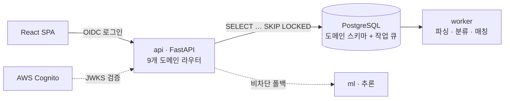

**LLM 인텔리전스 흐름 — 시나리오 디스패치 → 멀티 프로바이더 → 구조화 응답**

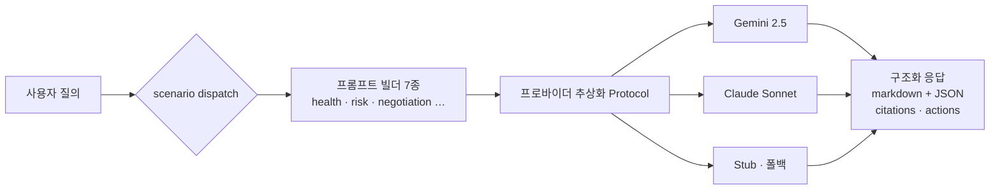

**애플리케이션 워크플로우 — 지출 인테이크부터 재소싱까지 (회차 순환)**

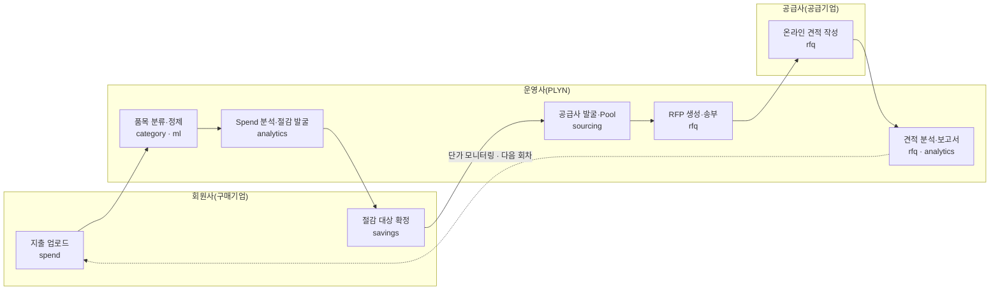

**Supplier Health 트리아지 — 신호 → 우선순위 → 액션**

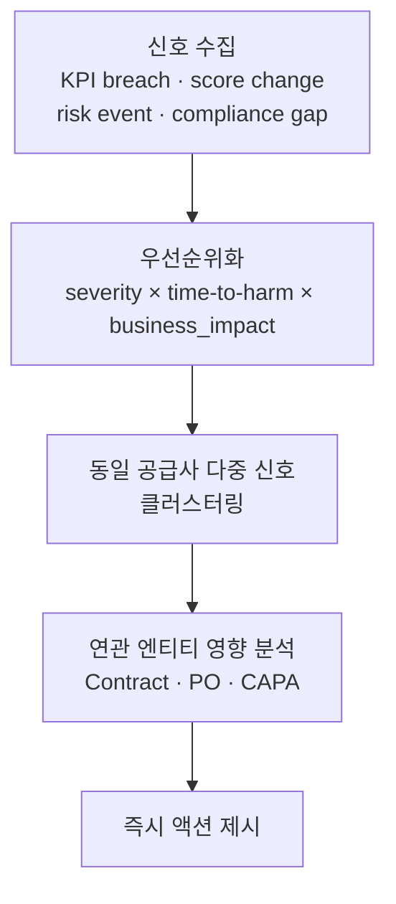

#### 상세 역할 및 성과

**① 기획·설계 — 제품 정의**
- **요구사항 정의·플로우 설계** — 시퀀스 플로우·와이어프레임·프로토타입을 직접 설계해 SRM 업무 프로세스를 제품 흐름으로 정의
- **설계 스펙 문서화(spec-driven)** — API 계약 9종·데이터 엔티티 10종·물리 스키마·도메인 이벤트 10종·상태머신 5종을 구현 전 스펙으로 선정의
- **PRD·소개 자료 작성** — AI-Native SRM PRD 및 대외 소개서 등 산출물 제작

**② 플랫폼·아키텍처 — 모듈러 모놀리스 기반 구축**
- **도메인 경계 강제 아키텍처** — api·worker·ml 3배포 단위 + 9개 도메인 패키지를 import-linter로 CI에서 경계 강제
- **Cognito 기반 인증 전환** — 자체 인증 서버를 제거하고 BE는 JWKS 검증(Resource Server)만 담당하도록 재설계
- **DB 기반 작업 큐 도입** — 비용 절감을 위해 Redis/ElastiCache를 걷어내고 PostgreSQL `SKIP LOCKED` 큐로 CPU 바운드 작업 격리
- **인프라 통합·IaC** — 멀티 서비스 Docker compose 구성과 스키마 격리, Cognito 인증 인프라 Terraform 코드화, alembic 단일 마이그레이션 트리 운영

**③ AI-Native SRM 도메인 구현 — 거래 전 프로세스 자동화**
- **공급사 도메인 9종 구현** — 발굴·미팅노트·RFQ·온보딩·디렉터리·헬스·협상·조달리포트·인테이크를 REST API 26종으로 묶어 하나의 실행 시스템으로 구성
- **공급사 발굴 AI 챗봇 워크플로우** — 챗봇 스캔으로 발굴 후보를 제시하고, 카드에서 본 후보가 상세까지 정합성 있게 이어지는 인터랙션 구현
- **비정형 입력 정규화·자산화** — 이메일·문서·카탈로그·시험성적서·견적서 등 비정형 정보를 공급사 마스터 기준으로 정규화해 재사용 가능한 공급사 지식 그래프로 축적

**④ LLM 인텔리전스 연동 — Gemini·Claude 멀티 프로바이더**
- **프로바이더 추상화 계층 설계** — Gemini(`gemini-2.5-flash`)·Claude(`claude-sonnet-4-6`)를 공통 Protocol 인터페이스 뒤로 추상화하고 dev/test용 Stub 클라이언트로 폴백, JSON Schema 기반 구조화 추출과 대화형 챗을 분리
- **시나리오별 프롬프트 디스패치** — Supplier Health·Risk Center·Negotiation·Compare·Memory·Scorecards·AI-Manager 7개 시나리오를 `(system_prompt, messages)` 빌더로 매핑, 신규 시나리오는 매핑만 확장하는 구조로 설계
- **근거 추적형 구조화 응답** — 모델이 마크다운 인사이트 본문 + 말미 JSON 블록(citations·assumptions·actions)을 규약된 순서로 반환하도록 강제하고, 서비스 레이어가 이를 파싱해 응답 스키마로 분리 → 답변마다 참조 근거·후속 액션을 추적 가능하게 구현
- **Supplier Health 트리아지** — KPI breach·score change·risk event·compliance gap 신호를 심각도 × time-to-harm × business_impact로 우선순위화하고, 동일 공급사 다중 신호 클러스터링·연관 엔티티(Contract/PO/CAPA) 영향·즉시 액션까지 제시
- **LLM 실패 비차단(graceful)** — 호출 타임아웃·SDK 재시도(max 2)·예외 계층·Stub 폴백으로 LLM 장애 시에도 파이프라인이 멈추지 않도록 처리

**⑤ QA·검증**
- **상태 전이 정의·정합성 QA** — 발굴·RFQ·온보딩·협상 등 주요 흐름을 상태머신 명세로 정의하고, 챗봇 스캔 결과가 상세 화면까지 정합성 있게 이어지는지 시나리오 기반으로 검증·회귀 방지
- **LLM·도메인 테스트** — LLM 클라이언트(gemini·claude·chat) 단위 테스트 + 챗·발굴 통합 테스트로 회신 안정성 확보

**⑥ 대외 데모 — 대외 산출물**
- **대외 데모 플로우 단독 구성** — 문서 기반 수집 파이프라인을 단일 흐름으로 묶어 리스크 컨텍스트를 2분 내 확보하는 시나리오 설계
- **인터랙티브 리포트 구현** — 예측 → 설명 → 대응으로 이어지는 리스크 리포트를 하나의 화면 흐름으로 구현
- **리스크 보드·원인 카드 UI** — 위험 등급 보드와 원인 그래프를 시각화해 위험의 근거를 화면에서 설명

[↑ 맨 위로](#top)

---

### 해상운송 정시성 Visibility PoC

`2026.06 – 2026.12` &nbsp;·&nbsp; 고객사: 글로벌 가전 제조사 · 정부지원사업

화물 지연 리스크를 조기 감지하는 정시성 Visibility 플랫폼 — 에이전트(적재·정규화) 골격·인프라 세팅부터 위험 산출·모니터링 대시보드까지 백그라운드·웹 양 구간 단독 담당.

     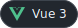  

> [개발기 → 정확한 예측이 불가능하다는 걸 인정하는 데서 시작한 설계](writing/shipping-visibility-design.md)

#### 아키텍처

**데이터 계층 — raw · core · svc 3계층 분리**

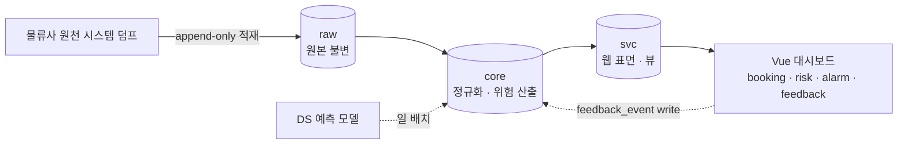

**애플리케이션 워크플로우 — 일 스냅샷 멱등 적재 (해시 대조)**

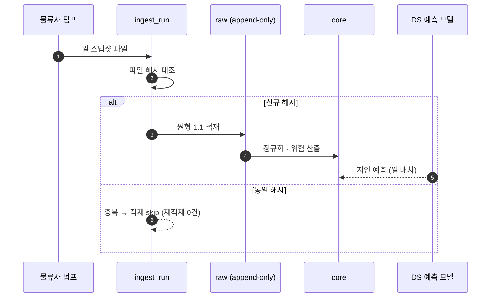

#### 상세 역할 및 성과

**① 기획·설계 — 요구사항부터 화면 정의까지**
- **요구사항 명세·데이터 정의서 작성** — 물류사 원천 시스템 export 항목을 업무 요건과 매핑해 수급 범위·주기·필수 컬럼을 확정, 데이터정의서·화면기능정의서(v1.3)·WBS 등 기획 산출물 제작
- **리스크 판단 기준 설계** — 단일 스냅샷 데이터로는 정확한 ETA 예측이 불가함을 정직하게 스코핑, 핵심 산출을 위험 등급(진행·주의·회피) + 근거 한 줄로 재정의하고 평가 기준을 "회피 권고 묶음의 정밀도"로 확정

**② 데이터 아키텍처 — raw·core·svc 3계층 분리**
- **계층 분리 설계** — 원본 불변 보존(raw) → 정규화·위험 산출(core) → 웹 표면(svc, 대부분 뷰)으로 스키마를 분리, 변화 추적은 파생 레이어가 전담하도록 구성(일 변경률 8.4% 실측 기반)
- **엔티티 키 검증** — 데이터 프로파일링으로 복합 자연키 유일성 99.6% 확보, 잔여 중복은 원천의 부분정보 분할 방출이 원인임을 규명해 대체 판정 로직 제안

**③ 인프라·운영 — DB·배포 환경 단독 세팅**
- **로컬·dev 동형 DB 인프라 구성** — docker-compose(PostgreSQL 16)로 로컬·dev를 동일 구조로 세팅, initdb 스크립트로 스키마·롤을 1회 생성
- **롤 기반 권한 경계** — agent·ds·web 3개 롤로 스키마 소유·접근 권한을 분리(웹은 svc만, write는 feedback_event 한정), 포트 분리·시크릿 커밋 방지 등 운영 위생 확립
- **배포 구성** — 원본 보관 S3 + 단일 이미지 컨테이너, EKS 배포 토폴로지 설계

**④ 에이전트(백그라운드) — 적재·정규화 파이프라인 골격 구현**
- **agent–DS 책임 경계·핸드오프 계약 설계** — 적재·정규화의 물리 골격(빈 테이블·Alembic 마이그레이션·멱등 적재 틀)은 agent가, 등급·근거 산식은 DS가 맡도록 경계를 정의하고 PostgreSQL 단일 결합으로 핸드오프
- **원천 시스템 덤프 랜딩 구축** — 외부 덤프를 원형 1:1로 적재하는 랜딩 12테이블을 Alembic으로 구성
- **일 스냅샷 캡처 체계** — 소급 불가한 관측 이력(eta_observation, append-only)을 매일 캡처하는 ingest_run 메타 구조를 최우선 구축, 파일 해시 이력으로 멱등성 확보 → 동일 파일 중복 적재 0건(누적 약 20만 행)

**⑤ 위험 산출·서비스화**
- **예측 모델 연동·일 배치화** — DS 개발 지연 예측 모델의 입력 규격을 표준화해 일 배치로 연결, 예측 결과를 위험 신호로 대시보드에 노출
- **인시던트 그룹핑(경보 폭포 방지)** — 한 선박에서 나온 다수 지연 신호를 인시던트로 묶어 중복 경보를 차단
- **피드백 루프 설계** — 담당자 피드백을 수집하고, 선제 대응(preventive) 건은 오탐 집계에서 제외해 지표를 왜곡 없이 축적

**⑥ 웹 — 정시성 모니터링 대시보드**
- **모듈러 모놀리식 백엔드** — booking·risk·alarm·feedback 도메인을 내부 HTTP 계약으로 분리, 멀티 스키마 Alembic로 마이그레이션 관리
- **위험 보드·대량 목록 UX** — B/L 목록·경로·상태·ETA 기준 위험구간을 임계값별로 시각화, 다중 검색·필터 조합 환경에서 조회 성능 확보

[↑ 맨 위로](#top)

---

### 스토리지니

`2026.06 – 진행중`

App/Agent 파이프라인 기반 AI 맞춤형 동화책 생성 서비스 — 인수인계 후 생성 파이프라인 안정화·확장. 아이 정보·사진으로 LoRA 학습 → 개인화 삽화 생성 → 편집·PDF·인쇄까지 한 흐름으로 처리.

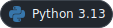   

#### 아키텍처

**App(웹) · Agent(GPU 워커) 분리 — 3개 통신 채널**

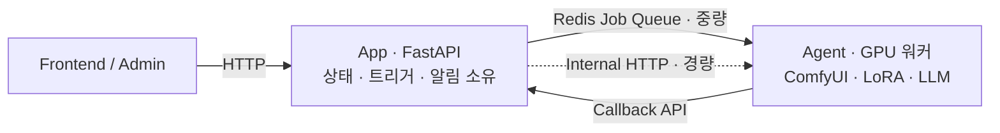

#### 상세 역할 및 성과

**① 서비스 인수인계 — 무중단 연속성**
- App·Agent 2프로세스 구조와 인프라를 파악해 유실 없이 서비스 연속성 확보 (운영·확장 중인 서비스 규모: REST API 98개)

**② App/Agent 분리 구조 이해·확장**
- App이 모든 상태·트리거·알림을 단일 트랜잭션으로 소유하고 Agent는 GPU 작업만 수행 후 콜백 보고하는 경계를 유지하며 기능 확장
- 통신 3채널(Redis 큐=중량 비동기, Internal HTTP=경량, Callback=진행·완료·실패 보고) 위에서 제작 흐름 확장

**③ 생성 파이프라인 안정화**
- input → 승인 → 처리 → 검수 → 템플릿 → 다운로드 6단계 흐름에서 생성 실패·지연 구간 대응
- 외부 연동 7종(ComfyUI·AIToolkit(LoRA)·Gemini·Claude·Sendon·Naver·SMTP)의 실패·타임아웃 처리로 파이프라인 안정화

[↑ 맨 위로](#top)

<!-- TODO(B안): 앞으로 작업하며 "숫자가 실제로 나온 뒤" 채울 정량 성과. 측정·개선 결과가 확보되면
     __ 를 실제 값으로 바꾸고 주석을 해제해 배지/상세로 노출할 것. (개발 순서: 계측 → 안정화 → 확장)

- 생성 단계별 실패·타임아웃 구간을 계측 지표로 노출하고, 재시도·폴백 정책을 정비해 생성 성공률 __% 확보
- Redis 큐 적체·GPU 워커 병목 구간을 분석해 삽화 생성 리드타임 __분 → __분으로 단축
- LoRA 학습 → 삽화 생성 → 편집 → PDF 내보내기 파이프라인에 신규 단계 +__ 를 추가
-->

---

### 팀 협업 체계·개발 환경 구축

`2026.06 – 진행중` &nbsp;·&nbsp; 전사 공통

분산된 협업 도구 정리 및 개발 알림 자동화 도입.

- **이슈 관리 체계 이관·표준화** — Notion·메일 등에 흩어져 있던 업무를 Jira 티켓 체계로 정리·이관해 추적성과 협업 가시성 확보
- **Slack Git 알림 봇 신설** — 커밋·PR·배포 이벤트를 Slack으로 자동 알림해 팀 개발 흐름 가시화
- **개발 워크플로우 정비** — 흩어진 커뮤니케이션을 티켓·알림 중심으로 통합

[↑ 맨 위로](#top)

<!--
- **항공물류 PoC** · `2026.07 – 예정` · 공공 부문 · 정부지원사업
  항공 화물 운송 데이터 기반 PoC — 프로토타입 개발 착수 예정
  국방 분야 화주 PoC — 프로토타입 개발 착수 예정
-->

---

##  (주)잼퍼블릭 · Frontend Engineer · `2023.03 – 2025.08` (2년 5개월)

> 실시간 웹 서비스와 사내 시스템 프론트엔드를 단독으로 설계·운영했습니다.

### 승부사 온라인

[`바로가기 ↗`](https://www.adventurer.co.kr/) &nbsp;·&nbsp; `2023.03 – 2025.08`

대규모 실시간 스포츠 베팅 웹 애플리케이션 — PC·모바일 완전 대응 프론트엔드 개발(741파일·15만 라인 규모의 프로덕션).

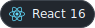     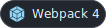

#### 아키텍처

**실시간 반응성 흐름 — 이중 WebSocket · MobX · Remote Config**

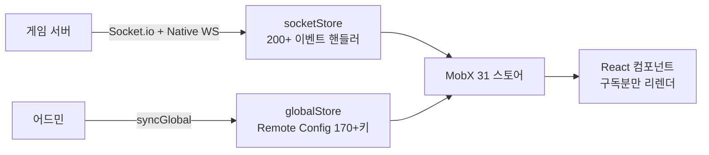

#### 상세 역할 및 성과

**① 대규모 실시간 통신 — Socket.io + Native WebSocket 이중 구조**
- Socket.io와 Native WebSocket 이중 연결로 안정성 확보, WebSocket 불가 환경은 자동 폴링 fallback 전환
- 연결 실패 시 지수 백오프 재연결(최대 5회) + wildcard 이벤트 구독으로 배당률·채팅·스코어·결제 알림 등 200+ 실시간 이벤트 핸들링

**② MobX 상태 아키텍처 — 도메인별 31개 스토어**
- `@observable`/`@computed`/`@action` 데코레이터로 세밀한 반응성 설계 — 변경된 값을 구독한 컴포넌트만 정확히 리렌더
- 스토어 간 의존성(auth→user→matchup) 관리 + 라우터 스토어 연동으로 URL ↔ 상태 양방향 동기화

**③ HTTP 레이어 고도화**
- Axios 커스텀 인스턴스에 중복 요청 제거(URL+파라미터 시간 윈도우) 구현
- 401 응답 시 자동 토큰 갱신 후 원요청 재시도 + 에러 코드 → 사용자 메시지 매핑·전역 토스트 처리

**④ 성능 최적화**
- `react-loadable` 라우트 단위 코드 스플리팅으로 초기 번들 최소화, `react-virtualized`/`react-window`로 대용량 경기 목록 가상화
- `cache-loader`+`thread-loader` 병렬 컴파일, 모바일 300ms 탭 지연 제거·스크롤 리스너 중복 등록 방지

**⑤ 복잡한 베팅 슬립 UI — 실시간 배당 계산**
- 단식/다리 베팅 조합을 실시간 계산하고 배당률 변경을 버블 알림 + 자동 반영
- 현금·티켓·다이아 등 다중 화폐, 쿠폰·아이템 자동 선택, 금액 포맷팅·유효성 검사

**⑥ 어드민 원격 설정(Remote Config) — 무배포 Feature Flag**
- 170+ 설정 키를 TypeScript enum(`GlobalStoreKey`)으로 중앙 정의해 코드 재배포 없이 기능 on/off·URL·경제 수치를 제어
- WebSocket `syncGlobal` 이벤트 → MobX `@observable` 자동 갱신 → 구독 컴포넌트 즉시 반영(새로고침 불필요), 점진적 롤아웃 지원

[↑ 맨 위로](#top)

---

### 사내 매출 통계 대시보드

`2023.03 – 2025.08` &nbsp;·&nbsp; 사내 시스템

스포츠 베팅·포커 두 도메인의 매출·유저·게임 데이터를 실시간 시각화하는 어드민 리포트 대시보드.

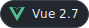   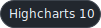 

#### 아키텍처

**이중 도메인 대시보드 — 공유 인증 · 도메인 격리 · 등급 접근 제어**

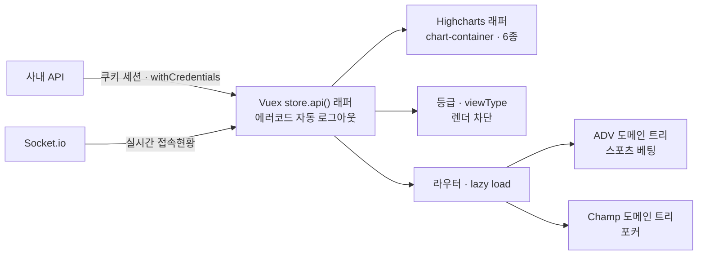

#### 상세 역할 및 성과

**① 이중 도메인 대시보드 아키텍처**
- ADV(스포츠 베팅)·Champ(포커) 두 플랫폼 데이터를 탭 전환으로 완전 분리, 공유 인증 + 도메인별 격리 데이터 구조로 설계
- 30개 컴포넌트를 계층적으로 구성(Layout → dashboard → 도메인별 트리)

**② Highcharts 데이터 시각화**
- 재사용 차트 래퍼(`chart-container`)로 동적 chartId 6개 차트 인스턴스 관리 — 일별 베팅·유저 수, 월별 결제, 헤비 유저 등
- 한국식 천 단위 로케일 커스텀, 차트 클릭 → 상세 데이터 다이얼로그 14종 연동

**③ Vuex 커스텀 API 래퍼**
- `store.api()`로 공통 HTTP 래퍼 구현 — 에러 코드 기반 자동 로그아웃(`S002`), `Content-Disposition` 감지 시 파일 다운로드 자동 처리
- 쿠키 세션 + `withCredentials` 인증, 앱 시작 시 토큰 자동 복원

**④ 실시간 접속 현황(Socket.io)**
- 현재 접속자 + 일·주·월·전체 최대 접속 수를 실시간 표시, 전역 소켓 인스턴스로 연결 상태 감지

**⑤ 등급 기반 접근 제어**
- Grade(권한 레벨) + viewType(가시성) 이중 권한 구조로 고수익 위험 차트·민감 지표를 낮은 등급엔 렌더링 자체 차단
- 권한 정보를 Vuex + localStorage 이중 저장으로 세션 유지

**⑥ 다중 환경 빌드·배포**
- dev/qa/prod webpack 완전 분리(baseURL·BUILD_ENV 주입), 벤더 청크 분리 + 라우트 단위 lazy loading
- Firebase Hosting SPA rewrites로 History 모드 배포, FileSaver.js로 CSV/Excel 리포트 내보내기

[↑ 맨 위로](#top)

---

### 챔프포커

[`바로가기 ↗`](https://champpoker.co.kr/) &nbsp;·&nbsp; `2025.01 – 2025.08`

Unity 웹보드 게임 — 웹뷰 인터페이스 퍼블리싱.

 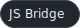 

#### 아키텍처

**웹뷰 퍼블리싱 — JSON 콘텐츠 분리 · JS Bridge 연동**

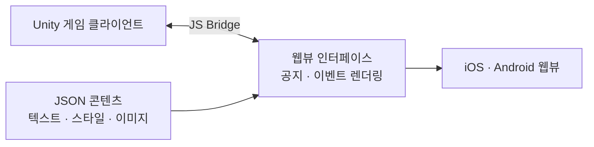

- **퍼블리싱 관리 체계화** — 텍스트·스타일·이미지 요소를 JSON 기반으로 분리 관리해 코드 변경 없이 콘텐츠를 반영하도록 구조화
- **JS Bridge ↔ Unity WebView 연동** — 게임 클라이언트와 웹뷰 간 공지·이벤트 렌더링을 브릿지 통신으로 구현
- **웹뷰 스타일 가이드·반응형 대응** — 기기별 해상도·렌더링 차이를 흡수하는 스타일 가이드 정의
- **기기별 오류 대응 최적화** — iOS/Android 웹뷰 환경별 렌더링 이슈 대응

[↑ 맨 위로](#top)

---

### 신규 사업부 모바일 MVP

`2025.07 – 2025.08`

Expo 기반 React Native 마이그레이션 및 프론트엔드 개발.

    

#### 아키텍처

**크로스 플랫폼 단일 코드베이스 — EAS Build · OTA**

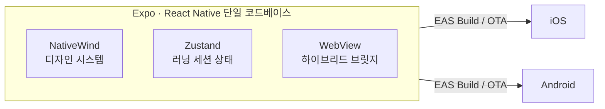

- **크로스 플랫폼 앱 구조 설계** — Expo/RN 기반 iOS·Android 동시 대응 초기 세팅 및 NativeWind 디자인 시스템 구성
- **러닝 핵심 플로우 화면 개발** — 러닝 기록·세션 상태를 Zustand로 관리하는 코어 플로우 구현
- **하이브리드 웹뷰 연동** — 웹 콘텐츠를 WebView로 통합하고 네이티브 브릿지 통신 처리
- **2개월 내 양 플랫폼 동시 배포** — EAS Build/OTA를 도입해 스토어 심사 없이 수정 반영, 검증 사이클 단축
- **재작업 리소스 최소화** — 컴포넌트 단위 개발로 빠른 기능 검증 진행

[↑ 맨 위로](#top)

---

> [← 프로필로 돌아가기](../README.md)
