

# 경력 상세 · Experience

> [← 프로필로 돌아가기](../README.md)
>
> 프로젝트별 상세 역할·성과와 아키텍처 도식입니다. 요약은 프로필 README를 참고하세요.

**목차**

**(주)에이아이지먼트** `2026.06 – 2026.08`
- [PLYN — AI-Native SRM 플랫폼](#plyn)
- [공급사 탐색 R&D (WS03) 전수 검토](#rnd-review)
- [PLYN CES 2027 혁신상 출품 · 대외 데모](#ces)
- [국제운송 정시성 Visibility PoC](#shipping)
- [스토리지니](#storygenie)
- [SRM 원가절감 AI 데모 · 넥스콘 데이터 스크리닝](#demo)
- [팀 협업 체계 · 개발 환경 구축 및 연구·행정 대응](#team)

**(주)잼퍼블릭** `2023.03 – 2025.08`
- [승부사 온라인](#adventurer)
- [사내 매출 통계 대시보드](#dashboard)
- [챔프포커](#champpoker)
- [신규 사업부 모바일 러닝 MVP](#mobile)
- [디자인팀 — 프론트엔드 리드·트렌드 조사·기능 기획](#designteam)

---

##  (주)에이아이지먼트 · Full-stack Engineer · `2026.06 – 2026.08`

> B2B SaaS·PoC를 기획·디자인·개발·QA까지 단독 전담. 요구사항 정의와 시퀀스 플로우·와이어프레임·프로토타입 설계부터 데이터 파이프라인·API·화면 구현·QA까지 제품 전 과정을 end-to-end로 담당했습니다.
>
> 3개월 동안 **자사 플랫폼 1건 · 고객사 PoC 3건 · 대외 출품 1건 · 전사 과제 2건**을 병행했습니다.

### PLYN — AI-Native SRM 플랫폼

[`바로가기 ↗`](https://plynai.com) &nbsp;·&nbsp; `2026.06 – 2026.08`

공급사 발굴부터 RFQ·협상까지 거래 전 프로세스를 자동 실행하고, 대외 데모로 리스크 예측·설명까지 확장.

       

> [개발기 → 벤더 하나에 묶이지 않기 위한 LLM 프로바이더 추상화](writing/plyn-llm-provider-abstraction.md)

#### 아키텍처

**배포 구조 — 모듈러 모놀리스 (api · worker · ml)**

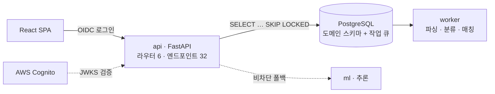
```mermaid
flowchart LR
  FE["React SPA"] -->|"OIDC 로그인"| API["api · FastAPI<br/>라우터 6 · 엔드포인트 32"]
  Cognito["AWS Cognito"] -.->|"JWKS 검증"| API
  API -->|"SELECT … SKIP LOCKED"| DB[("PostgreSQL<br/>도메인 스키마 + 작업 큐")]
  DB --> W["worker<br/>파싱 · 분류 · 매칭"]
  API -.->|"비차단 폴백"| ML["ml · 추론"]
```

**LLM 인텔리전스 흐름 — 전략 디스패치 → 멀티 프로바이더 → 근거 병기 응답**

이 구간은 제품 저장소(`plynai-v3`)가 아니라 품목 분류 R&D 저장소의 구현입니다.

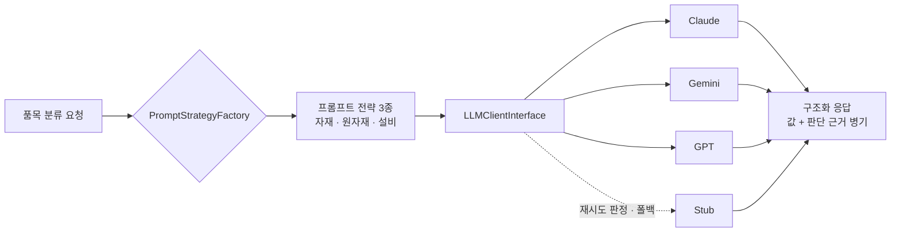
```mermaid
flowchart LR
  Q["품목 분류 요청"] --> S{"PromptStrategyFactory"}
  S --> B["프롬프트 전략 3종<br/>자재 · 원자재 · 설비"]
  B --> P["LLMClientInterface"]
  P --> C["Claude"]
  P --> G["Gemini"]
  P --> X["GPT"]
  P -.->|"재시도 판정 · 폴백"| ST["Stub"]
  C --> R["구조화 응답<br/>값 + 판단 근거 병기"]
  G --> R
  X --> R
  ST --> R
```

**애플리케이션 워크플로우 — 지출 인테이크부터 재소싱까지 (회차 순환)**

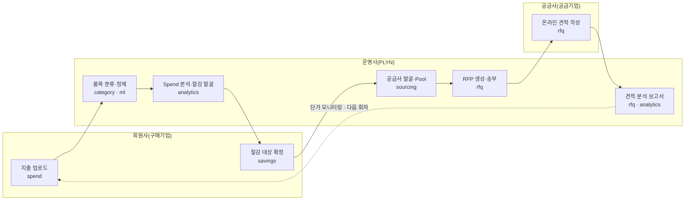
```mermaid
flowchart LR
  subgraph BUYER["회원사(구매기업)"]
    U1["지출 업로드<br/>spend"]
    U2["절감 대상 확정<br/>savings"]
  end
  subgraph OPS["운영사(PLYN)"]
    P1["품목 분류·정제<br/>category · ml"]
    P2["Spend 분석·절감 발굴<br/>analytics"]
    P3["공급사 발굴·Pool<br/>sourcing"]
    P4["RFP 생성·송부<br/>rfq"]
    P5["견적 분석·보고서<br/>rfq · analytics"]
  end
  subgraph VENDOR["공급사(공급기업)"]
    V1["온라인 견적 작성<br/>rfq"]
  end
  U1 --> P1 --> P2 --> U2 --> P3 --> P4 --> V1 --> P5
  P5 -.->|"단가 모니터링 · 다음 회차"| U1
```

#### 상세 역할 및 성과

**① 기획·설계 — 제품 정의**
- **요구사항 정의·플로우 설계** — 시퀀스 플로우·와이어프레임·프로토타입을 직접 설계해 SRM 업무 프로세스를 제품 흐름으로 정의
- **설계 스펙 문서화(spec-driven)** — API 계약 9종·데이터 엔티티 10종·물리 스키마·도메인 이벤트 10종·상태머신 5종을 구현 전 스펙으로 선정의
- **PRD·소개 자료 작성** — AI-Native SRM PRD 및 대외 소개서 등 산출물 제작

**② 플랫폼·아키텍처 — 모듈러 모놀리스 기반 구축**
- **도메인 경계 강제 아키텍처** — api·worker·ml 3배포 단위 + 도메인 패키지 6종을 물리 스키마까지 분리하고, import-linter 계약 2건(도메인 간 상호 import 금지 · 공유 모듈의 상위 참조 금지)을 CI 게이트로 강제 — `lint-imports` 2 kept · 0 broken
- **Cognito 기반 인증 전환** — 자체 인증 서버를 제거하고 BE는 JWKS 검증(Resource Server)만 담당하도록 재설계
- **DB 기반 작업 큐 도입** — 비용 절감을 위해 Redis/ElastiCache를 걷어내고 PostgreSQL `SKIP LOCKED` 큐로 CPU 바운드 작업 격리
- **인프라 통합·IaC** — 멀티 서비스 Docker compose 구성과 스키마 격리, Cognito 인증 인프라 Terraform 코드화, alembic 단일 마이그레이션 트리 운영

**③ AI-Native SRM 도메인 구현 — 거래 전 프로세스 자동화**
- **도메인 설계 9종 · Phase 1 구현 5종** — 발굴·미팅노트·RFQ·온보딩·디렉터리·헬스·협상·조달리포트·인테이크를 L2 도메인 문서로 선정의하고, Phase 1 에서 auth·spend·category·sourcing·savings 5종을 구현. HTTP 라우터를 가진 도메인은 4개이고 category 는 큐·포트를 경유합니다 — 라우터 6개 · REST 엔드포인트 32종(실측)
- **공급사 발굴 화면 흐름** — 발굴 후보 카드에서 상세까지 정합성 있게 이어지는 인터랙션 구현. 전시에서 시연한 발굴 AI 챗봇은 데모 산출물이며 제품 코드베이스에는 포함되지 않습니다.
- **비정형 입력 정규화·자산화** — 이메일·문서·카탈로그·시험성적서·견적서 등 비정형 정보를 공급사 마스터 기준으로 정규화해 재사용 가능한 공급사 지식 그래프로 축적

**④ LLM 인텔리전스 — 품목 분류 R&D 라인**

아래 구현은 제품 저장소(`plynai-v3`)가 아니라 품목 분류 R&D 저장소에 있습니다.
- **프로바이더 추상화 계층 설계** — Claude·Gemini·GPT 3종을 `LLMClientInterface` 뒤로 추상화하고(`providers/{claude,gemini,gpt}_provider.py`) 재시도 판정을 클라이언트 레벨에 배치, 호출부가 프로바이더를 모르도록 분리
- **프롬프트 전략 디스패치** — 자재·원자재·설비 3종 전략을 `ClassificationPromptStrategy` 추상 클래스 상속으로 구현하고 `PromptStrategyFactory` 가 품목 종류에 따라 디스패치, 신규 품목군은 전략 추가만으로 확장
- **근거를 붙인 구조화 응답** — 값만 반환하지 않고 판단 근거를 함께 내려보내는 응답 형태를 계약으로 고정, 서비스 레이어가 이를 파싱해 응답 스키마로 분리
- **LLM 실패 비차단(graceful)** — 호출 타임아웃·재시도 판정·예외 계층·Stub 폴백으로 LLM 장애 시에도 파이프라인이 멈추지 않도록 처리

**⑤ QA·검증**
- **상태 전이 정의·정합성 QA** — sourcing·savings·rfq 의 상태 전이를 L2 도메인 문서에 명세하고 구현이 그 명세를 따르게 함, 화면 흐름은 시나리오 기반으로 검증해 회귀 방지
- **LLM·도메인 테스트** — LLM 클라이언트(gemini·claude·chat) 단위 테스트 + 챗·발굴 통합 테스트로 회신 안정성 확보

**⑥ 설계 의사결정 기록 — 업무일지 6편**

구현 중 내린 결정과 막혔던 지점을 기록해, 이후 합류자가 근거를 추적할 수 있게 했습니다. (전문은 [Velog](https://velog.io/@jiyean99/posts) 연재)

| 주제 | 결정 | 근거 · 배운 것 |
|---|---|---|
| **인증 · Resource Server** | BE는 토큰을 발급하지 않고 검증만 한다. 서명·`iss`·`exp`·`token_use`·`client_id` 5개 질문을 모두 통과해야 인증된 요청 | JWKS 공개키를 TTL 1시간 캐싱 + 지연 로딩 — Cognito가 늦게 떠도 앱 부팅이 막히지 않음. 만료와 위조를 분리해 401을 다르게 처리 |
| **초대 · 신원 연결** | 피초대자가 자신의 `sub`를 요청 본문으로 들고 오는 원안을 폐기하고, `sub`는 오직 검증된 Bearer 토큰에서만 추출 | 공격 시나리오를 직접 그려 보니 남의 `sub`를 주장해 조직에 침투할 수 있었음. 오버스펙이 아니라 최소 방어선 |
| **작업 큐** | 큐 하나 때문에 인프라를 늘리지 않기로 하고 PostgreSQL `FOR UPDATE SKIP LOCKED`로 워커 큐 구현 | 한 트랜잭션 안에서 집기·처리·완료. 실패는 지수 백오프. 처리량 상한 같은 한계도 문서에 함께 명시 |
| **데이터 무결성** | 도메인 격리 + Soft Delete로 DB FK가 일관되게 동작하지 않아, FK를 제거하고 앱 계층에서 책임 | ① 동시 변경 규칙 ② 관계 레지스트리(코드 선언) ③ 고아 정찰 러너. FK를 그냥 쓰는 것보다 나았는지 솔직하게 평가까지 기록 |
| **트러블슈팅** | 목(mock)은 통과하는데 실제 토큰은 401. 원인 두 가지를 끝까지 추적해 규명 | ① access 토큰에는 `aud`가 없어 `client_id`를 직접 검증해야 함 ② 방금 발급한 토큰이 시계 오차로 거부됨. `token_use` 검증도 함께 추가 |
| **제약과 기능** | '1 신원 = 1 조직' 제약 때문에 '이미 등록된 회사에 담당자 추가' 요구가 막힘 | 없는 `sub`를 만들어내는 우회 대신, 이미 있는 로그인 흐름을 재사용해 검증된 `sub`로 멤버를 생성하는 경로로 해결 |

> 대외 데모·CES 출품 산출물은 [PLYN CES 2027 혁신상 출품 →](#ces) 에 별도로 정리했습니다.

[↑ 맨 위로](#top)

---

### 공급사 탐색 R&D (WS03) 전수 검토

`2026.08` &nbsp;·&nbsp; 사내 R&D 저장소 · 코드/연구 신뢰성 검토

사내 R&D 저장소를 소스 전수로 검토하고, 대외 발표에 쓰일 수치의 정합성까지 직접 실행 검증했습니다.

#### 검토 방법 — 저장소의 주장에 의존하지 않는다

레포가 문서로 주장하는 내용을 그대로 받아쓰지 않고, 다음을 **직접 실행**해 1차 신호를 먼저 확보했습니다.

| 검증 | 결과 |
|---|---|
| `pytest` (clean venv) | **416개 전부 통과** (2.35초) |
| `ruff check` (CI 기준 select) | All checks passed |
| 오프라인 dry-run (네트워크·키 없이) | end-to-end 산출물 생성 성공 |
| 추적 파일 시크릿 스캔 | **라이브 키 0건** · `.env.example`만 placeholder |
| 로컬 산출물 대조 | 실측 수치 확인 (288 official / 91.5% resolved) |

> 로컬 `ruff`가 보고한 292건은 비표준 확장 룰셋에 의한 **환경 착시**였고, 프로젝트/CI가 실제로 쓰는 기본 select로는 전부 통과함을 확인해 정정했습니다.

#### 영역별 평가

| 영역 | 등급 | 근거 요약 |
|---|---|---|
| ML / LLM 코어 | **A−** | 근거 보존·false-merge 차단·graceful degradation을 코드 게이트로 확인 |
| 데이터·크롤링·인프라 | **A−** | robots RFC 9309 정확 구현 · 재현성 · 시크릿 위생 우수 |
| 테스트·데모·재현성 | **A** | 416개 전부 통과 · 완전 오프라인 · 행위 기반 |
| 연구 신뢰성·문서 정합 | **B+** | 방법론·정직성 우수 / 단계 게이트 미확정·문서 드리프트 |
| 개발 위생 (git·CI·시크릿) | **A** | 라이브 키 0 · CI(lint + test + dry-run) 통과 |

#### 검토 결과 — 즉시 처리 3가지 제안

- **대외 수치를 '통과'가 아니라 '중재 대기(동결)'로 통일** — 발표 슬라이드의 수치가 조건부임을 모든 문서에서 동일하게 표기하도록 제안
- **정본 보고서 헤드라인을 실제 납품 수치로 정정** — 하위 문서·대외 산출물은 이미 최신 수치를 쓰는데 정본만 낡은 스냅샷에 멈춰 있었음
- **골든셋 독립성 회귀를 문서에 명시** — 추출·채점이 동일 계열 모델로 수렴하며 생긴 순환 위험을 표기하도록 제안

[↑ 맨 위로](#top)

---

### PLYN CES 2027 혁신상 출품 · 대외 데모

`2026.07` &nbsp;·&nbsp; 대외 출품 · 시연 산출물

CES 2027 Innovation Award 제출용 2분 영상 플롯 재구성과 인터랙티브 리스크 리포트 제작을 단독 담당했습니다.

#### 2분 영상 플롯 (120초)

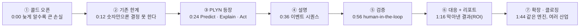
```mermaid
flowchart LR
  S1["① 콜드 오픈<br/>0:00 늦게 알수록 큰 손실"] --> S2["② 기존 한계<br/>0:12 숫자만으론 결정 못 한다"]
  S2 --> S3["③ PLYN 등장<br/>0:24 Predict · Explain · Act"]
  S3 --> S4["④ 설명<br/>0:36 이벤트 시퀀스"]
  S4 --> S5["⑤ 검증<br/>0:56 human-in-the-loop"]
  S5 --> S6["⑥ 대응 + 리포트<br/>1:16 막아낸 결과(ROI)"]
  S6 --> S7["⑦ 확장 · 클로징<br/>1:44 같은 엔진, 여러 산업"]
```

#### 상세 역할 및 성과

**① 플롯 재구성 — 2분 안에 이해되고 기억되게**
- **11씬을 7씬으로 통합**하고 내레이션을 약 25% 축약해 속사포 VO 방지 (영문 기준 약 230단어)
- 3개 산업 병렬 전개를 **단일 히어로 스토리**로 바꿔 예측 → 설명 → 검증 → 대응 → 리포트를 끝까지 하나로 끌고 가고, 나머지 산업은 오프닝 훅·클로징 몽타주로 역할 분리

**② 심사 관점 반영 — 원안 대비 핵심 변경**
- **결과(ROI) 한 컷 추가** — 기능 나열에서 그치지 않고 마진 방어·라인 가동 유지라는 '막아낸 결과'를 클로징 직전에 배치
- **신뢰·감사 비트 명시** — human-in-the-loop · 필드별 검토 · audit log를 검증 씬에 노출 (구매·국방 바이어용 차별점)
- 약해 보이는 수치는 제거하고 **규모·속도 중심**으로 정리, 제품 정식명을 통일
- **국제 심사 대응** — 영문 VO 기본에 국문 자막을 병기하는 이중 언어 구성

**③ 인터랙티브 리스크 리포트 · 리스크 보드 UI**
- **예측 → 설명 → 검증 → 대응**으로 이어지는 리스크 리포트를 하나의 화면 흐름으로 구현
- 와이어프레임·리포트를 **단일 파일 인터랙티브 산출물**로 제작해 배포·시연 부담 제거
- 위험 등급 보드와 **원인 그래프를 시각화**해 위험의 근거를 화면에서 설명
- 문서 기반 수집 파이프라인을 단일 흐름으로 묶어 **리스크 컨텍스트를 2분 내 확보**하는 시연 시나리오 설계

[↑ 맨 위로](#top)

---

### 국제운송 정시성 Visibility PoC

`2026.06 – 2026.08` &nbsp;·&nbsp; 고객사: 글로벌 가전 제조사 · 정부지원사업 · PoC 전체 기간 2026.06 – 2026.12

화물 지연 리스크를 조기 감지하는 정시성 Visibility 플랫폼 — 에이전트(적재·정규화) 골격·인프라 세팅부터 위험 산출·모니터링 대시보드까지 백그라운드·웹 양 구간 단독 담당.

       

> [개발기 → 정확한 예측이 불가능하다는 걸 인정하는 데서 시작한 설계](writing/shipping-visibility-design.md)

99.6% 는 `port_radar` ↔ `port_radar_snapshot` **항만 키 한 쌍의 일치율**이고 전체 조인이 아닙니다. 원천 간 결합에는 한계가 있었습니다 — Global Tracking ↔ Port Radar 39%, House B/L·Invoice·Container 0% (고객사 확인 회신 2026-06). PoC 전체 기간은 2026.12까지이며, 위 기간은 제가 담당한 구간입니다.

#### 아키텍처

**데이터 계층 — raw · core · svc 3계층 분리**

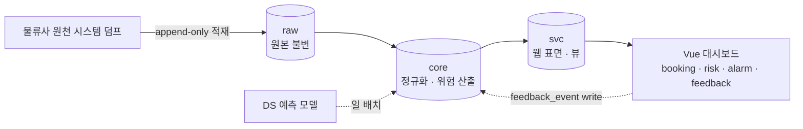
```mermaid
flowchart LR
  SRC["물류사 원천 시스템 덤프"] -->|"append-only 적재"| RAW[("raw<br/>원본 불변")]
  RAW --> CORE[("core<br/>정규화 · 위험 산출")]
  DS["DS 예측 모델"] -.->|"일 배치"| CORE
  CORE --> SVC[("svc<br/>웹 표면 · 뷰")]
  SVC --> WEB["Vue 대시보드<br/>booking · risk · alarm · feedback"]
  WEB -.->|"feedback_event write"| CORE
```

**애플리케이션 워크플로우 — 일 스냅샷 멱등 적재 (해시 대조)**

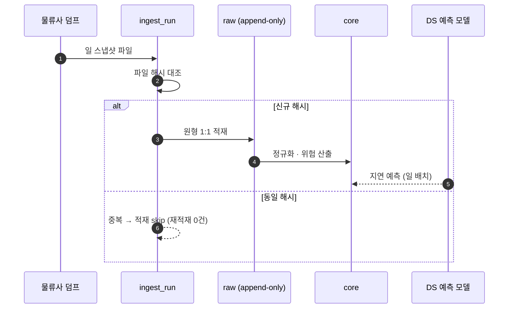
```mermaid
sequenceDiagram
  autonumber
  participant SRC as 물류사 덤프
  participant ING as ingest_run
  participant RAW as raw (append-only)
  participant CORE as core
  participant DS as DS 예측 모델
  SRC->>ING: 일 스냅샷 파일
  ING->>ING: 파일 해시 대조
  alt 신규 해시
    ING->>RAW: 원형 1:1 적재
    RAW->>CORE: 정규화 · 위험 산출
    DS-->>CORE: 지연 예측 (일 배치)
  else 동일 해시
    ING-->>ING: 중복 → 적재 skip (재적재 0건)
  end
```

#### 상세 역할 및 성과

**① 기획·설계 — 요구사항부터 화면 정의까지**
- **요구사항 명세·데이터 정의서 작성** — 물류사 원천 시스템 export 항목을 업무 요건과 매핑해 수급 범위·주기·필수 컬럼을 확정, 데이터정의서·화면기능정의서(v1.3)·WBS 등 기획 산출물 제작
- **ETA 산출 설계 — 두 트랙으로 분리** — 스냅샷 한 장으로 "정확한 도착시각 하나"를 약속할 수 없다고 판단해 산식을 둘로 나눔. **ETA2(구간 누적)** 는 기점 ATD 에 구간별 3개월 평균 리드타임을 쌓아 산출하고 구간별 근거를 함께 내며(88,754 / 90,444 = **98.13%**), **ETA3(모델 산출)** 는 화물 한 건을 통짜로 예측하고 지연 확률을 함께 냄(77,387 / 90,444 = **85.56%**). 화면에서 스위치로 전환
- **못 낸 값의 사유 분리** — 빈칸을 `—` 하나로 뭉치지 않고 **서빙 뷰 없음 / 모델 입력 없음(`no_model_input`, 14.44%) / 트랙 미실행** 세 갈래로 구분해, 어디를 고쳐야 값이 느는지가 표에서 사라지지 않게 함. 받은 자료의 ETA 는 우리 산출값과 별개 열로 병기하고 덮어쓰지 않음
- **위험 등급은 병행 축** — 진행·주의·회피 3단계를 trigger-count 로 산출해 경보 축으로 함께 운영. ETA 를 대체한 것이 아니라 병행하는 지표이며, 평가 기준은 "회피 권고 묶음의 정밀도"

**② 데이터 아키텍처 — raw·core·svc 3계층 분리**
- **계층 분리 설계** — 원본 불변 보존(raw) → 정규화·위험 산출(core) → 웹 표면(svc, 대부분 뷰)으로 스키마를 분리, 변화 추적은 파생 레이어가 전담하도록 구성
- **엔티티 키 검증** — 데이터 프로파일링으로 port_radar ↔ port_radar_snapshot 조인키 일치율 99.6% 확보, 잔여 중복은 원천의 부분정보 분할 방출이 원인임을 규명해 대체 판정 로직 제안

**③ 인프라·운영 — DB·배포 환경 단독 세팅**
- **로컬·dev 동형 DB 인프라 구성** — docker-compose(PostgreSQL 16)로 로컬·dev를 동일 구조로 세팅, initdb 스크립트로 스키마·롤을 1회 생성
- **롤 기반 권한 경계** — agent·ds·web 3개 롤로 스키마 소유·접근 권한을 분리(웹은 svc만, write는 feedback_event 한정), 포트 분리·시크릿 커밋 방지 등 운영 위생 확립
- **배포 구성** — 원본 보관 S3 + 단일 이미지 컨테이너, EKS 배포 토폴로지 설계

**④ 에이전트(백그라운드) — 적재·정규화 파이프라인 골격 구현**
- **agent–DS 책임 경계·핸드오프 계약 설계** — 적재·정규화의 물리 골격(빈 테이블·Alembic 마이그레이션·멱등 적재 틀)은 agent가, 등급·근거 산식은 DS가 맡도록 경계를 정의하고 PostgreSQL 단일 결합으로 핸드오프
- **원천 시스템 덤프 랜딩 구축** — 외부 덤프를 원형 1:1로 적재하는 랜딩 12테이블을 Alembic으로 구성
- **일 스냅샷 캡처 체계** — 소급 불가한 관측 이력(eta_observation, append-only)을 매일 캡처하는 ingest_run 메타 구조를 최우선 구축, 파일 해시 이력으로 멱등성 확보 → 동일 파일 중복 적재 0건(누적 약 20만 행)

**⑤ 위험 산출·서비스화**
- **예측 모델 연동·일 배치화** — DS 개발 지연 예측 모델의 입력 규격을 표준화해 일 배치로 연결, 예측 결과를 위험 신호로 대시보드에 노출
- **인시던트 그룹핑(경보 폭포 방지)** — 한 선박에서 나온 다수 지연 신호를 인시던트로 묶어 중복 경보를 차단
- **피드백 루프 설계** — 담당자 피드백을 수집하고, 선제 대응(preventive) 건은 오탐 집계에서 제외해 지표를 왜곡 없이 축적

**⑥ 웹 — 정시성 모니터링 대시보드**
- **모듈러 모놀리식 백엔드** — booking·risk·alarm·feedback 도메인을 내부 HTTP 계약으로 분리, 멀티 스키마 Alembic로 마이그레이션 관리
- **위험 보드·대량 목록 UX** — B/L 목록·경로·상태·ETA 기준 위험구간을 임계값별로 시각화, 다중 검색·필터 조합 환경에서 조회 성능 확보

[↑ 맨 위로](#top)

---

### 스토리지니

`2026.06 – 2026.08`

App/Agent 파이프라인 기반 AI 맞춤형 동화책 생성 서비스 — 인수인계 후 생성 파이프라인 안정화·확장. 아이 정보·사진으로 LoRA 학습 → 개인화 삽화 생성 → 편집·PDF·인쇄까지 한 흐름으로 처리.

   

#### 아키텍처

**App(웹) · Agent(GPU 워커) 분리 — 3개 통신 채널**

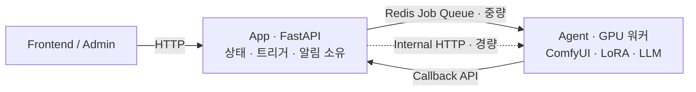
```mermaid
flowchart LR
  FE["Frontend / Admin"] -->|"HTTP"| APP["App · FastAPI<br/>상태 · 트리거 · 알림 소유"]
  APP -->|"Redis Job Queue · 중량"| AGENT["Agent · GPU 워커<br/>ComfyUI · LoRA · LLM"]
  APP -.->|"Internal HTTP · 경량"| AGENT
  AGENT -->|"Callback API"| APP
```

#### 상세 역할 및 성과

**① 서비스 인수인계 — 무중단 연속성**
- App·Agent 2프로세스 구조와 인프라를 파악해 유실 없이 서비스 연속성 확보 (운영·확장 중인 서비스 규모: REST API 98개)

**② App/Agent 분리 구조 이해·확장**
- App이 모든 상태·트리거·알림을 단일 트랜잭션으로 소유하고 Agent는 GPU 작업만 수행 후 콜백 보고하는 경계를 유지하며 기능 확장
- 통신 3채널(Redis 큐=중량 비동기, Internal HTTP=경량, Callback=진행·완료·실패 보고) 위에서 제작 흐름 확장

**③ 생성 파이프라인 안정화**
- input → 승인 → 처리 → 검수 → 템플릿 → 다운로드 6단계 흐름에서 생성 실패·지연 구간 대응
- 외부 연동 7종(ComfyUI·AIToolkit(LoRA)·Gemini·Claude·Sendon·Naver·SMTP)의 실패·타임아웃 처리로 파이프라인 안정화

[↑ 맨 위로](#top)

---

### SRM 원가절감 AI 데모 · 넥스콘 데이터 스크리닝

`2026.06 – 2026.07` &nbsp;·&nbsp; 고객사 데모 · 대응

#### SRM 원가절감 AI 데모 — 대화 안에서 구매 액션까지 `2026.06`

가격 신호에서 시작해 분석·판단·발굴·RFQ·온보딩까지 **끊기지 않는 하나의 대화**로 이어지는 데모. 백엔드 연동 없이 프론트만으로 전 과정을 시뮬레이션합니다.

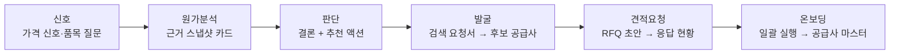
```mermaid
flowchart LR
  A["신호<br/>가격 신호·품목 질문"] --> B["원가분석<br/>근거 스냅샷 카드"]
  B --> C["판단<br/>결론 + 추천 액션"]
  C --> D["발굴<br/>검색 요청서 → 후보 공급사"]
  D --> E["견적요청<br/>RFQ 초안 → 응답 현황"]
  E --> F["온보딩<br/>일괄 실행 → 공급사 마스터"]
```

- **화면 정의 작성 (v1 · v2)** — SRM 시스템·AI 워크플로우의 화면·인터랙션·데이터 흐름을 정의
- **시나리오 3종 설계** — 니켈 LME 하락(양극재) · 에폭시 원재료 하락(봉지재) · 구리 LME 하락(전지박). 스타터 카드와 자유 입력 키워드 인식 **두 경로를 모두 지원**
- **온보딩 자동화 3개 업무** — 재무·신용정보 조회 / 필수 서류 조회 및 누락분 자동 요청 / 단가계약 생성 + 전자서명 링크 발송
- **시연 실패를 막는 설계** — 키워드 기반 시연의 한계를 인정하고, 각 단계 화면에 **'진행 방법 안내' 박스를 상시 노출**해 키워드를 외우지 못해도 화면만 보고 진행되도록 안전장치 배치
- **타 팀 단독 시연용 가이드 제작** — 진입 경로·키워드·스크립트·주의사항까지 문서화

#### 넥스콘 — 공급사 발굴 데이터 스크리닝 `2026.07`

배포 환경에서 발굴 후보의 프로필 상세가 빈 화면으로 뜨던 문제를, 원인 규명부터 스크리닝·병합 규칙 설계까지 해결했습니다.

-2563EB?style=flat-square&labelColor=475569)

- **근본 원인 규명** — 프로필 상세가 클릭 시 넘어온 후보 객체를 쓰지 않고 `id`만으로 API를 재조회하도록 되어 있었고, 실 API 응답이 없거나 형태가 어긋나면 오류 처리로 빠져 화면 전체가 비었음. 캠페인 현황 화면은 응답이 배열이 아닐 때 `.map()` 예외 발생
- **스크리닝·보강 3원칙** — ① 실데이터가 있으면 절대 덮어쓰지 않는다(API 응답 → 후보 카드 값 → 보강 순) ② 동일 공급사는 항상 동일한 값(식별자 기반 결정론) ③ 빈 화면·오류 상태를 제거한다
- **정합성 결함 수정** — 신용등급 `BBB−`에도 '최우수'로 표기되던 배지를 등급별(최우수/양호/주의)로 정정
- **완결성·정합성·결정론 단위 테스트 11건 신설** + 빌드·브라우저 검증 완료

[↑ 맨 위로](#top)

---

### 팀 협업 체계 · 개발 환경 구축 및 연구·행정 대응

`2026.06 – 2026.08` &nbsp;·&nbsp; 전사 공통

분산된 협업 도구를 정리하고, 개발 알림·환경 재현을 자동화했습니다. 정부지원사업 연구 기록 체계와 클라우드 운영 정책 대응도 함께 담당했습니다.

**① 이슈 관리 체계 이관 · 표준화**
- Notion·메일 등에 흩어져 있던 업무를 **Jira 티켓 체계로 정리·이관**해 추적성과 협업 가시성 확보
- **Atlassian 업무 인프라 구성 보고**를 작성해 도구 구성·운영 방식을 전사에 공유
- 산출물 배포 형식을 정리 — 깊은 레퍼런스는 MD, 팀 공유는 데크로 이원화

**② Slack Git 알림 봇 신설**
- **커밋·PR·배포 이벤트를 Slack으로 자동 알림**해 팀 개발 흐름을 가시화
- 누가 무엇을 언제 올렸는지 별도 확인 없이 드러나도록 해 비동기 협업의 마찰 감소

**③ 개발 환경 온보딩 표준화**
- **온보딩 가이드 + 멱등 셋업 스크립트**(`setup.sh`)만으로 동일한 WSL2 개발환경을 재현하도록 문서화 (재실행 안전을 설계 원칙으로 명시)
- 사내 저장소 **10종**의 Python 버전 · 패키지 매니저 · 설치 명령 · 필요한 `.env` 키를 표로 정리
- **Python 의존성 표준을 `uv` + `uv.lock`으로 선언**하고, pip 기반 과도기 프로젝트의 설치 명령을 통일
- 포트 충돌처럼 실제로 부딪히는 함정을 문서에 명시하고, **시크릿은 값이 아니라 키 이름만 문서화**하는 원칙 수립

**④ TIPS 연구노트 체계 재설계** (정부지원사업 2차년도)
- 배정표의 가상 과업이 아니라 **실제 git 커밋·PR·설계 문서를 근거로** 작성하도록 원칙을 재수립하고, 각 회차에 커밋 해시를 명시
- 배정표 WBS가 실제 작업과 불일치함을 확인하고 **실증 WBS의 실제 작업패키지로 재매핑**
- 소급 회차를 일괄 작성하고, 이후로는 **주간 `git log` 기반 실시간 작성 절차**를 정의
- 근거 없는 회차는 추정으로 채우지 않고 **확인 필요 항목으로 명시**

**⑤ 클라우드 · 보안 정책 대응**
- AWS **GPU 예약 서비스(EC2 Capacity Blocks for ML)** 활용 가이드 검토
- **IAM User 사용 원칙·계정 탈취 예방** 보안 교육 및 IAM 정책·Root 계정·MFA 등록 가이드 대응
- **Bastion을 통한 Private GPU 서버 접속** 구성 및 빌링·알림 운영 가이드 숙지

**⑥ 인수인계 · 자산 정리**
- 업무 자산을 **11개 아카이브 · 약 50.5GB**로 정리하고 매니페스트 문서화
- 각 아카이브를 **① 크기 ② 엔트리 카운트 ③ 시크릿·제3자 패턴 grep ④ 원본과 파일 단위 대조**(유니코드 NFC 정규화)로 검증
- **시크릿·제3자 개인정보를 의도적으로 제외**하고 그 목록과 사유를 명시, 남아 있는 개인키·환경변수 실값에 대해 **삭제·키 회전 권고**를 문서로 인계
- 원본은 하나도 삭제하지 않는 원칙으로 복구 가능성 보장

**⑦ 함께 수행한 기타 업무**
- **PLYN v3 전환 대응** — 전면 재작성 방침 하에 레포·인프라 이식 계획과 인증 설계를 정리한 전환 보고서·실행 핸드북 작성
- **분류 체계 데이터 정비** — eClass 표준 분류 체계 및 국문 매핑 데이터를 품목 분류 도메인의 기준 데이터로 준비
- **조달·구매 데이터 확보** — 조달 데이터와 기업별 Spend 분석 자료를 절감 발굴 로직의 검증 데이터로 정리
- **회의 기록 · 설계 검토** — 플로우/시스템 설계 검토 회의, 전사 미팅, PoC DS 프로세스 공유 등 주요 논의를 회의록으로 남기고 후속 액션으로 연결

[↑ 맨 위로](#top)

<!--
- **항공물류 PoC** · `2026.07 – 예정` · 공공 부문 · 정부지원사업
  항공 화물 운송 데이터 기반 PoC — 프로토타입 개발 착수 예정
  국방 분야 화주 PoC — 프로토타입 개발 착수 예정
-->

---

##  (주)잼퍼블릭 · Frontend Project Lead · `2023.03 – 2025.08` (2년 6개월)

> 실시간 웹 서비스와 사내 시스템 프론트엔드를 단독으로 설계·운영했습니다. 기능 기획서·디자인 시안·퍼블리싱·개발·QA를 한 사람 안에서 이어 붙였습니다.
>
> 모노레포 누적 6,441커밋 중 **926커밋**(2023.04.26 – 2025.08.19) 기여. 서비스 프론트(`v2-front`) 외 `report-front`·`home`·`entr`·`admin-front`·`lib`까지 동시 담당했습니다.

### 승부사 온라인

[`바로가기 ↗`](https://www.adventurer.co.kr/) &nbsp;·&nbsp; `2023.03 – 2025.08`

대규모 실시간 스포츠 베팅 웹 애플리케이션 — PC·모바일 완전 대응 프론트엔드 개발(741파일·15만 라인 규모의 프로덕션).

     

#### 아키텍처

**실시간 반응성 흐름 — 이중 WebSocket · MobX · Remote Config**

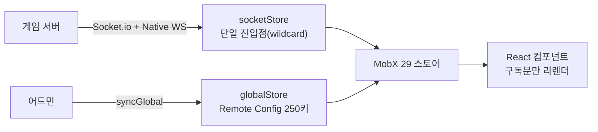
```mermaid
flowchart LR
  SRV["게임 서버"] -->|"Socket.io + Native WS"| SOCK["socketStore<br/>단일 진입점(wildcard)"]
  ADMIN["어드민"] -->|"syncGlobal"| GLB["globalStore<br/>Remote Config 250키"]
  SOCK --> MOBX["MobX 29 스토어"]
  GLB --> MOBX
  MOBX --> UI["React 컴포넌트<br/>구독분만 리렌더"]
```

#### 상세 역할 및 성과

**① 대규모 실시간 통신 — Socket.io + Native WebSocket 이중 구조**
- Socket.io와 Native WebSocket 이중 연결로 안정성 확보, WebSocket 불가 환경은 자동 폴링 fallback 전환
- 연결 실패 시 지수 백오프 재연결(최대 5회) + wildcard 이벤트 구독으로 배당률·채팅·스코어·결제 알림 등 포털 소켓 이벤트 26종·라이브 프로토콜 12종 핸들링

**② MobX 상태 아키텍처 — 도메인별 29개 스토어**
- `@observable`/`@computed`/`@action` 데코레이터로 세밀한 반응성 설계 — 변경된 값을 구독한 컴포넌트만 정확히 리렌더
- 스토어 간 의존성(auth→user→matchup) 관리 + 라우터 스토어 연동으로 URL ↔ 상태 양방향 동기화

**③ HTTP 레이어 고도화**
- Axios 커스텀 인스턴스에 중복 요청 제거(URL+파라미터 시간 윈도우) 구현
- 401 응답 시 자동 토큰 갱신 후 원요청 재시도 + 에러 코드 → 사용자 메시지 매핑·전역 토스트 처리

**④ 성능 최적화**
- `react-loadable` 라우트 단위 코드 스플리팅으로 초기 번들 최소화, `react-virtualized`/`react-window`로 대용량 경기 목록 가상화
- `cache-loader`+`thread-loader` 병렬 컴파일, 모바일 300ms 탭 지연 제거·스크롤 리스너 중복 등록 방지

**⑤ 복잡한 베팅 슬립 UI — 실시간 배당 계산**
- 단식/다리 베팅 조합을 실시간 계산하고 배당률 변경을 버블 알림 + 자동 반영
- 현금·티켓·다이아 등 다중 화폐, 쿠폰·아이템 자동 선택, 금액 포맷팅·유효성 검사

**⑥ 어드민 원격 설정(Remote Config) — 무배포 Feature Flag**
- 250개 설정 키를 TypeScript enum(`GlobalStoreKey`)으로 중앙 정의해 코드 재배포 없이 기능 on/off·URL·경제 수치를 제어
- WebSocket `syncGlobal` 이벤트 → MobX `@observable` 자동 갱신 → 구독 컴포넌트 즉시 반영(새로고침 불필요), 점진적 롤아웃 지원

[↑ 맨 위로](#top)

---

### 사내 매출 통계 대시보드

`2023.03 – 2025.08` &nbsp;·&nbsp; 사내 시스템

스포츠 베팅·포커 두 도메인의 매출·유저·게임 데이터를 실시간 시각화하는 어드민 리포트 대시보드.

    

#### 아키텍처

**이중 도메인 대시보드 — 공유 인증 · 도메인 격리 · 등급 접근 제어**

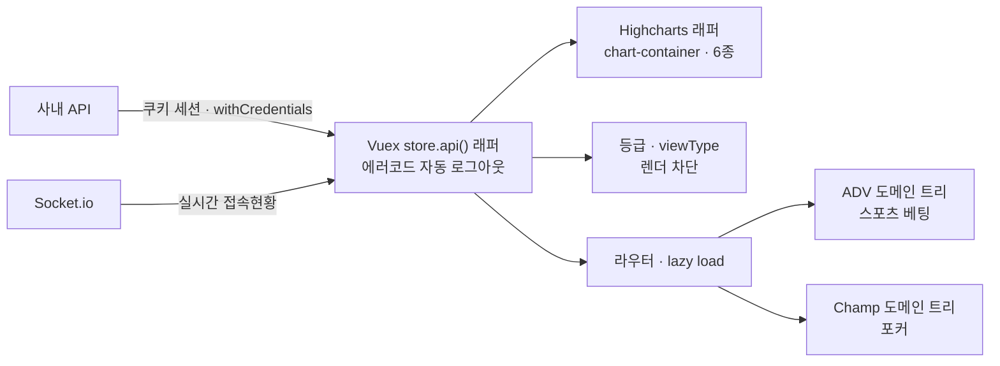
```mermaid
flowchart LR
  API["사내 API"] -->|"쿠키 세션 · withCredentials"| ST["Vuex store.api() 래퍼<br/>에러코드 자동 로그아웃"]
  SOCK["Socket.io"] -->|"실시간 접속현황"| ST
  ST --> CH["Highcharts 래퍼<br/>chart-container · 6종"]
  ST --> GR["등급 · viewType<br/>렌더 차단"]
  RT["라우터 · lazy load"] --> ADV["ADV 도메인 트리<br/>스포츠 베팅"]
  RT --> CHP["Champ 도메인 트리<br/>포커"]
  ST --> RT
```

#### 상세 역할 및 성과

**① 이중 도메인 대시보드 아키텍처**
- ADV(스포츠 베팅)·Champ(포커) 두 플랫폼 데이터를 탭 전환으로 완전 분리, 공유 인증 + 도메인별 격리 데이터 구조로 설계
- 30개 컴포넌트를 계층적으로 구성(Layout → dashboard → 도메인별 트리)

**② Highcharts 데이터 시각화**
- 재사용 차트 래퍼(`chart-container`)로 동적 chartId 6개 차트 인스턴스 관리 — 일별 베팅·유저 수, 월별 결제, 헤비 유저 등
- 한국식 천 단위 로케일 커스텀, 차트 클릭 → 상세 데이터 다이얼로그 14종 연동

**③ Vuex 커스텀 API 래퍼**
- `store.api()`로 공통 HTTP 래퍼 구현 — 에러 코드 기반 자동 로그아웃(`S002`), `Content-Disposition` 감지 시 파일 다운로드 자동 처리
- 쿠키 세션 + `withCredentials` 인증, 앱 시작 시 토큰 자동 복원

**④ 실시간 접속 현황(Socket.io)**
- 현재 접속자 + 일·주·월·전체 최대 접속 수를 실시간 표시, 전역 소켓 인스턴스로 연결 상태 감지

**⑤ 등급 기반 접근 제어**
- Grade(권한 레벨) + viewType(가시성) 이중 권한 구조로 고수익 위험 차트·민감 지표를 낮은 등급엔 렌더링 자체 차단
- 권한 정보를 Vuex + localStorage 이중 저장으로 세션 유지

**⑥ 다중 환경 빌드·배포**
- dev/qa/prod webpack 완전 분리(baseURL·BUILD_ENV 주입), 벤더 청크 분리 + 라우트 단위 lazy loading
- Firebase Hosting SPA rewrites로 History 모드 배포, FileSaver.js로 CSV/Excel 리포트 내보내기

[↑ 맨 위로](#top)

---

### 챔프포커

[`바로가기 ↗`](https://champpoker.co.kr/) &nbsp;·&nbsp; `2025.01 – 2025.08`

Unity 웹보드 게임 — 웹뷰 인터페이스 퍼블리싱.

  

#### 아키텍처

**웹뷰 퍼블리싱 — JSON 콘텐츠 분리 · JS Bridge 연동**

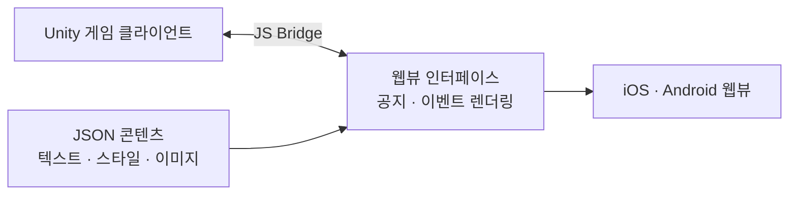
```mermaid
flowchart LR
  UNITY["Unity 게임 클라이언트"] <-->|"JS Bridge"| WV["웹뷰 인터페이스<br/>공지 · 이벤트 렌더링"]
  JSON["JSON 콘텐츠<br/>텍스트 · 스타일 · 이미지"] --> WV
  WV --> DEV["iOS · Android 웹뷰"]
```

- **퍼블리싱 관리 체계화** — 텍스트·스타일·이미지 요소를 JSON 기반으로 분리 관리해 코드 변경 없이 콘텐츠를 반영하도록 구조화
- **JS Bridge ↔ Unity WebView 연동** — 게임 클라이언트와 웹뷰 간 공지·이벤트 렌더링을 브릿지 통신으로 구현
- **웹뷰 스타일 가이드·반응형 대응** — 기기별 해상도·렌더링 차이를 흡수하는 스타일 가이드 정의
- **기기별 오류 대응 최적화** — iOS/Android 웹뷰 환경별 렌더링 이슈 대응

[↑ 맨 위로](#top)

---

### 신규 사업부 모바일 러닝 MVP

`2025.07 – 2025.08`

Expo 기반 React Native 마이그레이션 및 프론트엔드 개발.

    

#### 아키텍처

**크로스 플랫폼 단일 코드베이스 — EAS Build · OTA**

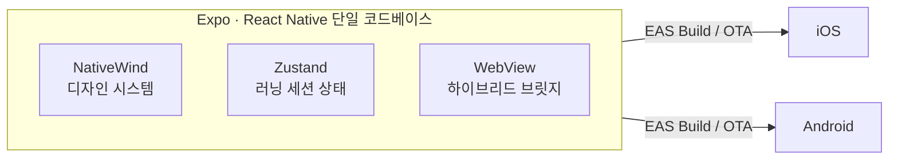
```mermaid
flowchart LR
  subgraph EXPO["Expo · React Native 단일 코드베이스"]
    NW["NativeWind<br/>디자인 시스템"]
    Z["Zustand<br/>러닝 세션 상태"]
    WVB["WebView<br/>하이브리드 브릿지"]
  end
  EXPO -->|"EAS Build / OTA"| IOS["iOS"]
  EXPO -->|"EAS Build / OTA"| AND["Android"]
```

- **크로스 플랫폼 앱 구조 설계** — Expo/RN 기반 iOS·Android 동시 대응 초기 세팅 및 NativeWind 디자인 시스템 구성
- **러닝 핵심 플로우 화면 개발** — 러닝 기록·세션 상태를 Zustand로 관리하는 코어 플로우 구현
- **하이브리드 웹뷰 연동** — 웹 콘텐츠를 WebView로 통합하고 네이티브 브릿지 통신 처리
- **2개월 내 양 플랫폼 동시 배포** — EAS Build/OTA를 도입해 스토어 심사 없이 수정 반영, 검증 사이클 단축
- **재작업 리소스 최소화** — 컴포넌트 단위 개발로 빠른 기능 검증 진행

[↑ 맨 위로](#top)

---

### 디자인팀 — 퍼블리싱 리드 · 트렌드 조사 · 기능 기획

`2023.03 – 2025.08` &nbsp;·&nbsp; 디자인팀 소속 · 전사

디자인팀 퍼블리셔로 합류해 프론트엔드 개발·프로젝트 리드로 역할을 확장했습니다. 개발 외에 디자인·기획·조직 커뮤니케이션까지 담당한 영역입니다.

**① 기능 기획서 작성 (6건)** — 개발 범위와 화면 시나리오를 직접 정의
- 경기결과 페이지 → **Score 페이지 개선** (2025.03)
- 나도 승부사 — **분석글 삭제·수정 기능 추가** (2023.11)
- 대시보드 팝업 — **스포츠 이슈·추천 분석글 타이틀 출력 조건 수정** (2025.08)
- **베팅내역 공유 채팅 — 스포츠톡 자동 업로드** 기능 추가 (2025.02)
- **스포츠 이슈 이미지·URL 팝업 스와이프** 기능 추가 (2025.01)
- 프리미엄 분석가·나도 승부사 페이지 **띠배너** 기능 추가 (2025.04)

**② 디자인 시안 · 퍼블리싱**
- **Adobe XD로 시안 직접 제작** — 승부사 온라인 배너(v1.3) · 페이지별 화면 정의(v1.3) · 아이콘 세트
- 디자인–퍼블리싱–개발이 한 사람 안에서 이어지므로 **시안 단계에서 구현 난이도를 미리 반영**
- 반응형·애니메이션 퍼블리싱을 담당하며 PC·모바일 렌더링 차이를 흡수

**③ 기술 트렌드 조사 · 사내 발표 (4회)**
- **2023** 웹/UI 트렌드 · **2024 상반기 CSS** 신규 명세·기법 · **2024 하반기 Lottie** · **2025 UX/UI + 퍼블리싱**
- Lottie 조사는 실제 서비스의 적용 사례를 화면 단위로 분석해 **도입 기준을 제시**하는 형태로 정리
- 조사에 그치지 않고 **우리 서비스에 적용 가능한 형태**로 변환해 공유

**④ 팀 커뮤니케이션 · 인수인계**
- **2023.04부터 2년 이상 매주** 디자인팀 주간 이슈 자료를 직접 작성·공유 (누적 100회 이상)
- 진행 중 이슈·기기별 렌더링 문제·퍼블리싱 규칙 변경을 **팀 공통 지식으로 축적**
- **퍼블리셔 인수인계 문서**(문서 + 체크리스트)를 작성해 담당 영역·규칙·주의사항을 이관

[↑ 맨 위로](#top)

---

> [← 프로필로 돌아가기](../README.md)
