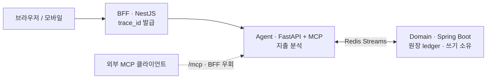

# 개인 지출 분석 AI 에이전트 (가칭 · 상표 출원 검토 중)

> [← 프로필로 돌아가기](../README.md)
>
> 상표 출원 검토로 저장소를 비공개로 운영 중이라, 공개 리포 대신 이 페이지로 아키텍처와 상세를 갈음합니다.

`2026.07 – 진행중` &nbsp;·&nbsp; 개인 프로젝트

개인 지출을 분석하는 AI 에이전트와, 그 에이전트 자체를 관측하는 비용·관측 대시보드. 모노레포 기반 서비스 지향 아키텍처(각 서비스는 모듈러 모놀리식 — MSA 아님).

``NestJS`` ``FastAPI · MCP`` ``Spring Boot`` ``Redis Streams`` ``OpenTelemetry``

## 아키텍처 — 3-언어 백엔드 (BFF · Agent · Domain)

## 상세 역할 및 성과

- **3-언어 백엔드 아키텍처** — 사용자향 BFF(NestJS), 지출 분석 Agent(FastAPI), 원장 Domain(Spring Boot)을 서비스 지향으로 분리하되 각 서비스는 모듈러 모놀리식으로 단순 유지
- **계약 우선(OpenAPI) · 멱등 쓰기** — 모든 쓰기는 Domain 경유, `Idempotency-Key` 헤더 필수(Agent는 원장 직접 쓰기 금지)
- **MCP 서버(FastAPI)** — 외부 MCP 클라이언트가 BFF를 우회해 에이전트에 직접 접근하는 경로 제공
- **모듈 경계·전송 계층 분리** — 타 모듈은 `api` 패키지만 참조, Domain은 전송 계층(Web·JPA)을 모르도록 격리
- **관측 가능성** — OpenTelemetry 기반 trace_id 전파로 요청 흐름 추적
- **ADR 16건** — 3-언어 백엔드·Redis Streams·인증·배포·분류 전략 등 주요 결정을 ADR로 기록

---

> [← 프로필로 돌아가기](../README.md)
