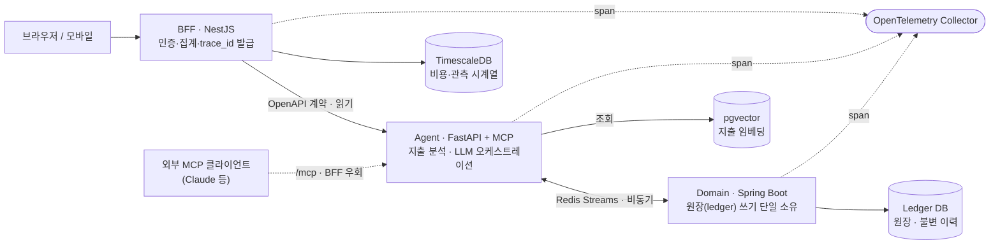
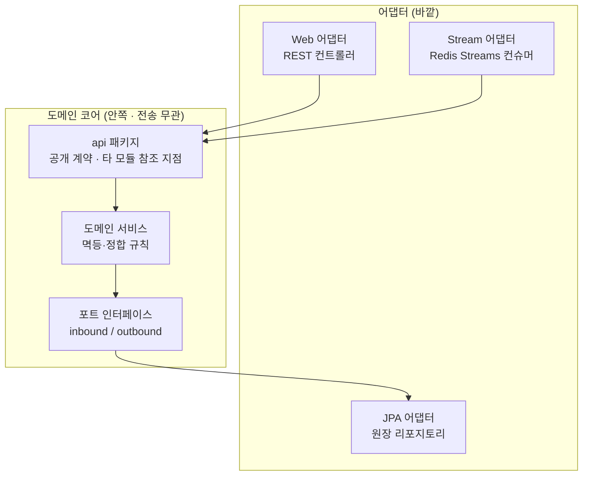
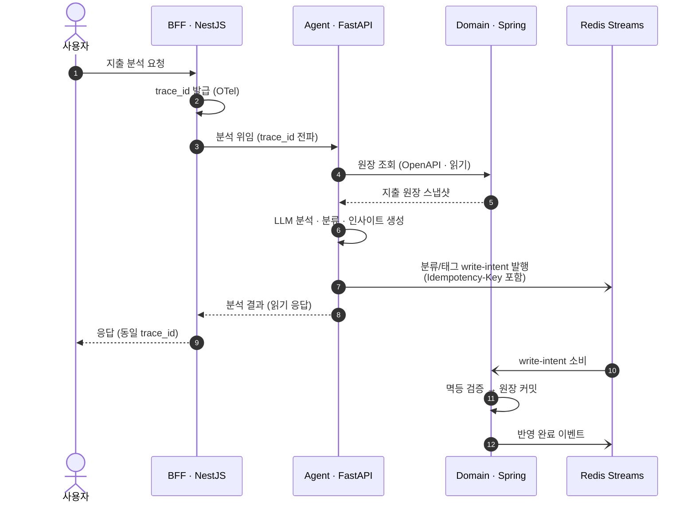
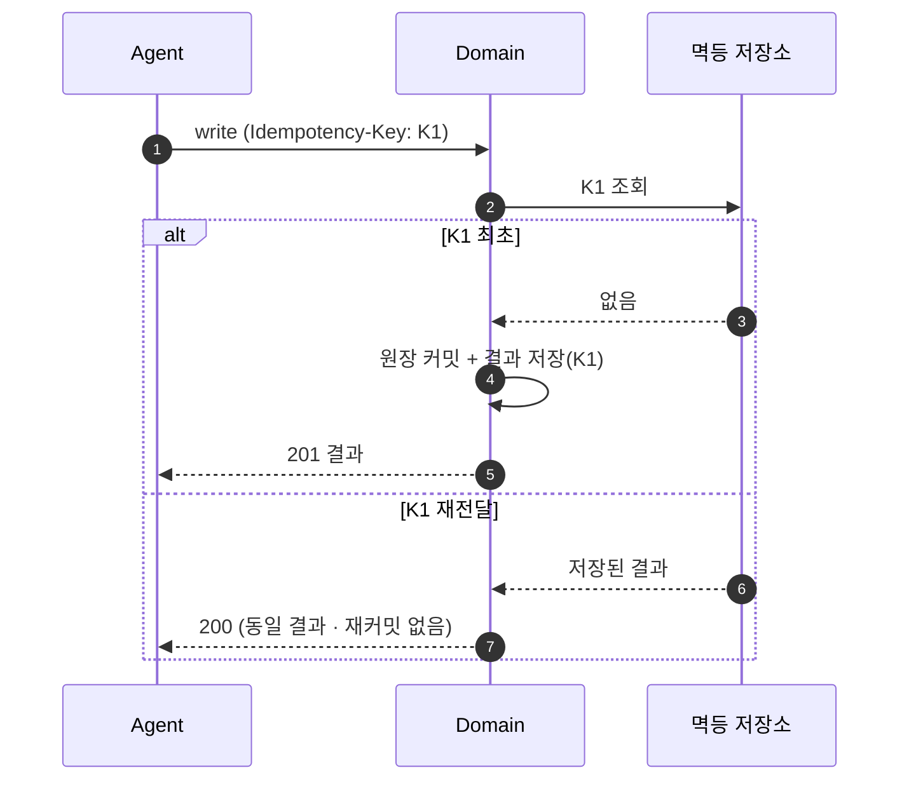
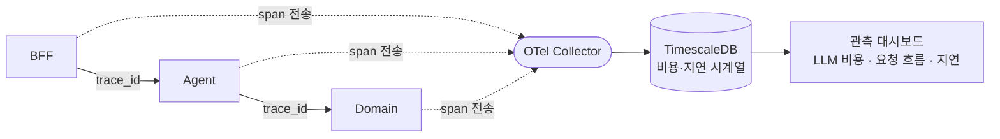

# 개인 지출 분석 AI 에이전트 (가칭 · 상표 출원 검토 중)

> [← 프로필로 돌아가기](../README.md)
>
> 상표 출원 검토로 저장소를 비공개로 운영 중이라, 공개 리포 대신 이 페이지로 아키텍처와 상세를 갈음합니다.

`2026.07 – 진행중` &nbsp;·&nbsp; 개인 프로젝트

개인 지출을 분석하는 AI 에이전트와, 그 에이전트 자체를 관측하는 비용·관측 대시보드. 모노레포 기반 서비스 지향 아키텍처(각 서비스는 모듈러 모놀리식 — MSA 아님).

``NestJS`` ``FastAPI · MCP`` ``Spring Boot`` ``Redis Streams`` ``OpenTelemetry`` ``TimescaleDB`` ``pgvector``

---

## 1. 아키텍처 — 3-언어 백엔드 (BFF · Agent · Domain)

각 언어를 "잘하는 일"에 배치했다. 사용자향 오케스트레이션은 NestJS(BFF), LLM·에이전트 추론은 FastAPI(Agent), 금전 원장의 무결성은 Spring Boot(Domain). 세 서비스를 **서비스 지향으로 분리**하되, 각각은 내부적으로 **모듈러 모놀리식**으로 단순하게 유지한다(운영 부담을 지지 않는 선에서의 경계).

### 서비스 책임 경계

| 서비스 | 언어 | 소유 | 하지 않는 것 |
|--------|------|------|-------------|
| **BFF** | NestJS | 사용자 세션·요청 오케스트레이션·응답 집계·`trace_id` 발급 | 원장 직접 쓰기 안 함 · LLM 직접 호출 안 함 |
| **Agent** | FastAPI + MCP | 지출 분석·LLM 오케스트레이션·MCP 도구 노출 | **원장 직접 쓰기 금지** (Domain 경유만) |
| **Domain** | Spring Boot | 원장(ledger) 쓰기 단일 소유·정합성·멱등 | 전송 계층(Web·JPA)을 **모름** — 포트로만 소통 |

> **설계 원칙** — 금전 데이터의 "진실의 원천(source of truth)"은 오직 Domain 한 곳. Agent가 아무리 똑똑해져도 원장을 직접 건드리지 못하게 하는 것이 이 구조의 핵심 안전장치다.

---

## 2. 모듈 경계 — Domain의 포트·어댑터 (Hexagonal)

Domain(Spring)은 전송 계층을 모르도록 격리했다. 컨트롤러(Web)·리포지토리(JPA)는 바깥 어댑터일 뿐이고, 순수 도메인 로직은 포트 인터페이스로만 세상과 만난다. 타 모듈은 오직 `api` 패키지만 참조한다.

| 규칙 | 강제 방법 |
|------|----------|
| 타 모듈은 `api` 패키지만 참조 | 패키지 의존 방향 고정 — 내부 구현 비노출 |
| Domain 코어는 Web·JPA를 모름 | 코어→어댑터 의존 금지(포트 역전) |
| 쓰기는 도메인 서비스의 멱등 경로로만 | `Idempotency-Key` 없는 쓰기 거부 |

---

## 3. 애플리케이션 워크플로우 — 지출 분석 요청

읽기는 계약(OpenAPI) 기반 동기 호출로, 쓰기는 Redis Streams 기반 **비동기 멱등 반영**으로 분리했다. 모든 홉에 동일한 `trace_id`가 흐른다.

> **왜 쓰기를 비동기로?** 사용자 응답(분석 결과)은 원장 반영을 기다릴 필요가 없다. 분석은 즉시 돌려주고, 분류 결과의 원장 반영은 스트림으로 흘려보내 Domain이 자기 속도로 멱등 처리한다. Agent가 재시도해도 같은 `Idempotency-Key`면 원장은 한 번만 바뀐다.

---

## 4. 멱등 쓰기 계약

같은 요청이 두 번 들어와도(네트워크 재시도·스트림 재전달) 원장은 **정확히 한 번** 바뀐다.

| 항목 | 규칙 |
|------|------|
| 쓰기 경로 | **Domain 단독** — Agent·BFF는 원장 직접 쓰기 금지 |
| 멱등 키 | 모든 쓰기에 `Idempotency-Key` 필수 |
| 재시도 안전성 | 동일 키 → 원장 무변경, 저장된 결과 반환 |
| 계약 | 요청/응답 스키마는 OpenAPI로 선정의 후 구현 |

---

## 5. 관측 가능성 — 에이전트를 관측하는 대시보드

이 프로젝트의 두 번째 축은 "**에이전트 자체를 관측**"하는 것이다. `trace_id`를 세 서비스에 전파해 하나의 요청이 BFF→Agent→Domain을 어떻게 흘렀는지, LLM 호출 비용·지연이 어디서 발생했는지를 시계열(TimescaleDB)로 쌓아 대시보드로 노출한다.

- **요청 흐름 추적** — 하나의 `trace_id`로 3-서비스 요청을 end-to-end 연결
- **LLM 비용 관측** — 분석 요청당 토큰·비용을 시계열로 적재해 추세 분석
- **지연 분해** — 병목이 BFF 오케스트레이션인지, LLM 추론인지, 원장 I/O인지 구간별로 분리

---

## 6. 설계 결정 기록 (ADR 16건 중 대표 발췌)

주요 의사결정을 ADR로 남겨 "왜 이렇게 했는가"를 추적 가능하게 관리한다.

| 주제 | 결정 | 근거 |
|------|------|------|
| 백엔드 구성 | 3-언어 **서비스 지향** (각 서비스는 모듈러 모놀리식) | 언어별 강점 배치 · 소규모라 MSA 운영부담은 회피 |
| 쓰기 소유권 | 원장 쓰기는 **Domain 단독** · Agent 직접 쓰기 금지 | 금전 데이터 단일 진실원 · 무결성 |
| 멱등성 | 모든 쓰기 `Idempotency-Key` 필수 | 재시도·스트림 재전달에도 원장 1회 반영 |
| 서비스 간 계약 | **OpenAPI 우선**(contract-first) | 구현 전 계약 고정 → 병렬 개발·회귀 방지 |
| 비동기 연동 | Agent↔Domain **Redis Streams** | 분석 응답과 원장 반영을 분리 · 백프레셔 흡수 |
| 외부 접근 | **MCP 서버**로 BFF 우회 경로 제공 | 외부 MCP 클라이언트가 에이전트에 직접 접근 |
| 모듈 경계 | 타 모듈은 `api`만 참조 · Domain은 전송계층 미인지 | 포트·어댑터로 결합도 격리 |
| 관측 | **OpenTelemetry** `trace_id` 전파 | 3-서비스 요청 흐름·LLM 비용 추적 |

---

## 7. 상세 역할 및 성과

**① 시스템 아키텍처 — 3-언어 서비스 지향**
- 사용자향 BFF(NestJS)·지출 분석 Agent(FastAPI)·원장 Domain(Spring Boot)을 서비스 지향으로 분리하되, 각 서비스는 모듈러 모놀리식으로 단순 유지 — 소규모 프로젝트가 MSA 운영부담을 지지 않도록 경계 수위 조절

**② 데이터 무결성 — 원장 단일 소유·멱등 쓰기**
- 모든 쓰기를 Domain 경유로 강제하고 `Idempotency-Key`를 필수화(Agent는 원장 직접 쓰기 금지) — 재시도·스트림 재전달에도 원장이 정확히 한 번만 바뀌도록 보장
- 계약 우선(OpenAPI)으로 서비스 간 스키마를 구현 전에 고정 → 병렬 개발과 회귀 방지

**③ 에이전트 연동 — MCP 서버·비동기 스트림**
- MCP 서버(FastAPI)를 구현해 외부 MCP 클라이언트가 BFF를 우회해 에이전트에 직접 접근하는 경로 제공
- Agent↔Domain을 Redis Streams로 비동기 연동해 분석 응답과 원장 반영을 분리, 백프레셔를 흡수

**④ 경계 격리 — 포트·어댑터**
- 타 모듈은 `api` 패키지만 참조하도록 의존 방향을 고정하고, Domain 코어는 전송 계층(Web·JPA)을 모르도록 포트로 역전 — 어댑터 교체가 코어에 영향을 주지 않는 구조

**⑤ 관측 가능성 — 에이전트를 관측하는 대시보드**
- OpenTelemetry 기반 `trace_id`를 3-서비스에 전파해 요청 흐름을 추적하고, LLM 호출 비용·지연을 TimescaleDB 시계열로 적재해 대시보드로 노출

**⑥ 의사결정 기록 — ADR 16건**
- 3-언어 백엔드·Redis Streams·인증·배포·분류 전략 등 주요 결정을 ADR 16건으로 기록해 설계 근거를 추적 가능하게 관리

---

> [← 프로필로 돌아가기](../README.md)
