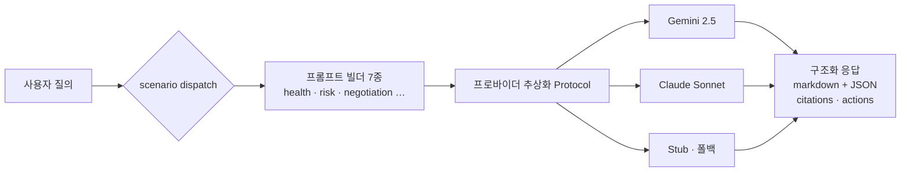

# LLM 하나로는 안 됐다 — 7개 시나리오를 위한 프로바이더 추상화 계층

> [← Writing 인덱스로 돌아가기](../writing/index.md)

`PLYN` · `2026.06 – 진행중` · [플랫폼 →](https://plynai.com) · [프로젝트 상세 →](../experience.md#plyn)

## 문제: 시나리오는 늘어나는데, 모델 하나에 다 걸 수는 없었다

PLYN은 공급사 발굴부터 RFQ·협상까지 거래 전 프로세스에 LLM이 개입한다. Supplier Health, Risk Center, Negotiation, Compare, Memory, Scorecards, AI-Manager — 7개 시나리오. 이 전부를 모델 하나에 묶어버리면 장애·비용·품질 리스크가 전부 한 지점에 몰린다. 프로바이더 하나가 응답 품질이 떨어지거나 요금 정책이 바뀌면, 그 순간 7개 기능이 동시에 흔들린다.

그래서 처음부터 "어떤 모델을 쓸까"가 아니라 "모델을 바꿀 수 있는 구조를 어떻게 만들까"를 먼저 풀어야 했다.

## 설계: 공통 Protocol 뒤로 숨기기

Gemini(`gemini-2.5-flash`)와 Claude(`claude-sonnet-4-6`)를 공통 Protocol 인터페이스 뒤로 추상화했다. dev/test 환경에서는 실제 API 호출 없이 Stub 클라이언트로 폴백하도록 만들어서, 로컬 개발이나 테스트가 외부 API 가용성에 발목 잡히지 않게 했다.

여기서 한 가지 더 중요한 결정은 **JSON Schema 기반 구조화 추출과 대화형 챗을 분리**한 것이다. 같은 LLM 호출이라도 "정형화된 데이터를 뽑아내야 하는 경우"와 "사용자와 대화를 이어가야 하는 경우"는 요구되는 신뢰성의 종류가 다르다. 전자는 스키마를 어기면 그대로 실패해야 하는 것이고, 후자는 자연스러움이 더 중요하다. 이 둘을 같은 인터페이스로 뭉뚱그리면 둘 다 어중간해진다.

## 시나리오가 늘어나도 코드는 안 늘어나게

7개 시나리오 각각을 `(system_prompt, messages)`를 만드는 빌더로 매핑했다. 새 시나리오가 추가돼도 이 매핑 테이블만 확장하면 되고, 디스패치 로직이나 프로바이더 호출 코드는 건드릴 필요가 없다. 시나리오 수가 늘어나는 게 예정된 방향이었기 때문에 — 실제로 처음부터 지금까지 7개까지 늘었다 — 이 구조가 아니었다면 매번 분기문이 하나씩 늘어나는 구조가 됐을 것이다.

## 핵심 구현 ① — 근거 없는 답은 못 믿는다: 근거 추적형 구조화 응답

모델이 인사이트만 던져주면, 그 답이 어디서 나온 근거인지 사용자는 알 수 없다. 그래서 모델의 응답 형식 자체를 규약했다 — **마크다운 인사이트 본문 + 말미 JSON 블록(citations·assumptions·actions)을 정해진 순서로 반환**하도록 강제하고, 서비스 레이어가 이걸 파싱해서 별도 응답 스키마로 분리한다.

이렇게 하면 답변마다 "이 결론의 근거가 된 데이터가 뭔지", "이 결론이 전제하고 있는 가정이 뭔지", "다음에 뭘 해야 하는지"를 구조적으로 추적할 수 있다. LLM 응답을 그냥 텍스트로 흘려보내는 것과, 근거·가정·액션을 분리해서 받는 것 사이에는 신뢰도 차이가 크다.

## 핵심 구현 ② — Supplier Health 트리아지

공급사 관련 신호는 종류가 다양하다 — KPI breach, score change, risk event, compliance gap. 이걸 그냥 시간순으로 나열하면 담당자가 뭘 먼저 봐야 할지 판단하는 데 시간이 든다.

그래서 심각도 × time-to-harm(피해가 발생하기까지 남은 시간) × business_impact 세 축으로 우선순위를 계산하고, 동일 공급사에서 나온 다중 신호는 클러스터링해서 하나의 맥락으로 묶었다. 여기에 연관 엔티티(Contract·PO·CAPA)에 미치는 영향과 즉시 취할 수 있는 액션까지 같이 제시한다. 신호 하나하나를 보여주는 게 아니라, "지금 뭘 봐야 하고 뭘 해야 하는지"를 보여주는 쪽으로 설계 목표를 잡았다.

## 장애: LLM이 죽어도 파이프라인은 안 죽는다

외부 LLM 호출은 언제든 실패할 수 있다는 전제로 설계했다. 호출 타임아웃, SDK 재시도(최대 2회), 예외 계층, 그리고 최종적으로 Stub 폴백까지 — LLM 장애가 나도 파이프라인 자체는 멈추지 않도록 했다. AI 기능이 핵심이라고 해서 AI 기능의 장애가 전체 서비스의 장애가 되어서는 안 된다는 게 기준이었다.

## 결과

이 구조 위에서 공급사 도메인 9종을 REST API 26종으로 묶어 하나의 실행 시스템으로 구성했고, 이 리스크 예측·설명 흐름을 대외 데모로도 확장했다. 문서 기반 수집 파이프라인을 단일 흐름으로 묶어 리스크 컨텍스트를 2분 내 확보하는 데모 시나리오도 이 프로바이더 추상화 위에서 만들어졌다.

가장 크게 배운 건, 프로바이더 교체 가능성은 "언젠가 필요할 수도 있는 유연성"이 아니라 **여러 시나리오가 같은 인프라를 공유할 때 필연적으로 필요해지는 설계 제약**이라는 점이다. 시나리오 하나였다면 이 정도로 추상화 계층에 공을 들이지 않았을 거다.

---

> [← Writing 인덱스로 돌아가기](../writing/index.md)
