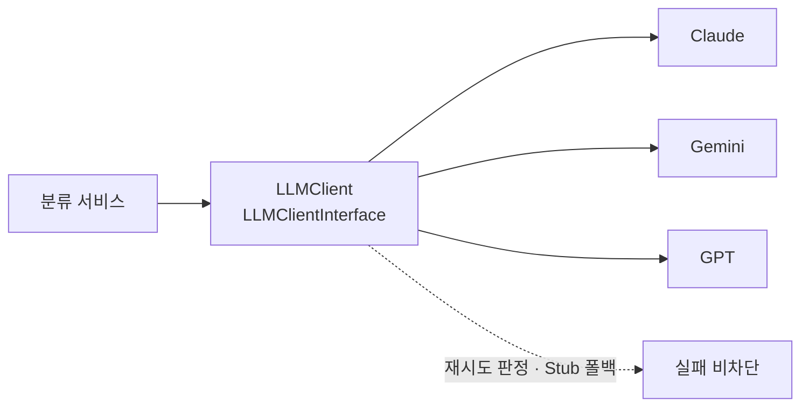

# 벤더 하나에 묶이지 않기 위한 LLM 프로바이더 추상화

> [← Writing 인덱스로 돌아가기](../writing/index.md)

`PLYN · 품목 분류 R&D` · `2026.06 – 2026.08` · [프로젝트 상세 →](../experience.md#plyn)

> 이 글의 구현은 제품 저장소(`plynai-v3`)가 아니라 **품목 분류 R&D 저장소**에 있습니다.
> 제품 본체에는 LLM 호출 코드가 없고, 분류 파이프라인이 R&D 라인의 결과를 소비하는 구조입니다.

## 문제: 한 벤더에 묶이면 품질도 비용도 통제할 수 없다

품목 분류는 "이 지출 항목이 자재인가, 원자재인가, 설비인가"를 판정하고 표준 체계에 매핑하는 일이다. 규칙만으로는 한계가 있어 LLM을 쓰기로 했는데, 여기서 두 가지가 걸렸다.

하나는 **품질 비교가 필요했다는 것**. 같은 프롬프트라도 모델마다 결과가 다르고, 어느 쪽이 우리 데이터에 맞는지는 붙여봐야 알 수 있었다. 다른 하나는 **벤더 리스크**. 응답 품질이 떨어지거나 rate limit·요금 정책이 바뀌면, 호출부가 특정 SDK에 직접 묶여 있는 한 그 순간 분류 전체가 멈춘다.

## 설계 ① — 호출부는 프로바이더를 모른다

`LLMClient`가 `LLMClientInterface`를 구현하고, 그 뒤에 프로바이더 3종을 뒀다.

```
app/infrastructure/clients/
├── llm_client.py              # 호출부가 보는 유일한 얼굴
└── providers/
    ├── base.py                # 공통 계약
    ├── claude_provider.py
    ├── gemini_provider.py
    └── gpt_provider.py
```


```mermaid
flowchart LR
  D["분류 서비스"] --> C["LLMClient<br/>LLMClientInterface"]
  C --> CL["Claude"]
  C --> GM["Gemini"]
  C --> GP["GPT"]
  C -.->|"재시도 판정 · Stub 폴백"| F["실패 비차단"]
```

재시도할 만한 실패인지 판정하는 `_is_retryable`도 프로바이더가 아니라 **클라이언트 레벨**에 뒀다. 벤더마다 에러 형태가 다른데 그 차이를 호출부까지 올려보내면 분기가 번진다.

## 설계 ② — 품목 종류마다 물어봐야 할 게 다르다

프롬프트를 하나로 쓰면 자재에는 맞고 설비에는 안 맞는다. 그래서 전략 패턴으로 나눴다.

```
app/domain/services/prompt_strategies.py
├── ClassificationPromptStrategy  (ABC)
├── MaterialPromptStrategy        # 자재
├── RawMaterialPromptStrategy     # 원자재
├── EquipmentPromptStrategy       # 설비
└── PromptStrategyFactory         # 품목 종류 → 전략 디스패치
```

새 품목군이 생기면 전략 클래스를 하나 추가하고 Factory 매핑만 늘리면 된다. 디스패치 로직이나 프로바이더 호출 코드는 건드리지 않는다.

## 설계 ③ — 값만 주면 쓸 수가 없다

모델이 "이건 자재입니다"만 던져주면, 담당자는 그 판정을 검토할 방법이 없다. 값이 맞는지 확인하려면 결국 원본을 다시 봐야 하고, 그러면 자동화한 의미가 없어진다.

그래서 **값과 함께 판단 근거를 같이 내려보내는 응답 형태를 계약으로 고정**했다. 서비스 레이어가 이를 파싱해 응답 스키마로 분리하고, 근거는 화면에서 값 옆에 붙는다.

이 원칙은 LG 정시성 PoC에서도 그대로 썼다. ETA2 값 옆에 실적/예측 구분·항로 포함 여부·표본 수를 붙인 게 같은 발상이다 — **값 하나만 있는 화면은 담당자가 신뢰할 수도, 의심할 수도 없다.**

## 남은 것

정량 평가 체계는 완성하지 못했다. 골든셋 문서를 두고 비교했지만, 프로바이더별 정확도를 수치로 확정하는 데까지는 가지 못했다.

그리고 검토 과정에서 하나 짚어둔 게 있다 — **추출과 채점을 같은 계열 모델로 하면 평가가 순환한다.** 모델이 만든 답을 같은 계열 모델이 채점하면 그 계열의 편향이 그대로 통과한다. 이건 다음 단계에서 반드시 끊어야 할 지점이라고 문서화를 요청했다.

## 배운 것

추상화 자체는 어렵지 않았다. 어려웠던 건 **어디까지를 인터페이스 뒤에 숨길지 정하는 일**이었다. 너무 얇게 감싸면 벤더별 분기가 호출부로 새어 나오고, 너무 두껍게 감싸면 각 모델의 고유한 기능을 못 쓴다.

기준으로 삼은 건 하나였다 — **"프로바이더를 하나 더 붙일 때 호출부를 고쳐야 하는가."** 고쳐야 하면 추상화가 새는 것이고, 안 고쳐도 되면 충분한 것이다. GPT를 세 번째로 붙일 때 호출부가 그대로였으니 그 기준은 통과했다.

---

> [← Writing 인덱스로 돌아가기](../writing/index.md)
