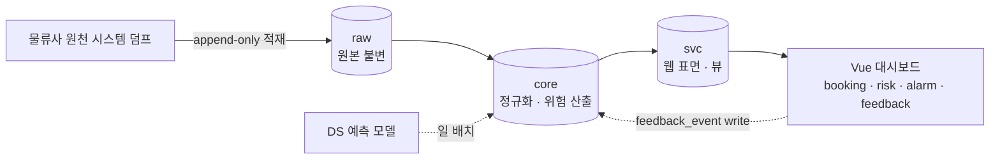

# 정확한 예측이 불가능하다는 걸 인정하는 데서 시작한 설계

> [← Writing 인덱스로 돌아가기](../writing/index.md)

`해상운송 정시성 Visibility PoC` · `2026.06 – 2026.12` · [프로젝트 상세 →](../experience.md#shipping)

화물 지연 리스크를 조기에 감지하는 정시성 Visibility PoC를 혼자 백엔드부터 대시보드까지 만들면서, 설계에서 가장 어려웠던 건 기술이 아니라 **"이 데이터로 뭘 약속할 수 있는가"**를 정하는 일이었다.

## 문제: 우리에게 있는 건 스냅샷 하나뿐이었다

물류사가 넘겨주는 원천 시스템 덤프는 특정 시점의 상태를 찍은 스냅샷이다. 시계열로 촘촘히 쌓인 관측 데이터가 아니라, 하루에 한 번 던져지는 단면. 이 데이터만으로 "이 화물은 3일 뒤 도착합니다"처럼 정밀한 ETA를 예측하겠다고 하면, 그건 데이터가 감당할 수 없는 약속을 하는 것이었다.

그래서 산출물의 정의를 다시 잡았다. 정밀한 시점 예측 대신, **위험 등급(진행·주의·회피) + 근거 한 줄**로. 그리고 평가 기준도 "예측이 얼마나 정확한가"가 아니라 **"회피 권고 묶음의 정밀도"**로 바꿨다. 무엇을 하지 말라고 말할지를 더 정확하게 맞추는 쪽으로 문제를 재정의한 것이다.

이 재정의가 이후 모든 아키텍처 결정의 기준이 됐다.

## 설계: 원본은 절대 건드리지 않는다 — raw · core · svc

스냅샷 기반 데이터의 가장 큰 리스크는 "원본이 이미 훼손된 상태로 들어왔는지, 우리가 가공하다 훼손했는지"를 나중에 구분할 수 없어지는 것이다. 그래서 스키마를 3계층으로 쪼갰다.

- **raw** — 외부 덤프를 원형 그대로, append-only로 적재만 한다. 절대 수정하지 않는다.
- **core** — 정규화와 위험 산출이 일어나는 곳. 변화 추적의 책임을 여기로 몰았다(실측 결과 일 변경률 8.4%).
- **svc** — 웹이 보는 표면. 대부분 뷰(view)로만 구성해서, 웹 쪽 코드가 core의 내부 구조에 직접 의존하지 않게 했다.

원본이 불변으로 남아있으면, 나중에 "이 위험 등급이 왜 이렇게 나왔지?"라는 질문에 raw까지 거슬러 올라가 답할 수 있다. 이게 이 아키텍처의 핵심 가치였다.

## 관측 이력은 소급이 안 된다 — ingest_run부터 만들었다

기능보다 먼저 만든 게 하나 있다. `ingest_run` 메타 구조다.

이유는 단순하다. `eta_observation` 같은 관측 이력은 append-only라서, **오늘 캡처를 놓치면 그 시점의 관측은 영원히 사라진다.** 나중에 "지난주 데이터도 백필해줘"가 안 되는 종류의 데이터다. 그래서 다른 기능보다 먼저, 매일 캡처하는 구조부터 최우선으로 박아뒀다.

멱등성은 파일 해시 이력으로 확보했다. 같은 파일이 실수로 두 번 들어와도 중복 적재가 나지 않도록 — 실제로 누적 약 20만 행이 쌓이는 동안 중복 재적재 0건을 유지했다.

## 데이터가 진짜 신뢰할 만한지 검증하기

계층을 나누고 파이프라인을 만드는 것과, 그 위에서 나오는 결과를 믿을 수 있는 것은 다른 문제다. 복합 자연키의 유일성을 데이터 프로파일링으로 직접 측정했고, 99.6%를 확보했다. 남은 잔여 중복은 그냥 넘기지 않고 원인을 추적했는데, 원천 시스템이 부분 정보를 여러 번에 나눠 방출하는 패턴 때문이라는 걸 규명해서 대체 판정 로직을 제안했다.

숫자를 맞추는 것보다, "왜 100%가 안 되는가"에 답할 수 있는 상태를 만드는 게 더 중요하다고 생각한다.

## 경보가 폭포처럼 쏟아지지 않게

배 한 척에서 지연 신호가 여러 개 동시에 뜰 수 있다. 이걸 그대로 흘려보내면 담당자 입장에서는 같은 사건에 대한 알람을 여러 번 받는 셈이 된다. 그래서 동일 선박에서 나온 다수 신호를 하나의 인시던트로 묶는 그룹핑을 넣었고, 담당자 피드백을 수집할 때도 선제 대응(preventive) 건은 오탐 집계에서 빼서 지표가 왜곡되지 않게 했다.

## 운영 — 권한 경계도 설계의 일부

agent(적재·정규화) / ds(예측 모델) / web(대시보드) 세 롤로 스키마 소유·접근 권한을 나눴다. 웹은 svc만 볼 수 있고, 쓰기는 feedback_event 하나로 한정했다. 코드로 강제하기 전에, 애초에 롤 경계로 실수할 수 있는 범위 자체를 좁혀둔 것이다.

## 배운 것

이 프로젝트에서 가장 남는 교훈은 기술 선택이 아니라 **"할 수 없는 걸 정직하게 인정하는 것이 오히려 더 견고한 설계로 이어진다"**는 것이었다. 정밀 ETA를 약속했다면 아마 지금도 정확도와 씨름하고 있었을 거다. 대신 "회피해야 할 것을 더 정확히 말하기"로 목표를 좁히니, raw·core·svc 분리도, ingest_run도, 인시던트 그룹핑도 전부 그 하나의 기준에서 자연스럽게 따라 나왔다.

---

> [← Writing 인덱스로 돌아가기](../writing/index.md)
