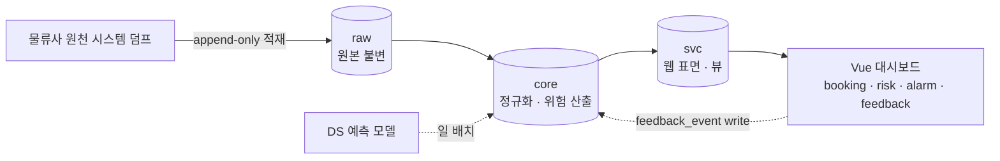

# 하나의 정답 대신 두 개의 산식 — 약속할 수 있는 범위부터 정한 설계

> [← Writing 인덱스로 돌아가기](../writing/index.md)

`국제운송 정시성 Visibility PoC` · `2026.06 – 2026.12` · [프로젝트 상세 →](../experience.md#shipping)

화물 지연 리스크를 조기에 감지하는 정시성 Visibility PoC를 혼자 백엔드부터 대시보드까지 만들면서, 설계에서 가장 어려웠던 건 기술이 아니라 **"이 데이터로 뭘 약속할 수 있는가"**를 정하는 일이었다.

## 문제: 우리에게 있는 건 스냅샷 하나뿐이었다

물류사가 넘겨주는 원천 시스템 덤프는 특정 시점의 상태를 찍은 스냅샷이다. 시계열로 촘촘히 쌓인 관측 데이터가 아니라, 하루에 한 번 던져지는 단면. 이 데이터만으로 "이 화물은 3일 뒤 도착합니다"처럼 정밀한 ETA를 예측하겠다고 하면, 그건 데이터가 감당할 수 없는 약속을 하는 것이었다.

그래서 산출을 포기하는 대신, **약속의 단위를 바꿨다.** 정답 하나를 내놓는 대신 산식을 둘로 나눠 담았다.

- **ETA2 — 구간 누적**: 기점 출항 실적에 구간별 3개월 평균 리드타임을 쌓아 도착 예정일을 만든다. 구간에 실제 도착이 찍히면 그 값으로 동기화한다. 값마다 실적/예측 구분·항로 포함 여부·표본 수·산출 확정 시각이 따라붙는다. 커버리지 **98.13%**(88,754 / 90,444).
- **ETA3 — 모델 산출**: 화물 한 건을 통짜로 예측하고 지연 확률을 함께 낸다. 구간을 쪼개지 않으니 구간별 근거는 없다. 커버리지 **85.56%**(77,387 / 90,444).

둘은 성질이 다르므로 합치지 않고 화면에서 스위치로 고르게 했다. 담당자가 값을 의심할 때 확인할 수 있는 것이 서로 다르기 때문이다.

그리고 **값이 없는 경우를 세 갈래로 나눴다.** 서빙 뷰가 없는 것, 모델에 넣을 입력이 없는 것, 산출 트랙이 돌지 않은 것. 원인이 다르면 담당자가 할 일이 완전히 다른데, `—` 하나로 뭉치면 어디를 고쳐야 값이 늘어나는지가 표에서 사라진다.

위험 등급(진행·주의·회피)은 이 ETA를 **대체한 것이 아니라 경보 축으로 병행**한다. 언제 도착하는지와 지금 손대야 하는지는 다른 질문이라서다.

이 판단이 이후 모든 아키텍처 결정의 기준이 됐다.

## 설계: 원본은 절대 건드리지 않는다 — raw · core · svc

스냅샷 기반 데이터의 가장 큰 리스크는 "원본이 이미 훼손된 상태로 들어왔는지, 우리가 가공하다 훼손했는지"를 나중에 구분할 수 없어지는 것이다. 그래서 스키마를 3계층으로 쪼갰다.

```mermaid
flowchart LR
  SRC["물류사 원천 시스템 덤프"] -->|"append-only 적재"| RAW[("raw
원본 불변")]
  RAW --> CORE[("core
정규화 · 위험 산출")]
  DS["DS 예측 모델"] -.->|"일 배치"| CORE
  CORE --> SVC[("svc
웹 표면 · 뷰")]
  SVC --> WEB["Vue 대시보드
booking · risk · alarm · feedback"]
  WEB -.->|"feedback_event write"| CORE
```

- **raw** — 외부 덤프를 원형 그대로, append-only로 적재만 한다. 절대 수정하지 않는다.
- **core** — 정규화와 위험 산출이 일어나는 곳. 변화 추적의 책임을 여기로 몰았다.
- **svc** — 웹이 보는 표면. 대부분 뷰(view)로만 구성해서, 웹 쪽 코드가 core의 내부 구조에 직접 의존하지 않게 했다.

원본이 불변으로 남아있으면, 나중에 "이 위험 등급이 왜 이렇게 나왔지?"라는 질문에 raw까지 거슬러 올라가 답할 수 있다. 이게 이 아키텍처의 핵심 가치였다.

## 관측 이력은 소급이 안 된다 — ingest_run부터 만들었다

기능보다 먼저 만든 게 하나 있다. `ingest_run` 메타 구조다.

이유는 단순하다. `eta_observation` 같은 관측 이력은 append-only라서, **오늘 캡처를 놓치면 그 시점의 관측은 영원히 사라진다.** 나중에 "지난주 데이터도 백필해줘"가 안 되는 종류의 데이터다. 그래서 다른 기능보다 먼저, 매일 캡처하는 구조부터 최우선으로 박아뒀다.

멱등성은 파일 해시 이력으로 확보했다. 같은 파일이 실수로 두 번 들어와도 중복 적재가 나지 않도록 — 실제로 누적 약 20만 행이 쌓이는 동안 중복 재적재 0건을 유지했다.

## 데이터가 진짜 신뢰할 만한지 검증하기

계층을 나누고 파이프라인을 만드는 것과, 그 위에서 나오는 결과를 믿을 수 있는 것은 다른 문제다. port_radar ↔ port_radar_snapshot 의 조인키 일치율을 데이터 프로파일링으로 직접 측정했고, 99.6%를 확보했다. 남은 잔여 중복은 그냥 넘기지 않고 원인을 추적했는데, 원천 시스템이 부분 정보를 여러 번에 나눠 방출하는 패턴 때문이라는 걸 규명해서 대체 판정 로직을 제안했다.

숫자를 맞추는 것보다, "왜 100%가 안 되는가"에 답할 수 있는 상태를 만드는 게 더 중요하다고 생각한다.

## 경보가 폭포처럼 쏟아지지 않게

배 한 척에서 지연 신호가 여러 개 동시에 뜰 수 있다. 이걸 그대로 흘려보내면 담당자 입장에서는 같은 사건에 대한 알람을 여러 번 받는 셈이 된다. 그래서 동일 선박에서 나온 다수 신호를 하나의 인시던트로 묶는 그룹핑을 넣었고, 담당자 피드백을 수집할 때도 선제 대응(preventive) 건은 오탐 집계에서 빼서 지표가 왜곡되지 않게 했다.

## 운영 — 권한 경계도 설계의 일부

agent(적재·정규화) / ds(예측 모델) / web(대시보드) 세 롤로 스키마 소유·접근 권한을 나눴다. 웹은 svc만 볼 수 있고, 쓰기는 feedback_event 하나로 한정했다. 코드로 강제하기 전에, 애초에 롤 경계로 실수할 수 있는 범위 자체를 좁혀둔 것이다.

## 배운 것

이 프로젝트에서 가장 남는 교훈은 기술 선택이 아니라 **"약속할 수 있는 범위를 먼저 정하면 오히려 더 많이 낼 수 있다"**는 것이었다.

정답 하나를 약속했다면 아마 지금도 정확도와 씨름하며 아무것도 못 냈을 거다. 대신 산식을 둘로 나누고 값 옆에 근거를 붙이니, 98%와 85%라는 실제 커버리지가 나왔다. 못 낸 것도 왜 못 냈는지를 적어두니 다음에 무엇을 붙여야 값이 느는지가 남았다.

raw·core·svc 분리도, ingest_run 도, 인시던트 그룹핑도 전부 그 하나의 기준에서 따라 나왔다 — **나중에 "이 값이 왜 이렇게 나왔지?"에 답할 수 있어야 한다**는 기준.

---

> [← Writing 인덱스로 돌아가기](../writing/index.md)
